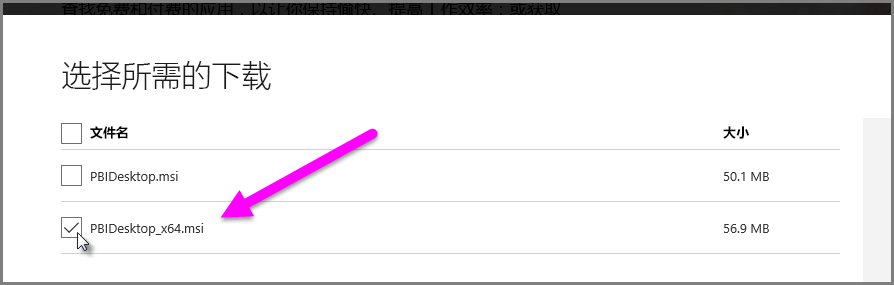

# 解决在 Power BI Desktop 中导入 Access 和 .XLS 文件出现的问题
在 Power BI Desktop 中，Access 数据库和旧版 Excel 工作簿（Excel 97-2003 的 .XLS 文件类型）均使用 Access 数据库引擎。 有三种常见情形可能会导致 Access 数据库引擎无法正常运行：

### 情况 1：未安装 Access 数据库引擎
当 Power BI Desktop 错误消息指示未安装 Access 数据库引擎时，必须安装与你的 Power BI Desktop 版本匹配的 Access 数据库引擎版本（32 位或 64 位）。 可以从[下载页](http://www.microsoft.com/en-us/download/details.aspx?id=13255)安装 Access 数据库引擎。

>[!NOTE]
>如果安装的 Access 数据库引擎位版本不同于 Microsoft Office 安装的位版本，则 Office 应用程序将不能使用 Access 数据库引擎。

### 情况 2：Access 数据库引擎位版本（32 位或 64 位）不同于你的 Power BI Desktop 位版本
当安装的 Microsoft Office 版本为 32 位，而安装的 Power BI Desktop 版本为 64 位时，通常会发生这种情况。 相反的情况也会发生，无论属于上述哪种情况，都是位版本不一致（如果使用的是 Office 365 订阅，请参阅**情形 3** 了解不同的问题和解决方法）。 以下任何一种解决方案都可以修复此位版本不一致错误：

1. 更改 Power BI Desktop 的版本以匹配 Microsoft Office 安装的位版本。 若要更改 Power BI Desktop 的位版本，请卸载 Power BI Desktop，然后安装与 Office 安装匹配的 Power BI Desktop 版本。 若要选择 Power BI Desktop 的版本，请在桌面下载页上选择**高级下载选项**。
   
   
   
   在出现的下载页上选择你的语言，然后选择**下载**按钮。 在出现的屏幕上，选择 PBIDesktop.msi 旁边的复选框以选择 32 位版本，或 PBIDesktop_x64.msi 旁边的复选框以选择 64 位版本。 在下面的屏幕中，选择了 64 位版本。
   
   
   
   >[!NOTE]
   >使用 Power BI Desktop 的 32 位版本时，如果创建非常大的数据模型，可能会遇到内存不足的问题。
2. 更改 Microsoft Office 的版本以匹配 Power BI Desktop 安装的位版本。 若要更改 Microsoft Office 的位版本，请卸载 Office，然后安装与 Power BI Desktop 安装匹配的 Office 版本。
3. 如果试图打开 .XLS 文件（Excel 97-2003 工作簿）时出错，可以通过在 Excel 中打开 .XLS 文件并将其另存为 XLSX 文件，来避免使用 Access 数据库引擎。
4. 如果前三种解决方案不可行，则可安装 Access 数据库引擎的两个版本，但这*不是*建议的解决方法。 安装两个版本将解决 Power Query for Excel 和 Power BI Desktop 的这一问题，但将对自动（默认）使用最先安装的 Access 数据库引擎的位版本的任何应用程序引入错误和问题。 若要安装 Access 数据库引擎的两个位版本，请[下载](http://www.microsoft.com/en-us/download/details.aspx?id=13255)两个版本，然后使用*被动*开关分别运行它们。 例如：
   
       c:\users\joe\downloads\AccessDatabaseEngine.exe /passive
   
       c:\users\joe\downloads\AccessDatabaseEngine_x64.exe /passive

### 情形 3：无法结合使用 Office 365 订阅和 Access 或 .XLS 文件
如果使用的是 Office 365 订阅，无论是 **Office 2013** 还是 **Office 2016**，Access 数据库引擎提供程序是在*仅*供 Office 进程访问的虚拟注册表位置中进行注册。 因此，不是 Office 进程的 Mashup 引擎（负责运行非 Office 365 Excel 和 Power BI Desktop）不能使用 Access 数据库引擎提供程序。

若要纠正这种情形，可以[下载并安装与 Power BI Desktop 安装位版本匹配的 Access 数据库引擎可再发行组件](http://www.microsoft.com/en-us/download/details.aspx?id=13255)（请参阅前面的部分，了解有关位版本的详细信息）。

### 导致导入问题发生的其他情形
我们会尽可能地收录 Access 或 .XLS 文件出现的问题。 如果遇到本文未收录的问题，请将问题提交给 [Power BI 支持团队](https://powerbi.microsoft.com/support/)。 我们会定期查看可能会对大量客户造成影响的问题，并将其收录到我们的文章中。

