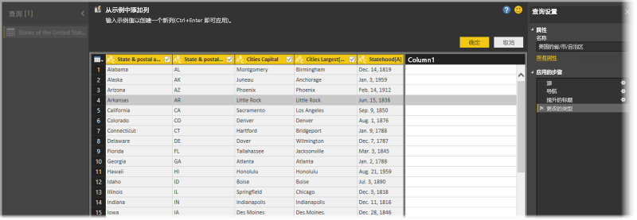
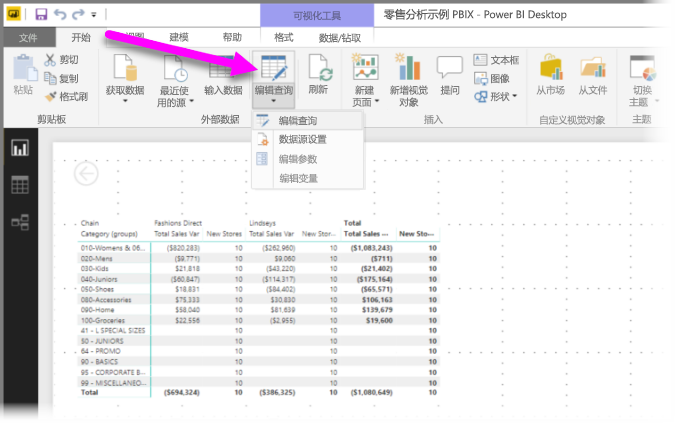
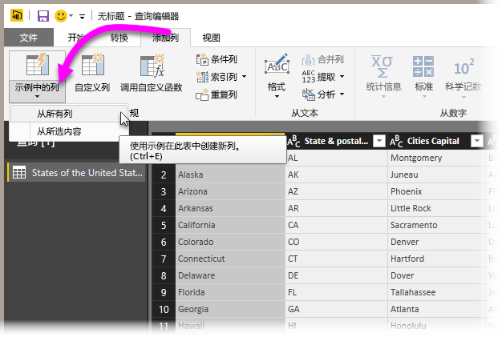
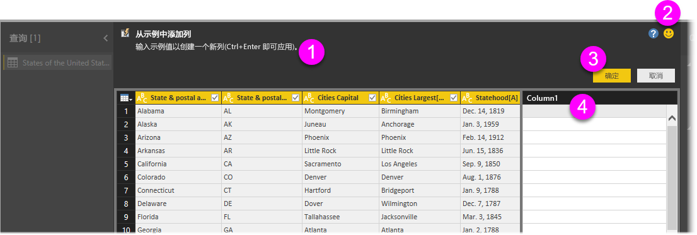
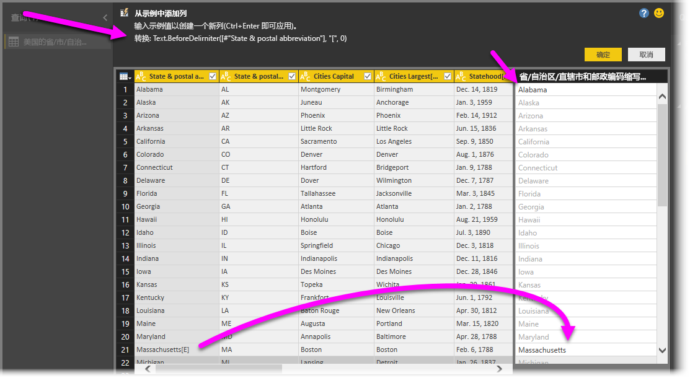

# 在 Power BI Desktop 中通过示例添加列
自 2017 年 4 月发布的 **Power BI Desktop** 起，只需提供新列的一个或多个示例值，即可使用**查询编辑器**向模型添加新的数据列。 可以根据当前所选内容，或通过根据给定表中的所有（或选定）列提供输入数据，创建新列示例。

这种方法有助于快速轻松地创建新列，非常适用于以下情形：

* 你知道自己想要在新列中获得的数据结果，但不确定通过哪种转换（或一系列转换）可以实现目的。
* 你已知道自己需要执行的转换，但不确定在 UI 中的什么位置进行单击或选择，从而执行这些转换。
* 你知道在“M”中使用“自定义列”表达式所需的转换的全部信息，但无法在 UI 中单击或添加其中一个（或多个）表达式。

**通过示例添加列**功能使用起来非常简单。 在接下来的几个部分中，我们就来看看如何轻松地使用这项功能。

## 使用查询编辑器通过示例添加新列
若要通过示例创建新列，请启动“查询编辑器”。 为此，可以在 **Power BI Desktop** 的“开始”功能区中选择“编辑查询”。

要从网页中获取数据，请转到“开始”选项卡，单击“获取数据”>“Web”，然后将 URL 粘贴到出现的对话框中。 本文使用 Wikipedia 文章中的数据。 可单击下面的链接，自行获取数据并按照下面操作：

* [**美国各州和领土列表**](https://wikipedia.org/wiki/List_of_states_and_territories_of_the_United_States)

启动“查询编辑器”且已加载部分数据后，便可以开始通过示例添加列。 若要添加新列，请在“查询编辑器”中依次选择功能区上的“添加列”选项卡和“通过示例添加列”。 可以选择下拉列表中的“通过所有列”（如果只选择了按钮，而未选择下拉列表，此为默认值）或“通过所选内容”。 在本文中，我们将一步步演示选择“通过所有列”的相关操作。

## “通过示例添加列”窗格
选择通过示例添加新列后，便会看到一个新窗格，其中显示了当前表中的列（可能需要滚动才能查看全部列）。 此外，新的“第 1 列”也在右侧显示，该列是 Power BI Desktop 根据你的示例创建的。 新的“第 1 列”标题下方是空白单元格，可以在其中键入示例，以便 Power BI 能够用来创建与示例匹配的规则和转换。

请注意，这是“查询设置”窗格中的“已应用步骤”。 和以往一样，**查询编辑器**会记录转换步骤，并依序向查询应用这些步骤。

这就是“通过示例添加列”窗格，主要分为以下四个区域：

1. 包含功能或转换的简要说明的“命令栏”。
2. 有助于 Power BI 改进此功能的“发送反馈”选项。
3. 用于提交转换并添加列或取消上述操作的“确定”和“取消”按钮。
4. 新列区域，可以在任意一行中键入示例值（向 Power BI 提供示例），从而与相应行的其他列相关联。

在新列中键入示例时，Power BI 会根据检测到的转换让你预览要创建的列。 例如，如果在第一行中键入“Alabama”，则它对应于表中第一列的“Alabama”值。 按 Enter 后，Power BI 便会立即根据此值填充列。

但是，随即便会转到包含 Massachusetts[E] 的行，并删除最后的 [E] 部分（因为你不再需要它）。 Power BI 可检测更改，并使用该示例创建转换。 请注意，窗格的中上方对转换进行了说明。

如果继续提供示例，**查询编辑器**会将其添加到转换中。 如果感到满意，可以选择“确定”提交更改。

## 观看“通过示例添加列”的实际操作
想看看此功能的实际效果？ 下面的视频展示了这项功能的实际运用（使用此示例前面提供的数据源）。 请仔细观看，自己跟着视频操作一下！

<iframe width="560" height="315" src="https://www.youtube.com/embed/-ykbVW9wQfw" frameborder="0" allowfullscreen></iframe>

## 注意事项和限制
虽然使用“通过示例添加列”时有许多转换可用，但并不是所有转换都包含在内。 下面列出了支持的全部转换。

* **引用**
  
  * 引用特定列（包含修整、清理和大小写转换）

* **文本转换**
  
  * 合并（支持合并文本字符串和整个列值）
  * 替换
  * 长度
  * 提取   
    * 第一个字符
    * 最后一个字符
    * 范围
    * 分隔符前的文本
    * 分隔符后的文本
    * 分隔符之间的文本
    * 长度

* 自 2017 年 11 月版 Power BI Desktop 起，支持下列文本转换：
    
  * 删除字符
  * 保留字符

> [!NOTE]
> 对于所有文本转换，都要考虑是否需要进行修整、清理或对列值应用大小写转换。
> 
> 

* **日期转换**
  
  * 天
  * 每周的某一日
  * 周几名称
  * 每年的某一日
  * 月份
  * 月份名称
  * 每年的某一季度
  * 每月的某一周
  * 每年的某一周
  * 年份
  * 年限
  * 年份开始值
  * 年份结束值
  * 月份开始值
  * 月份结束值
  * 季度开始值
  * 一个月的某些日
  * 季度结束值
  * 星期开始值
  * 星期结束值
  * 每月的某一日
  * 一天开始值
  * 一天结束值

* **时间转换**
  
  * 小时
  * 分钟
  * 秒  
  * 本地时间

> [!NOTE]
> 对于所有“日期”和“时间”转换，都要考虑是否可能需要将列值转换成“日期”或“时间”或“日期和时间”。
> 
> 

* **数字转换** 

  * 绝对值
  * 反余弦
  * 反正弦
  * 反正切
  * 转换为数字
  * 余弦
  * 多维数据集
  * 除
  * 求幂
  * 阶乘
  * 整除
  * 为偶数
  * 为奇数
  * 自然对数
  * 以 10 为底数的对数
  * 取模
  * 乘
  * 向下舍入
  * 向上舍入
  * 符号
  * 正弦
  * 平方根
  * 平方
  * 减
  * 求和
  * 正切

* 自 2017 年 11 月版 Power BI Desktop 起，支持下列数字转换：

  * Bucket/范围

* **常规**
  
  * 条件列