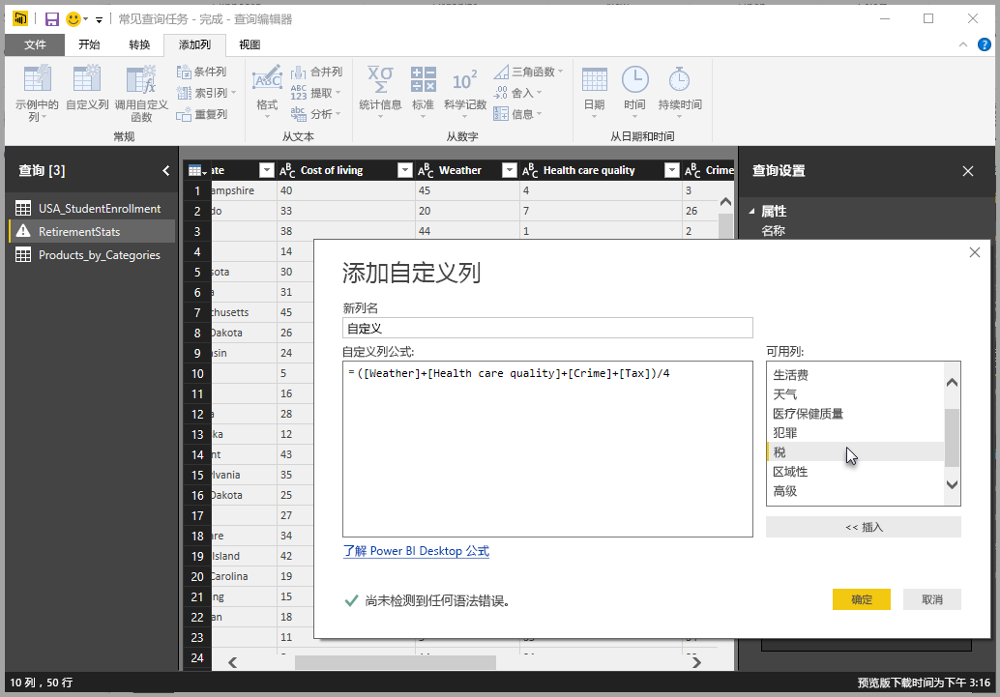
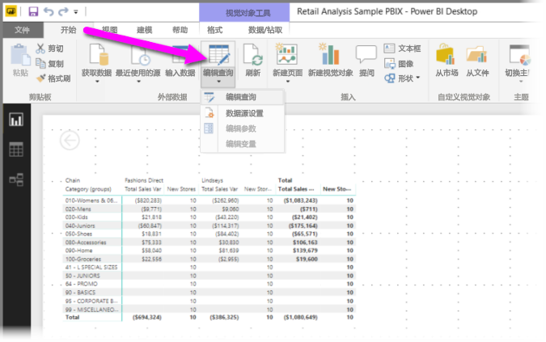
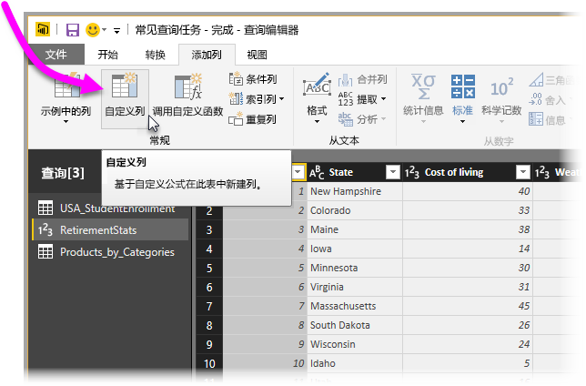
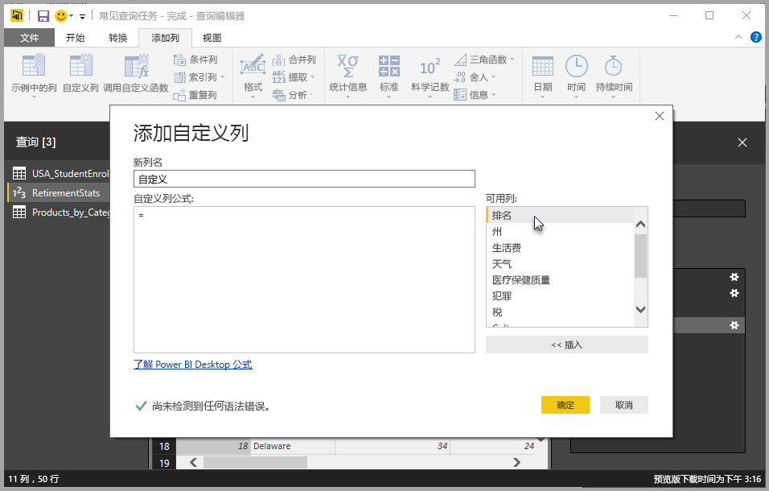
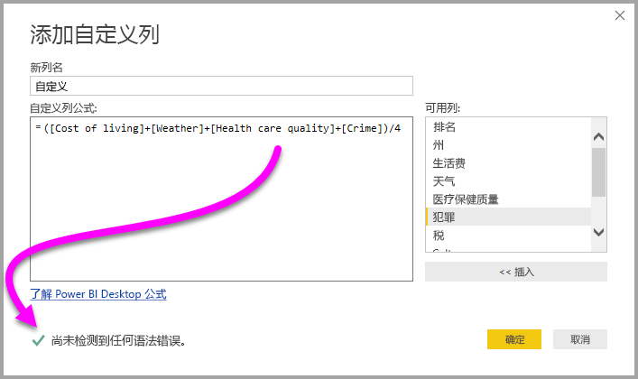
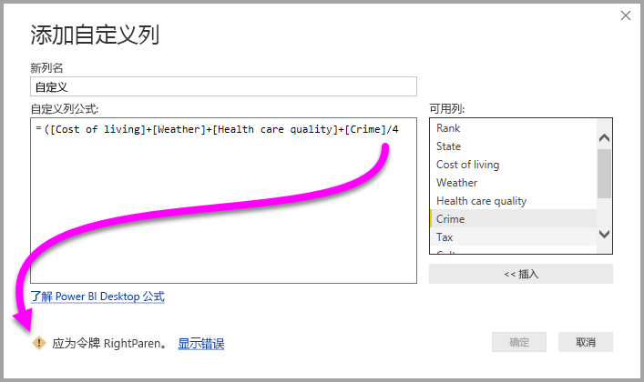
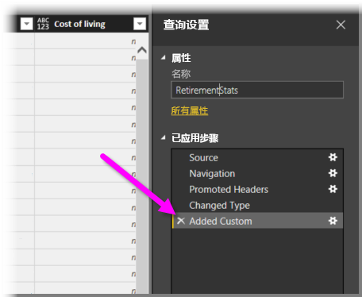
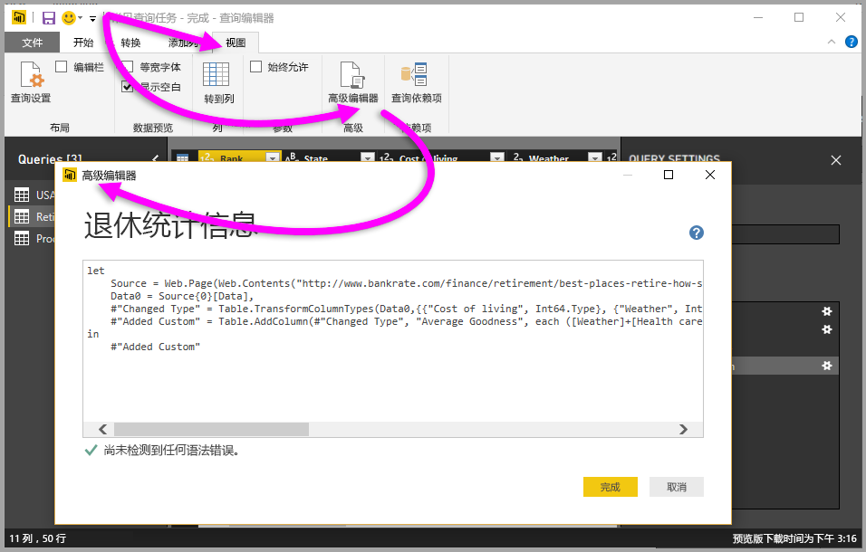

# 在 Power BI Desktop 中添加自定义列
你可以使用 **Power BI Desktop** 中的“查询编辑器”轻松地向模型添加新的自定义数据列。 可以使用易用按钮创建可定义自定义列的 [M 公式](https://msdn.microsoft.com/library/mt270235.aspx)，来创建和重命名自定义列。 M 公式包含[全面的函数引用内容集](https://msdn.microsoft.com/library/mt779182.aspx)。 

创建自定义列是在**查询编辑器**中创建的查询的另一个**应用的步骤**，这意味着可以随时对其进行更改、向前期或向后期移动或进行修改。

## 使用查询编辑器添加新的自定义列
要创建新的自定义列，请启动**查询编辑器**。 为此，可以在 **Power BI Desktop** 的“开始”功能区中选择“编辑查询”。

启动“查询编辑器”并加载一些数据后，可以通过在功能区上选择“添加列”选项卡，然后选择“自定义列”来添加自定义列。

此时，将出现“添加自定义列”窗口，我们将在下一节中对此进行讨论。

## “添加自定义列”窗口
在“添加自定义列”窗口中，将在右侧窗格中看到可用字段列表，在顶部看到自定义列的名称（只需在该文本框中键入新名称即可将它重命名），并看到基于从右侧插入字段、添加运算符或构建定义新自定义列的公式而创建（或编写）的 [M 公式](https://msdn.microsoft.com/library/mt779182.aspx)。 

## 创建自定义列的公式
可以从右侧的“可用列:”列表中选择一个字段，然后选择“<< 插入”，将其添加到自定义列公式中。 另外，也可以双击列表中的列进行添加。

键入公式并构建列时，在窗口底部，可看到实时（在输入时）告知是否检测到任何语法错误的指示器。 如果一切正常，你将看到一个绿色的选中标记。

但是，如果语法中存在某些错误，将看到一个黄色警告图标以及检测到的错误，还有将光标（在公式中）定位在检测到错误的位置的链接。

选择“确定”后，自定义列将添加到模型中，“已添加自定义”步骤将添加到查询的“应用的步骤”中。

如果双击“应用的步骤”窗格中的“已添加自定义”步骤，“添加自定义列”窗口将再次出现，你创建的自定义列公式也已加载，如有必要，可随时进行修改。

## 使用自定义列的高级编辑器
此外，还可以使用“高级编辑器”创建自定义列（并修改查询的任何步骤）。 在“查询编辑器”中，选择“查看”选项卡，然后选择“高级编辑器”来显示“高级编辑器”。

“高级编辑器”可使你完全控制查询。

## 后续步骤
创建自定义列还有一些其他方法，包括根据你向**查询编辑器**提供的示例创建列。 有关根据示例创建自定义列的详细信息，请参阅以下文章：

* [在 Power BI Desktop 中通过示例添加列](desktop-add-column-from-example.md)
* [M 公式语言简介](https://msdn.microsoft.com/library/mt270235.aspx)
* [M 函数引用](https://msdn.microsoft.com/library/mt779182.aspx)  

