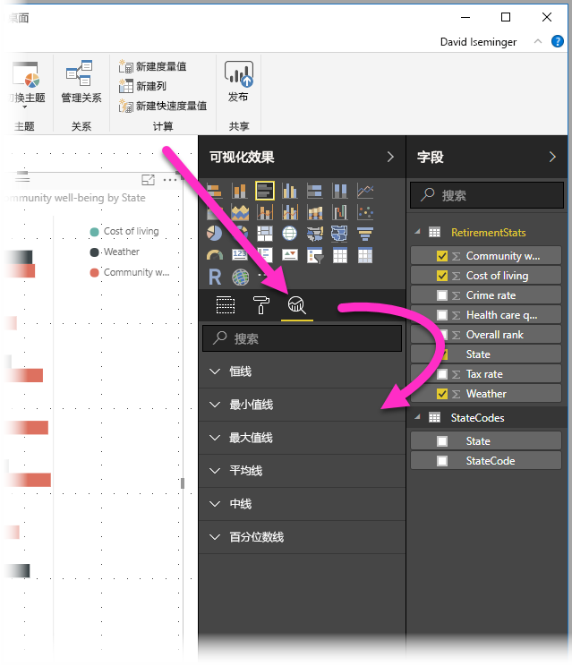
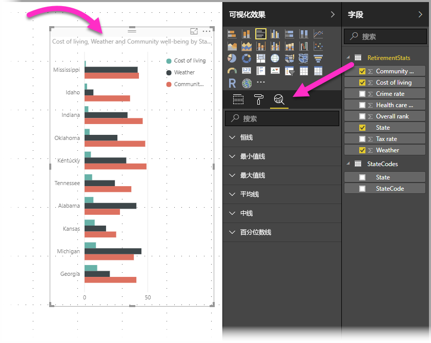
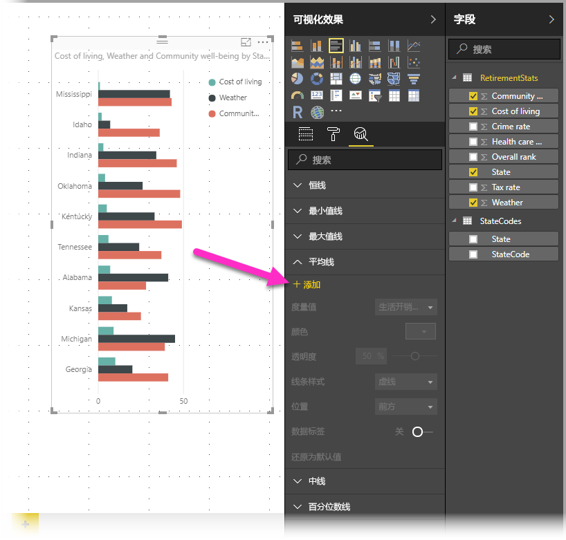
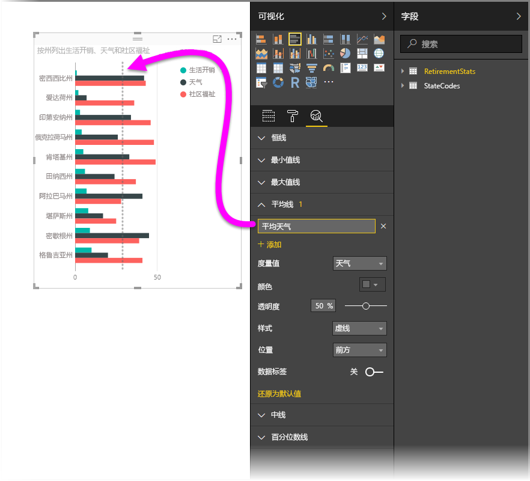
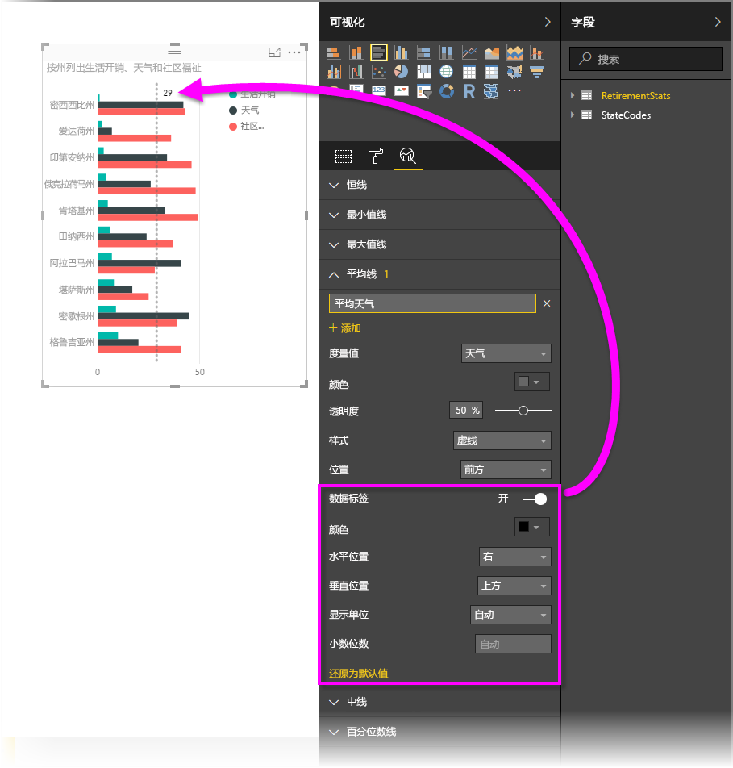
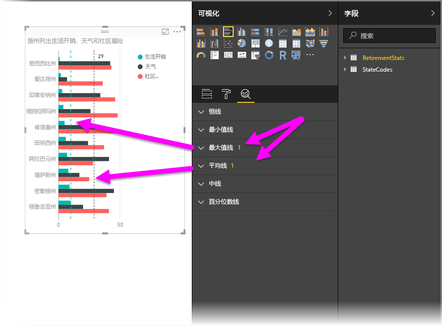
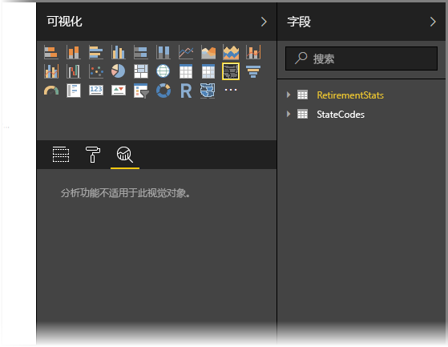
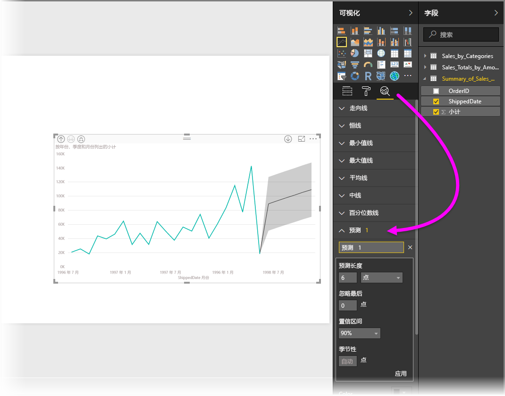

# 使用 Power BI Desktop 中的“分析”窗格
通过 **Power BI Desktop** 的“**分析**”窗格，你可以向视觉对象添加动态参考行，并重点关注重要趋势或见解。 “分析”窗格位于 Power BI Desktop 的“可视化效果”区域中。

> [!NOTE]
> 仅当在 Power BI Desktop 画布上选择视觉对象时才会显示“分析”窗格。

## 在“分析”窗格内搜索
自 2018 年 2 月版 Power BI Desktop（版本 2.55.5010.201 或更高版本）开始，可以在“分析”窗格内进行搜索，此窗格是“可视化效果”窗格的子节。 如下图所示，选中“分析”窗格时出现搜索框。

## 使用分析窗格
通过“**分析**”窗格，可以创建以下类型的动态参考行（并非所有的行都适用于所有视觉对象类型）：

* X 轴恒线
* Y 轴恒线
* 最小值线
* 最大值线
* 平均线
* 中线
* 百分位数线

以下各部分介绍如何在可视化效果中使用“**分析**”窗格和动态参考行。

若要查看视觉对象的可用动态参考行，请按照下列步骤操作：

1. 选择或创建视觉对象，然后从“**可视化效果**”部分选择“**分析**”图标。
   
   
2. 为想要创建的行类型选择向下箭头以展开其选项。 本示例中将选择“**平均线**”。
   
   
3. 若要创建一个新行，请选择“**+ 添加**”。 然后，可以通过双击文本框，键入名称来为行指定名称。
   
   对于行提供了各种选项，例如可以选择其“颜色”、“透明度”、“样式”和“位置”（与视觉对象的数据元素有关），以及是否包括标签。 重要的是，通过选择“度量值”下拉列表，可以选择想要行基于视觉对象中的哪个度量值，它会自动使用视觉对象中的数据元素予以填充。 本示例中将选择“天气”作为度量值，对其设置“平均天气”标签，并对其他几个选项进行自定义，如下所示。
   
   
4. 如果想要显示数据标签，请将“**数据标签**”滑块移至开启状态。 执行此操作可以为数据标签获取大量其他选项，如下图所示。
   
   
5. 请注意“**分析**”窗格中的“**平均线**”项旁显示的数目。 它指出目前在视觉对象上所拥有的动态行的数量和类型。 如果为“**生活成本**”添加了“最大值线”，则可以看到“**分析**”窗格显示现在也有适用于该视觉对象的“**最大值线**”动态参考行。
   
   

如果所选择的视觉对象不能具有对其适用的动态参考行（本示例中为**映射**视觉对象），则会在选择“**分析**”窗格时看到以下信息。

通过使用“**分析**”窗格创建动态参考行，可以突出显示各种有趣的见解。

我们正在计划开发更多的特性和功能，其中包括扩展可以具有适用动态参考行的视觉对象，因此请经常查看其新增功能。

## 应用预测
选择可视化对象，然后展开“**分析**”窗格的“**预测**”部分即可使用“**预测**”功能。 可以指定多个输入以修改预测，例如预测长度、置信区间等。 下图显示了已应用预测功能的基本行视觉对象，你可以使用自己的想象力（并使用预测功能）来查看它是如何应用到你的模型的。

## 限制
是否能使用动态参考行取决于正在使用的视觉对象的类型。 下表显示动态行当前适用的视觉对象：

动态行完全适用于以下视觉对象：

* 分区图
* 折线图
* 散点图
* 簇状柱形图
* 簇状条形图

以下视觉对象仅能使用“**分析**”窗格中的恒线：

* 堆积面积图
* 堆积条形图
* 堆积柱形图
* 百分比堆积条形图
* 百分比堆积柱形图

对于以下视觉对象，趋势线是当前仅有的选项：

* 非堆积折线图
* 簇状柱形图

最后，非笛卡尔视觉对象当前无法应用“**分析**”窗格中的动态行，例如：

* 矩形图
* 饼图
* 圆环图
* 表格

只有在使用 Power BI Desktop 中的导入数据，或在实时连接到运行 Analysis Service 2016 或更高版本、Azure Analysis Services 的服务器上的模型或连接到 Power BI 服务上的数据集时，才能使用百分位数线。 

## 后续步骤
Power BI Desktop 可用于执行多种操作。 有关其功能的详细信息，请参阅下列资源：

* [Power BI Desktop 中的新增功能](desktop-latest-update.md)
* [下载 Power BI Desktop](desktop-get-the-desktop.md)
* [Power BI Desktop 入门](desktop-getting-started.md)
* [Power BI Desktop 的查询概述](desktop-query-overview.md)
* [Power BI Desktop 中的数据类型](desktop-data-types.md)
* [使用 Power BI Desktop 调整和合并数据](desktop-shape-and-combine-data.md)
* [Power BI Desktop 中的常见查询任务](desktop-common-query-tasks.md)    

