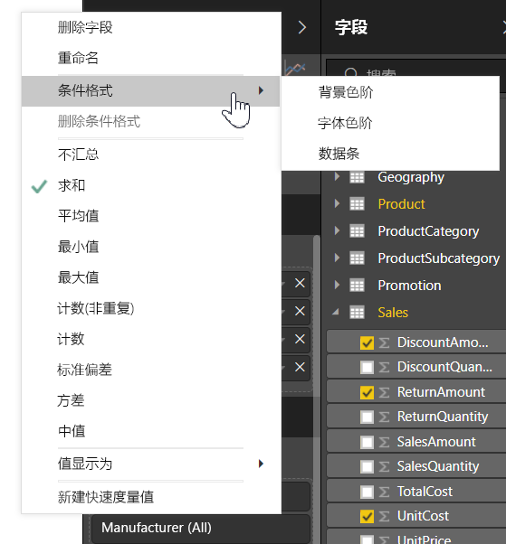
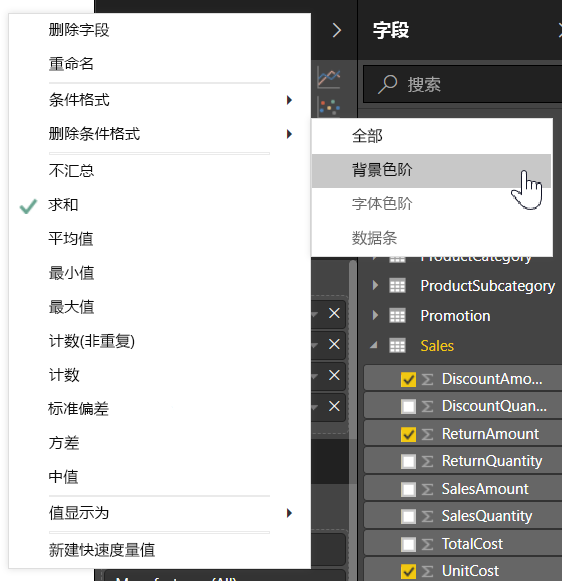
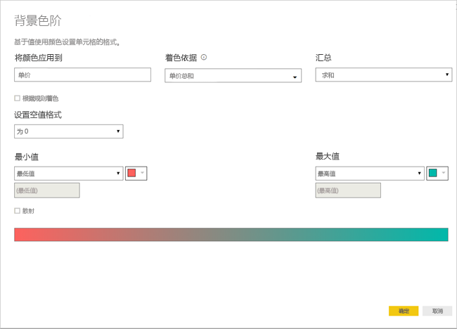
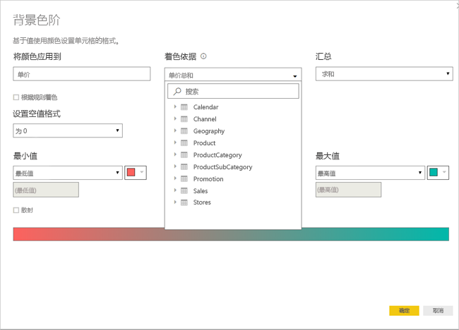
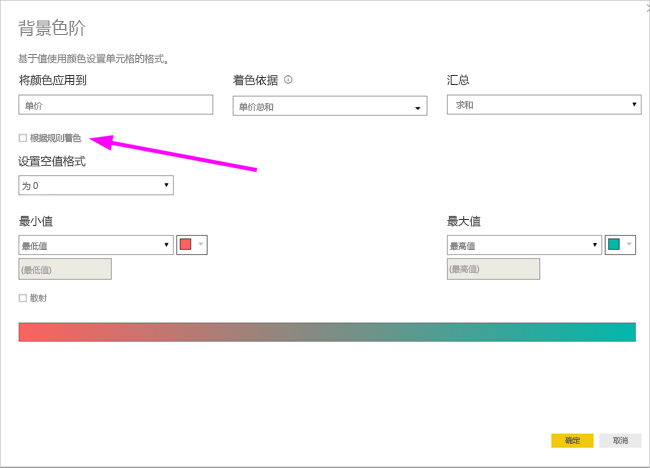
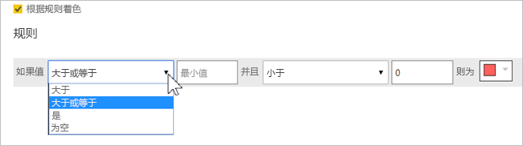
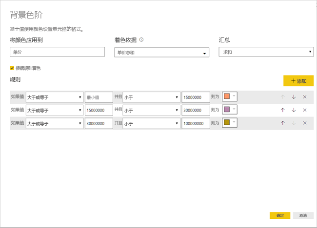
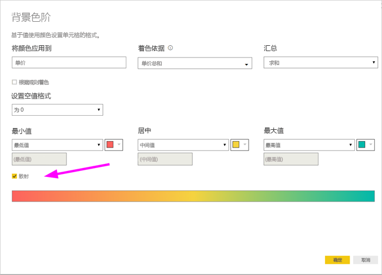
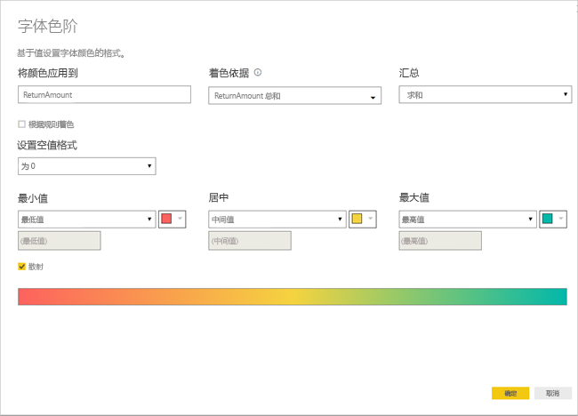
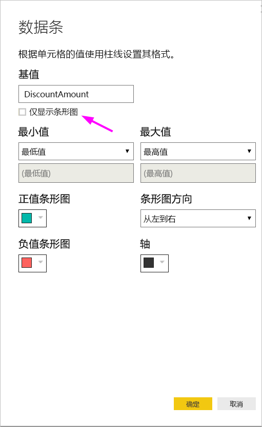

# 表格中的条件格式设置 
通过表格的条件格式设置，可根据单元格值或其他值/字段指定自定义单元格颜色，包括使用渐变色。 也可用数据条显示单元格值。 

若要访问条件格式，请在 Powr BI Desktop“可视化效果”窗格的“字段”格中，选择要设置其格式的“值”格中值旁边的向下箭头（或右键单击该字段）。 只能管理“字段”格的“值”区域中字段的条件格式。

以下各节逐一介绍了这些条件格式选项。 可在单个表列中使用一个选项或组合使用多个选项。

> [!NOTE]
> 应用到表后，条件格式将替代应用到已进行条件格式设置的单元格的任意自定义表格样式。

若要从可视化效果中删除条件格式，只需再次右键单击该字段，并选择删除条件格式和要删除的格式类型即可。

## 背景色阶

选择“条件格式”和“背景色阶”后，将显示以下对话框。

可通过将数据模型中的某一字段设置为“着色依据”，选择将其作为着色依据。 此外，可使用“汇总”值，为选定字段指定聚合类型。 在“将颜色应用到”字段中指定要着色的字段，以便进行跟踪。只要选择一个数值作为格式设置的基础，即可将条件格式应用于文本和日期字段。

若要对给定值范围使用离散的颜色值，请选择“根据规则着色”。 若要使用色谱，请将“根据规则着色”保持为未选中状态。 

### 根据规则着色

选择“根据规则着色”后，可以输入一个或多个值范围，每个范围使用一种设定的颜色。  每个值范围以“如果”值条件、“和”值条件和一种颜色开头。

使用给定颜色填充包含处于每个范围内的值的表单元格。 下图中包含三条规则。

示例表现如下所示：

### 最小值到最大值着色

可以配置最小值和最大值及其颜色。 如果选择“散射”框，还可以配置一个可选的“居中”值。

示例表现如下所示：

## 字体色阶

选择“条件格式”和“字体色阶”后，将显示以下对话框。 此对话框类似于“背景色阶”对话框，但更改的是字体颜色而不是单元格背景色。

示例表现如下所示：

## 数据条

选择“条件格式”和“数据条”后，将显示以下对话框。 

默认情况下，“仅显示数据条”选项处于未选中状态，因此表格单元格同时显示数据条和实际值。

如果“仅显示数据条”选项处于选中状态，表单元格将仅显示数据条。

## 按字段值设置颜色格式

可以使用度量值或列指定一种颜色，或者使用文本值或十六进制代码，将该颜色应用于表或矩阵视觉对象的字体颜色背景。 此外，还可以为给定字段创建自定义逻辑，使该逻辑向字体或背景应用所需的颜色。

例如，下表中包含与每个产品型号关联的颜色。 

若要根据其字段值设置该单元格格式，可通过右键单击该视觉效果的“颜色列”选择“条件格式”对话框，在此例中，选择菜单中的“背景色”。 

在出现的对话框中，选择“格式设置依据”下拉区域中的“字段值”，如下图所示。

可对字体颜色重复该过程，生成的视觉对象使用颜色列中的纯色，如下面的屏幕中所示。

此外，还可以基于业务逻辑创建一个 DAX 计算，根据首选条件输出不同的十六进制代码。 这通常比在条件格式对话框中创建多个规则更容易。 请考虑以下示例图像中的 ColorKPI。

然后，可通过以下方式设置“背景色”的字段值。

然后可获得类似以下矩阵的结果。

可以创建多个版本，只需动用你的想象力和一点 DAX 即可。

## 后续步骤
有关详细信息，请参阅以下文章：  

* [Power BI 中颜色格式设置的提示和技巧](service-tips-and-tricks-for-color-formatting.md)  

