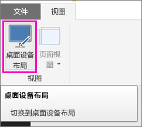
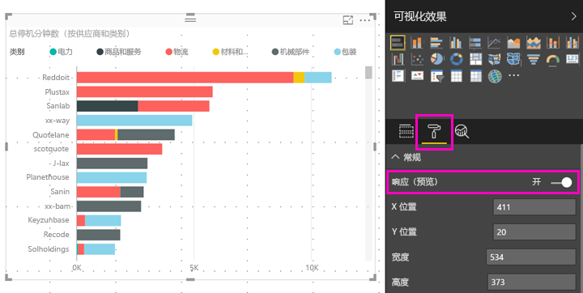

# 将 Power BI 视觉对象优化为适应任意大小
可以将仪表板或报表中的视觉对象设置为响应式，即动态缩放，尽可能显示最多的数据和见解，无论屏幕大小如何。

在视觉对象缩放时，Power BI 会优先确保显示数据视图。例如，自动删除填充，并将图例移至视觉对象顶部，这样即便视觉对象变小，也仍可提供信息。 在手机上的 Power BI 移动应用中，响应式视觉对象尤为有用。

可以为任何包含 X 轴、Y 轴和切片器的视觉对象启用响应式视觉对象重设大小。

## 在 Power BI Desktop 中启用响应式设置
1. 在 Power BI Desktop 的“视图”选项卡上，确保自己处于“桌面设备布局”中。
   
    
2. 选择视觉对象，在“可视化效果”窗格中，选择“格式”部分。
3. 展开“常规”，并将“响应式”滑至“开”。
   
    
   
     现在，[创建更适合在手机上显示的报表](desktop-create-phone-report.md)并添加此视觉对象后，它可以流畅地重设大小。

## 在 Power BI 服务中启用响应式设置
在 Power BI 服务中，为报表中的视觉对象启用响应式设置。 必须能够编辑报表。

1. 在 Power BI 服务 ([https://powerbi.com](https://powerbi.com)) 中，选择报表中的“编辑报表”。
2. 选择视觉对象，在“可视化效果”窗格中，选择“格式”部分。
3. 展开“常规”，并将“响应式”滑至“开”。
   
    
   
     现在，[创建仪表板的手机视图](service-create-dashboard-mobile-phone-view.md)并添加此视觉对象后，它可以流畅地重设大小。

## 后续步骤
* [创建针对 Power BI 手机应用的优化报表](desktop-create-phone-report.md)
* [在 Power BI 中创建仪表板电话视图](service-create-dashboard-mobile-phone-view.md)
* [查看针对你的电话进行优化的 Power BI 报表](mobile-apps-view-phone-report.md)
* 更多问题？ [尝试咨询 Power BI 社区](http://community.powerbi.com/)

