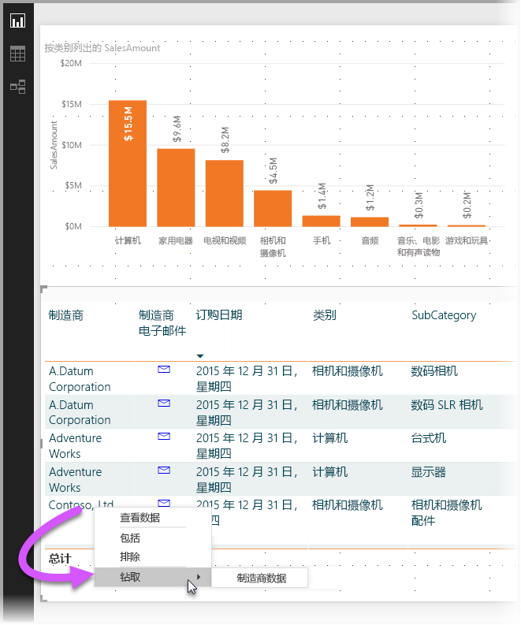
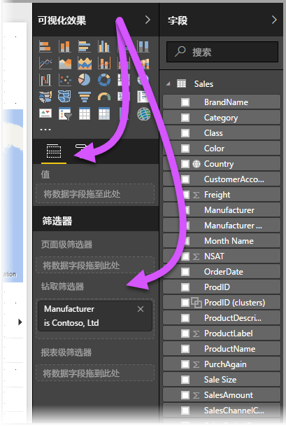
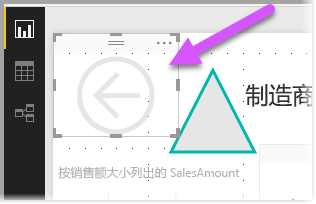
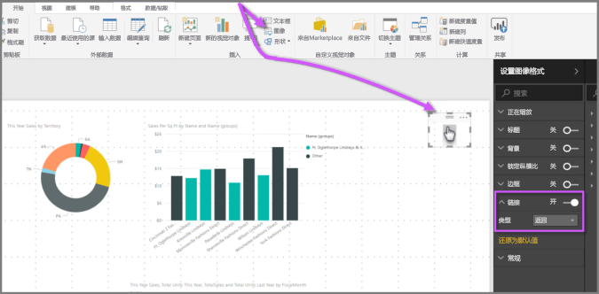
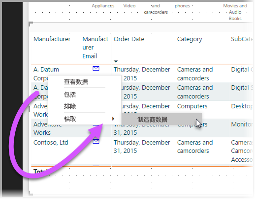

# 在 Power BI Desktop 中使用钻取
通过在 Power BI Desktop 中使用钻取，可以在报表中创建一个侧重于特定实体（如供应商、客户或制造商）的页。 有了这个针对性报表页，用户就可以在其他报表页上右键单击数据点，钻取到具有针对性的页，来获取针对此上下文进行筛选后的详细信息。

## 使用钻取
**若要使用钻取**，请创建一个具有视觉对象的报表页，这些视觉对象应该服务于你计划为其提供钻取的实体类型。 例如，如果要为制造商提供钻取，所创建钻取页中的视觉对象就应该体现总销售额、总出货量、按类别筛选的销售额、按地区筛选的销售额等等。 这样一来，当你钻取到该页时，视觉对象将特定于你单击并选择钻取数据的制造商。

然后，在该钻取页上“可视化效果”窗格的“字段”部分，将你要钻取数据的字段拖动到“钻取筛选器”框中。

将字段添加到“钻取筛选器”框中后，Power BI Desktop 会自动创建“返回”按钮视觉对象。 该视觉对象在已发布的报表中变成一个按钮，使在 Power BI 服务中使用报表的用户可轻松返回到原始报表页（他们选择进行钻取的页）。

由于“返回”按钮是一个图像，可以使用你想要的任何图像来替换此视觉对象的图像，而且它仍然可以作为按钮正常运行，让报表使用者返回到原始页面。 若要为“返回”按钮使用你自己的图像，只需在钻取页上放置一个图像视觉对象，然后选择视觉对象，并启动“返回”按钮滑块。 这将使你的图像作为“返回”按钮运行。

当“钻取”页完成时，如果用户在你的报表中（报表使用你在钻取页上“钻取筛选器”框中输入的字段）右键单击数据点，上下文菜单会随即出现，以便用户钻取到该页。

当用户选择钻取时，会对该页进行筛选，显示他们右键单击的数据点的相关信息。 例如，如果他们右键单击有关 Contoso（制造商）的数据点，并选择钻取，那么他们所转到的钻取页将被筛选到 Contoso。

> [!NOTE]
> 只有“钻取筛选器”框中的字段才会被传递到钻取报表页。 不会传递其他上下文信息。
> 
> 

这就是在报表中使用钻取的全部内容。 通过这个有用的方法，用户可以获取选择用于钻取筛选器的实体信息的扩展视图。

