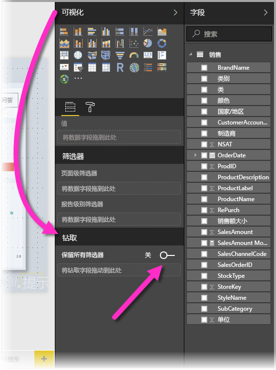
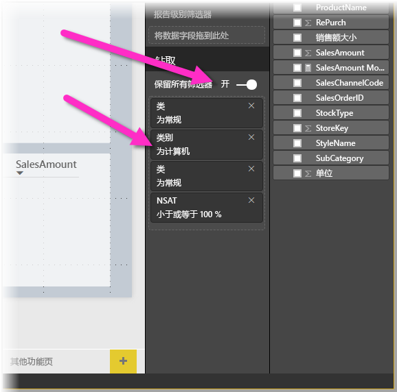
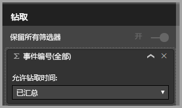

# 在 Power BI Desktop 中使用钻取
通过在 Power BI Desktop 中使用钻取，可以在报表中创建一个侧重于特定实体（如供应商、客户或制造商）的页。 有了这个针对性报表页，用户就可以在其他报表页上右键单击数据点，钻取到具有针对性的页，来获取针对此上下文进行筛选后的详细信息。

## 使用钻取
1. 若要使用钻取，请创建一个具有视觉对象的报表页，这些视觉对象应该服务于你计划为其提供钻取的实体类型。 

    例如，如果要为制造商提供钻取，所创建钻取页中的视觉对象就应该体现总销售额、总出货量、按类别筛选的销售额、按地区筛选的销售额等等。 这样一来，当你钻取到该页时，视觉对象将特定于你所选的制造商。

2. 然后，在该钻取页上“可视化效果”窗格的“字段”部分，将你要钻取数据的字段拖动到“钻取筛选器”框中。

    

    将字段添加到“钻取筛选器”框中后，Power BI Desktop 会自动创建“返回”按钮视觉对象。 该视觉对象在已发布的报表中变成一个按钮，使在 Power BI 服务中使用报表的用户可轻松返回到原始报表页（他们选择进行钻取的页）。

    

## 使用你自己的图像作为“后退”按钮    
 由于“后退”按钮是一个图像，可以使用你想要的任何图像来替换此视觉对象的图像，而且它仍然可以作为“后退”按钮正常运行，以便报表使用者可以返回到原始页面。

1. 在“开始”选项卡上，单击“图像”，然后找到图像并将其放置在钻取页上。
2. 在“钻取”页的“格式图像”部分下方选择新的图像，将“链接”滑块设置为“开”，并将“类型”设置为“后退”。 你的图像现充当“后退”按钮。

    

    当“钻取”页完成，且用户在你的报表中（报表使用你在“钻取筛选器”框中输入的字段）右键单击数据点，上下文菜单会随即出现，以支持钻取到该页。

    

    当报表使用者选择钻取时，会对该页进行筛选，显示他们右键单击的数据点的相关信息。 例如，如果他们右键单击有关 Contoso（制造商）的数据点，并选择钻取，那么他们所转到的钻取页将被筛选到 Contoso。

## 传递钻取中的所有筛选器

自 2018 年 5 月版的 Power BI Desktop 起，可将已应用的所有筛选器传递到“钻取”窗口。 例如，可能只选择了某个类别的产品，筛选到该类别的视觉对象，然后选择“钻取”。 可能想要了解在应用了所有这些筛选器时该钻取操作的呈现情况。

要保留已应用的所有筛选器，在“可视化效果”窗格的“钻取”部分中，仅需将“传递所有筛选器”开关设置为“开”即可。 

在 2018 年 5 月之前的 Power BI Desktop 版本中，该行为等同于将此开关设置为“关”。

钻取视觉对象时，可看到由于源视觉对象应用了临时筛选器而导致被应用的筛选器。 在“钻取”窗口中，以斜体显示这些临时筛选器。 

请注意，可使用工具提示页执行此操作，但这将是一种奇怪的体验（工具提示似乎无法正常工作），因此不建议使用工具提示执行此操作。

## 将度量值添加到钻取

除了将所有筛选器传递到钻取窗口之外，还可向钻取区域添加度量值（或汇总数字列）。 只需将钻取字段拖动到“钻取”卡即可应用。 

添加度量值（或汇总数字列）时，如果视觉对象的“值”区域使用了该字段，则可钻取到页面。

在报表中使用钻取就是这么简单。 通过这个有用的方法，用户可以获取选择用于钻取筛选器的实体信息的扩展视图。

## 后续步骤

你可能还会对以下文章感兴趣：

* [在 Power BI Desktop 中使用切片器](desktop-slicers.md)

