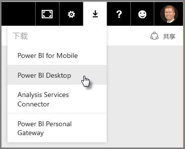

# Power BI Desktop 入门
欢迎使用 **Power BI Desktop 入门指南**。 此 Power BI Desktop 简短教学课程能让你熟悉它的运作方式、示范它的功能以及加速你构建稳固数据模型的能力 - 以令人惊叹的报表增强你的商业智慧工作。 

更愿意观看而不是阅读吗？ 欢迎[观看我们的入门视频](desktop-videos.md)。 如果你想要遵循视频及相匹配的示例数据，则可[下载此示例性 Excel 工作簿](http://go.microsoft.com/fwlink/?LinkID=521962)。

Power BI Desktop 可让你创建查询、数据连接和报表的集合，轻松地与他人共享。 Power BI Desktop 集成了经验证的 Microsoft 技术 – 强大的查询引擎、数据建模和可视化效果 – 与在线 [**Power BI 服务**](https://app.powerbi.com/)无缝配合。

通过将 **Power BI Desktop** 其中分析师和其他人可以创建功能强大的数据连接、模型和报表）和 [**Power BI 服务**](https://preview.powerbi.com/)（其中可以共享 Power BI Desktop 报表，因此用户能够查看并与其进行交互）相结合，数据世界的新见解可以更轻松地建模、生成、共享和扩展。

数据分析师会发现 Power BI Desktop 是个功能强大、有弹性且高度可存取的工具，可以连接和塑造数据世界、构建稳固的模型以及制作结构良好的报表。

## 如何使用本指南
你可以使用好几种方法使用本指南 - 扫描它以取得快速概述，或阅读每一部分以充分了解 Power BI Desktop 的运作方式。

如果你赶时间，可以在几分钟内快速扫视本指南，并且能够判断 Power BI Desktop 的运作方式及其使用方法。 本指南的大部分内容是以视觉方式演示 Power BI Desktop 的运作方式的画面。

若要更深入了解，你也可以阅读每一部分、执行这些步骤，然后带走你自己的 Power BI Desktop 文件，该文件随时都可发布到 **Power BI** 服务，并与他人共享。

>[!NOTE]
>此外，还有一个称作 [**Power BI 报表服务器**](report-server/get-started.md)的 **Power BI** 独立专业版本，它面向需要在本地保留数据和报表的客户。 与该专业版本配合使用的，还有一个称作**适用于 Power BI 报表服务器的 Power BI Desktop** 的 **Power BI Desktop** 独立专业版本，该版本仅适用于 Power BI 的报表服务器版本。 本文介绍标准版 **Power BI Desktop**。

## Power BI Desktop 工作原理
使用 Power BI Desktop，你可以 *连接到数据* （通常多个数据源）， *调整该数据* （使用能生成具洞察力、吸引力的数据模型的查询），以及使用该模型来 *创建报表* （他人可以利用、以其为基础构建并共享）。

按你要求完成步骤后（连接、调整和报表），你可以将工作保存为 Power BI Desktop 文件格式，其扩展名为 .pbix。 Power BI Desktop 文件可以像其他文件一样共享，但共享 Power BI Desktop 文件最引人注目的方式是将其上传（共享）到 [**Power BI 服务**](https://preview.powerbi.com/)。 

Power BI Desktop 会集中、简化并效率化设计与创建商业智能存储库和报表的程序，这些程序可能是散乱、不相关且棘手的。

准备好要试一试吗？ 让我们开始吧。

## 安装并运行 Power BI Desktop
你可以在 **Power BI** 服务中下载 Power BI Desktop，方法是先选择**齿轮**图标，然后选择 **Power BI Desktop**。

Power BI Desktop 会当作一个应用程序进行安装，并在桌面上运行。

当你运行 Power BI Desktop 时，将显示 *欢迎* 界面。

你可以直接从 *欢迎* （左窗格中的链接）界面 **获取数据** 、查看 **最近的数据源** 或 **打开其他** **报表** 。 如果关闭该界面（选择右上角的 **x**），则会显示 Power BI Desktop 的**报表**视图。

Power BI Desktop 中有三种视图：**报表**视图、**数据**视图和**关系**视图。 Power BI Desktop 还包含 **查询编辑器**，其会在单独的窗口打开。 在**查询编辑器**中，你可以生成查询和转换数据，然后将经过优化的数据模型加载到 Power BI Desktop，并创建报表。

下面的屏幕沿 Power BI Desktop 左侧自上而下显示了三个视图图标：**报表**、**数据**和**关系**。 当前显示的视图以左侧的黄色条表示。 在此示例中，当前显示了**报表**视图。 你可以通过选择这三个图标的任意一个更改视图。

安装 Power BI Desktop 后，你就可以连接到数据、调整数据以及生成报表（通常是依此顺序）。 在下面几部分中，我们会依次介绍每一项。

## 连接到数据
安装 Power BI Desktop 后，你就可以连接到持续扩展的数据世界。 查询窗口中有 *各种* 可用的数据源。 下图显示了如何连接到数据，通过选择**开始**功能区，然后选择**获取数据 \> 更多**。

 

在此快速教程中，我们将连接到几个不同的 **Web** 数据源。

假设你即将退休 – 你想要住在很多阳光、税制合理且具有良好医疗卫生的地方 - 或者也许你是数据分析师，你想要该信息来帮助你的客户。 例如，你可能希望帮助太阳镜零售商达到最晴朗区域的销售量。

无论如何，下列 Web 资源具有关于这些话题的相关和详细数据：

[*http://www.bankrate.com/finance/retirement/best-places-retire-how-state-ranks.aspx*](http://www.bankrate.com/finance/retirement/best-places-retire-how-state-ranks.aspx)

选择**获取数据 \> Web** 并粘贴地址。

 

选择**确定**后，Power BI Desktop 的**查询**功能就会开始运行。 查询会联系 Web 资源，**导航器**窗口将返回它在此网页上找到的信息。 在本例中，它找到一个表格（ *表格 0* ）和整个 Web 文档。 我们对该表有兴趣，因此我们从列表中选择它。 **导航器**窗口会显示预览。

 

此时我们可以通过从窗口底部选择**编辑**，先编辑查询再加载表，或者我们可以直接加载表。

选择**编辑**后，查询编辑器就会启动并且会呈现表的代表视图。 会显示**查询设置**窗格（若未显示，可以从功能区选择**视图**，然后依次选择**显示 \> 查询设置**来显示**查询设置**窗格）。 以下是其外观。

 

有关连接到数据的详细信息，请参阅[通过 Power BI Desktop 连接到数据](desktop-connect-to-data.md)。

下一部分，我们将调整数据，使其满足我们的需求。 调整连接数据的过程被称为 *调整* 数据。

## 调整和合并数据
由于我们已经连接到数据源，我们需要调整数据以符合我们的需求。 有时候调整意味着 *转换* 数据，例如重命名列或表格、将文字更改为数字、删除行、将第一列设置为标题列等。

Power BI Desktop 中的查询编辑器除能在功能区中提供可用的工作，还能够充分利用右键菜单。 大部分可在**转换**功能区选择的内容也可通过右键单击项目（如某列）并从所显示的菜单中进行选择。

## 调整数据
如果在**查询编辑器**中调整数据，你将在**查询编辑器**加载并呈现数据时提供分步说明（**查询编辑器**将为你执行此操作）以调整数据。 原始数据源不受影响，将仅调整或 *整理* 这一特定的数据视图。

**查询编辑器**会记录你指定的步骤（如重命名表格、转换数据类型或删除列），且每当此查询连接到数据源时，都会执行这些步骤，因此数据将始终按你指定的方式进行调整。 每当你在 Power BI Desktop 中使用查询时，或任何人使用你的共享查询（在如 **Power BI** 服务上）时，都会进行过程。 这些步骤是在**所应用步骤**下**查询设置**窗格中按顺序进行捕获的。

下图显示已调整查询的**查询设置**窗格，我们将于接下来几个段落中逐一说明每个步骤。

 

让我们回到退休数据（退休数据是我们通过连接到 Web 数据源找到的），并调整数据以符合我们的需求。

对于初学者，大部分评分都是以整数带入至**查询编辑器**，但并非全都如此（一个列包含了文本和数字，因此它不会自动转换）。 而我们需要该数据为数字。 没问题 – 只要右键单击数据列标题，然后选择**更改类型 \> 整数**来更改数据类型。 如果我们需要选择多个数据列，可以先选择数据列然后再按住 **Shift**，选择其他相邻的数据行，然后右键单击数据列标题以更改所有选择的数据列。 你也可以使用 **Ctrl** 选择非相邻的数据列。

 

你还可以使用 **转换** 功能区，将那些数据列从文本更改或 *转换* 为标题。 **转换**功能区显示如下，其中箭头指向**数据类型**按钮，可用于将当前数据类型转换成其他数据类型。

 

注意，在**查询设置**中，**所应用步骤**会反映已做的更改。 如果要删除调整过程中的任何步骤，只需选择该步骤，然后选择步骤左边的 **X**。

 

我们需要再做一些更改，让查询位于我们想要的位置：

* *删除第一列* – 不需要此列，它仅包含指出“查看你所在州的退休评级”的重复行，这是此数据源成为基于 Web 的表格的项目

<!-- -->

* *修复一些错误* – 在网页上，有一列有混合数字的文字（某些州结合在一个类别中）。 其在该网站上运作很好，但并不适合我们的数据分析。 （在此示例中）错误很容易修复，并显示了**查询编辑器**及其**所应用步骤**中一些很棒的特性和功能。

<!-- -->

* *更改表格名称* - **表格 0**不是有用的描述符，但更改它很简单

每个步骤都演示于**[在 Power BI Desktop 中调整和合并数据](desktop-shape-and-combine-data.md)**。 欢迎参阅该页面，或继续阅读这份文档，了解你接下来要做什么。 下一部分会在应用上述更改之后继续。

## 合并数据
有关各州的那份数据很有趣，而且适用于生成其他分析工作和查询。 但是有一个问题：大多数数据使用两个字母的州名代码缩写，而不是该州的完整名称。 我们需要某种方式来建立州名及其缩写的关联。

我们很幸运：有另一个公共数据源可执行该项工作，但还需要进行相当多的调整，才能连接到我们的退休表。 以下是州名缩写的 Web 资源：

<http://en.wikipedia.org/wiki/List_of_U.S._state_abbreviations>

从**查询编辑器**中的**开始**功能区，选择**获取数据 \> Web** 并键入地址，选择**确定**，**导航器**窗口将显示它在此网页上找到的信息。

 

我们选择**编辑表**，因为它包含我们想要的数据，但它需要大量调整才能将表格中的数据削减到所需数据。 每个步骤都演示于**[在 Power BI Desktop 中调整和合并数据](desktop-shape-and-combine-data.md)**。 汇总这些步骤，下面是我们要执行的操作：

选择**编辑**，然后：

* *删除前两行* – 它们是创建网页表格所产生的，不是所需的行。

<!-- -->

* *删除底部的 26 行* – 它们全是地区，无需包含在内。

<!-- -->
* *筛选出华盛顿特区* – 退休统计数据的表不包含华盛顿特区，因此我们从列表中将其排除。

<!-- -->

* *删除一些不必要的列* – 只需将州映射到其两个字母的官方缩写，因此可以删除其他数据列。

<!-- -->

* *将第一行用作标题* - 由于已删除前 3 行，所以当前的首行就是所需的标题。

    >[!NOTE]
    >此时非常适合指出：查询编辑器所应用步骤的序列是至关重要的，可能会影响数据调整的方式。 同时也必须考虑一个步骤对另一个后续的步骤可能会有什么影响；如果你从**所应用步骤**中删除一个步骤，则由于查询中步骤顺序的影响，后续步骤可能不会按原本所期望的方式进行。

* *重命名列和表格本身* – 通常会有几种方式可以重命名列，你可以选择你偏好的方式。

调整 *StateCodes* 表格后，我们可以将这两个表或查询合并成一个。由于当前具有的表格是我们对数据应用查询的结果，因此它们通常称为 *查询* 。

有两种主要方法可合并查询 – *合并* 和 *追加* 。

当你有一列或多列要添加到另一个查询时，你可**合并**这些查询。 当你有其他列要添加到现有查询时，你可**追加**查询。

本例中，我们要合并查询。 首先，我们选择想让其他查询合并 *进去* 的查询，然后从功能区的 **开始** 选项卡中选择 **合并查询** 。

 

将显示**合并**窗口，提示我们选择想要合并到所需表中的表格，然后选择要用于合并的匹配列。 从 *RetirementStats* 表（查询）中选择 *州* ，然后选择 *StateCodes* 查询（本例中很简单，因为仅有一个其他查询 - 在连接到多个数据源时，存在可从中选择的多个查询）。 在选择正确的匹配列时（ *RetirementStats* 中的 *州* ， *StateCodes* 中的 *州名* ）， **合并** 窗口如下所示，且 **确定** 按钮已启用。

 

在查询的结尾会创建 **NewColumn**，它是与现有查询合并的表（查询）内容。 来自合并查询的所有列均压缩到 **NewColumn** 中，但可选择**展开**表格并包含所需的任意列。 若要展开合并的表格，并选择要包含的列，请选择展开图示 ()。 **展开**窗口随即出现。

 

在此示例中，我们只需要 *州代码* 列，因此仅选择此列，然后选择 **确定** 。 清除 **使用原始列名作为前缀** ，因为我们不需要也不想要它，如果我们保留选择它，则合并的列将命名为 *NewColumn.State Code* （原始列名，或 *NewColumn* ，然后接一个点，再接要带入查询的列名）。

>[!NOTE]
>想尝试了解如何引入此 NewColumn 表吗？ 你可以试验一下，如果不喜欢结果，只需从**查询设置**窗格中**所应用步骤**列表删除该步骤，你的查询便会回到应用**展开**步骤之前的状态。 这就像是个自由重做的机会，你可以不限次数地任意执行，直到展开过程看起来是你要的方式为止。

我们现在有合并两个数据源的单一查询 （表格），其中每个数据源都已经过调整以符合我们的需求。 此查询可以作为许多其他相关数据连线的基础 – 例如任何州的住房成本统计数据、人口统计数据或工作机会。

有关每个调整及合并数据步骤的更完整说明，请参阅[在 Power BI Desktop 调整和合并数据](desktop-shape-and-combine-data.md)。

到目前为止，我们有足够的数据在 Power BI Desktop 内创建一些相关报表。 由于这是一个里程碑，让我们保存该 Power BI Desktop 文件 – 我们称它为 **Power BI Desktop 入门**。 若要在**查询编辑器**应用更改，并将其加载到 Power BI Desktop，请从**开始**功能区选择**关闭并应用**。

## 生成报表
加载表格之后可以进行其他更改，而且你可以重新加载模型来应用所做的任何更改。 但是目前这样就够了。 在 Power BI Desktop **报表**视图中，你可以开始生成报表。

**报表**视图具有五个主要区域：

1. 功能区，用于显示与报表和可视化效果相关联的常见任务
2. **报表**视图或画布，可在其中创建和排列可视化效果
3. 底部的**页面**选项卡，用于选择或添加报表页
4. **可视化效果**窗格，你可以在其中更改可视化效果、自定义颜色或轴、应用筛选器、拖动字段等
5. **字段**窗格，可在其中将查询元素和筛选器拖到**报表**视图，或拖到**可视化效果**的**筛选器**窗格
   
   

通过选择边缘的小箭头，可以折叠**可视化效果**和**字段**窗格，以便在**报表**视图中提供更多空间以生成炫酷的可视化效果。 修改可视化效果时，你会看到这些箭头朝上或朝下，这意味着你可以相应展开或折叠该部分。

 

若要创建可视化效果，只需将字段从**字段**列表拖到**报表**视图即可。 在此示例中，我们来拖动 *RetirementStats* 中的 *州* 字段，看看会发生什么。

 

看一下...Power BI Desktop 自动创建了基于地图的可视化效果，因为它识别到 *州* 字段包含地理位置数据。

注意，在**可视化效果**窗格中，可以选择不同类型的可视化效果，而且在那些图示下方的区域中，可以将字段拖至不同区域以应用图例，或修改可视化效果。

 

快进一点看看**报表**视图在添加了一些可视化效果以及新报表页面之后的外观。 有关报表的详细信息，请参阅 [Power BI Desktop 中的报表视图](desktop-report-view.md)。

报表第一页提供的是基于 *总体排名* 的数据分析。 当我们选择一个可视化效果，**字段和筛选器**窗格将显示所选字段和可视化效果的结构（字段应用到**共享轴**、**列值**和**行值**）。

 

该报表有 6 **页**，每一页都以可视方式显示了数据的某些元素。

1. 如上所示的第一页显示了基于 *总体排名* 的所有州。
2. 第二页侧重于基于 *总体排名* 的前十个州。
3. 在第三页中，显示生活成本最高的前 10 个州（及相关联的数据）。
4. 第四页的重点是天气，筛选为 15 个最晴朗的州。
5. 第五页绘制排名靠前的 15 个州的社区福利图表并将其可视化。
6. 最后一页，可视化犯罪统计数据，显示最佳（和最差）的 10 个州。

下面是着重于生活成本的报表页面外观。

 

你可以创建各种相关报表和可视化效果。

## 共享工作
由于我们已经有相当完整的 Power BI Desktop 报表，我们可以在 **Power BI** 服务上与他人共享。 有几种方法可以在 Power BI Desktop 中共享你的工作。 你可以发布到 **Power BI** 服务，直接从 Power BI 服务上传 .pbix 文件，或保存 .pbix 文件，然后就像任何其他文件一样发送它。

首先，我们来看一下直接从 **Power BI** Desktop 发布到 Power BI 服务。 从**开始**功能区选择**发布**。

系统可能会提示你登录到 Power BI。

当你登录并完成此发布过程后，你将看到以下对话框。

当登录到 Power BI 时，你将在该服务的**仪表板**、**报表**和**数据集**区域看到你刚加载的 Power BI Desktop 文件。

另一种共享工作的方式是从 **Power BI** 服务内加载它。 以下链接将在浏览器中显示 **Power BI** 服务：

`https://app.powerbi.com`

选择**获取数据**开始加载 Power BI Desktop 报表。

 

**获取数据**页面随即出现，你可以从中选择从何处获取你的数据。 在此示例中，我们选择从**文件**框**获取**。

**文件**视图随即出现。 在此示例中，我们选择 **本地文件**。

选择该文件后，Power BI 将上传文件。

该文件上传后，你可以选择从 Power BI 服务左窗格中的**报表**选择该文件。

**Power BI** 服务会显示报表的第一页。 沿页面的底部，你可以选择任意选项卡以显示该报表的页面。

 

你可以通过从报表画布上方选择**编辑报表**对 **Power BI** 服务中的报表做出更改。

若要保存报表，请从服务中选择**文件 \> 另存为**。 你可以在 **Power BI** 服务中，从你的报表创建各种有趣的视觉对象，并可以将该报表固定到 *仪表板* 。 若要了解有关 **Power BI** 服务中的仪表板的详细信息<strong>[，请参阅有关设计出色的仪表板提示](service-dashboards-design-tips.md)</strong>。

 

保存后，选择主页上的**共享**图标。

 

你可以在这里向你的同事发送电子邮件，与他们共享仪表板。

 

有关创建、共享和修改仪表板的详细信息，请参阅[共享仪表板](service-share-dashboards.md)。

你可以使用 Power BI Desktop 和 Power BI 服务来制作各种与数据相关的混搭和可视化效果。 有关详细信息，请查看下一部分。

## 诊断

Power BI Desktop 支持连接到诊断端口。 诊断端口允许连接到其他工具并执行跟踪以进行诊断。 不支持对模型进行任何更改！更改模型可能会导致损坏和数据丢失。

## 后续步骤
Power BI Desktop 可用于执行多种操作。 有关其功能的详细信息，请参阅下列资源：

* [Power BI Desktop 的查询概述](desktop-query-overview.md)
* [Power BI Desktop 中的数据源](desktop-data-sources.md)
* [连接到 Power BI Desktop 中的数据](desktop-connect-to-data.md)
* [使用 Power BI Desktop 调整和合并数据](desktop-shape-and-combine-data.md)
* [Power BI Desktop 中的常见查询任务](desktop-common-query-tasks.md)   