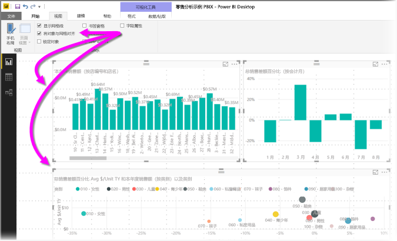
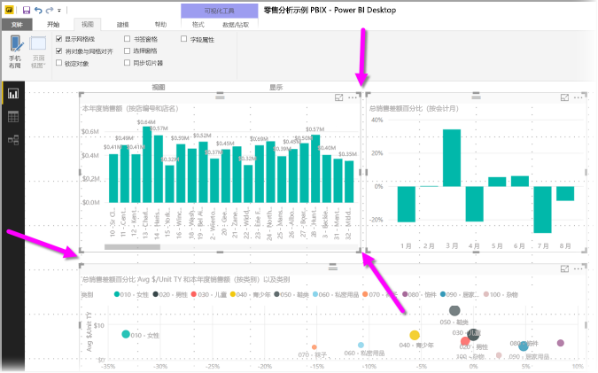
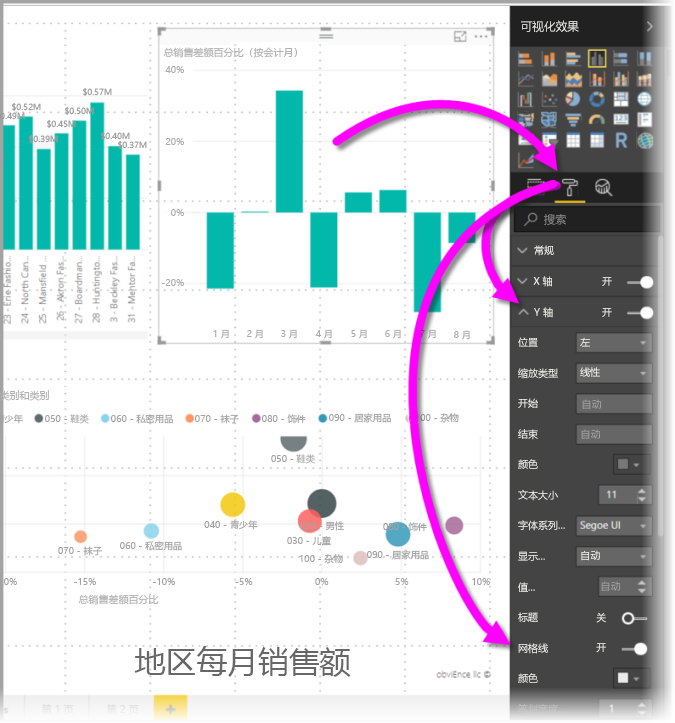
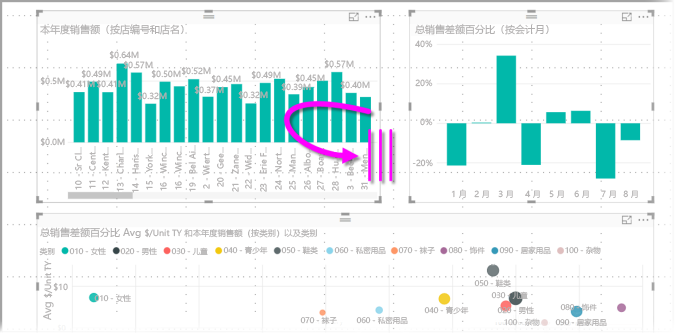
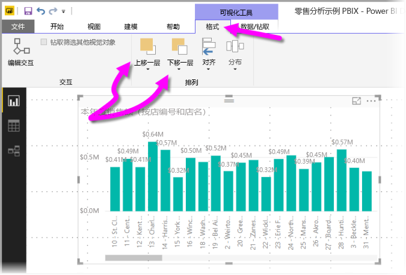
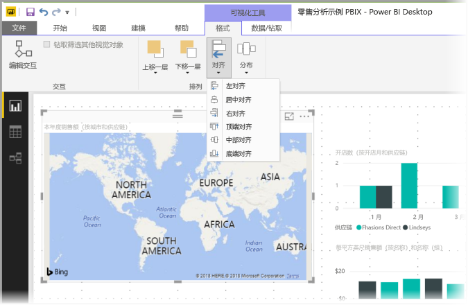
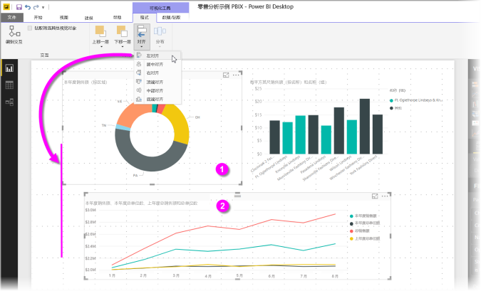
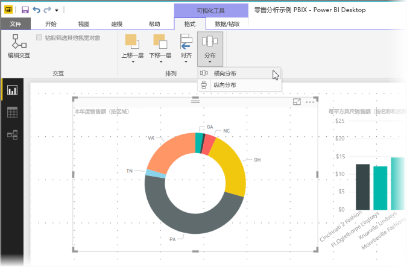

# 在 Power BI Desktop 报表中使用网格线和对齐网格
Power BI Desktop 报表画布提供网格线功能，以便你可以在报表页上巧妙地对齐视觉对象，并使用对齐网格功能，以便报表中的视觉对象清晰整齐且均匀分布。

在 Power BI Desktop 中，还可以调整报表上对象的 z 顺序（上移一层、下移一层），并能在画布上对齐或均匀分布选定的视觉对象。

### 启用网格线和对齐网格
若要启用网格线和与网格对齐功能，请选择“**视图**”功能区，然后选中“**显示网格线**”和“**将对象与网格对齐**”复选框。 你可选择一个或两个选项，它们将独立运行。

> [!NOTE]
> 如果禁用了“显示网格线”和“对象与网格对齐”，则连接到任何数据源可启用这两个选项。
> 
> 

### 使用网格线
网格线是可见的指南，可帮助你对齐视觉对象。 尝试确定两个（或更多）视觉对象是否水平或垂直对齐时，可使用网格线来确定其边框是否对齐。

可以通过按住 Ctrl 并单击来一次性选择多个视觉对象，该操作可显示所有所选视觉对象的边框，并显示视觉对象是否正确对齐。

#### 在视觉对象中使用网格线
Power BI 的视觉对象中也有网格线，提供用于比较数据点和值的视觉引导。 从 2017 年 9 月发行版 Power BI Desktop 开始，现在可以使用“可视化效果”窗格“格式”部分中的“X 轴”或“Y 轴”卡（具体根据视觉对象类型而定）管理视觉对象中的网格线。 可以在视觉对象中管理网格线的下列元素：

* 打开或关闭网格线
* 更改网格线的颜色
* 调整网格线的笔划（宽度）
* 选择视觉对象中网格线的线型，如实线、虚线或点线

修改网格线的某些元素对于视觉对象使用深色背景的报表特别有用。 下图显示了“Y 轴”卡中的“网格线”部分。

### 使用对齐网格
启用“**对象与网格对齐**”后，你在 **Power BI Desktop** 画布上移动（或调整大小）的所有视觉对象将自动对齐到最近的网格轴，从而大大简化了确保两个或多个视觉对象对齐到相同水平或垂直位置或大小的过程。

这就是使用“网格线”和“对齐网格”来确保报表中的视觉对象完全对齐的全部过程。

### 使用 z 顺序、对齐和分布
可以管理报表中视觉对象的从前向后顺序，通常将这称为元素的 z 顺序。 通过此功能，你可以任何所需的方式重叠视觉对象，然后调整每个视觉对象的从前向后顺序。 可使用“上移一层”和“下移一层”按钮设置视觉对象的顺序，这些按钮位于“格式”功能区的“排列”部分中。 选择页面上的一个或多个视觉对象后，“格式”功能区随即出现。

“格式”功能区可让你通过多种不同的方式对齐视觉对象，确保视觉对象以最合适的外观和方式在页面中对齐显示。

使用“对齐”按钮，可将选定视觉对象与报表画布的边缘（或中心）对齐，如下图所示。

选择两个或多个视觉对象后，可以将它们一起与所有选定视觉对象的现有对齐边界对齐。 例如，如果你选择了两个视觉对象，然后选择了“左对齐”按钮，那么这两个视觉对象会与所有选定视觉对象的最左边界对齐。

还可以在报表画布中均匀地分布视觉对象，无论是垂直分布还是水平分布。 只需使用“**格式**”功能区中的“**分布**”按钮即可。

选择相应的网格线、对齐方式和分布工具后，报表将按你希望的方式呈现。

