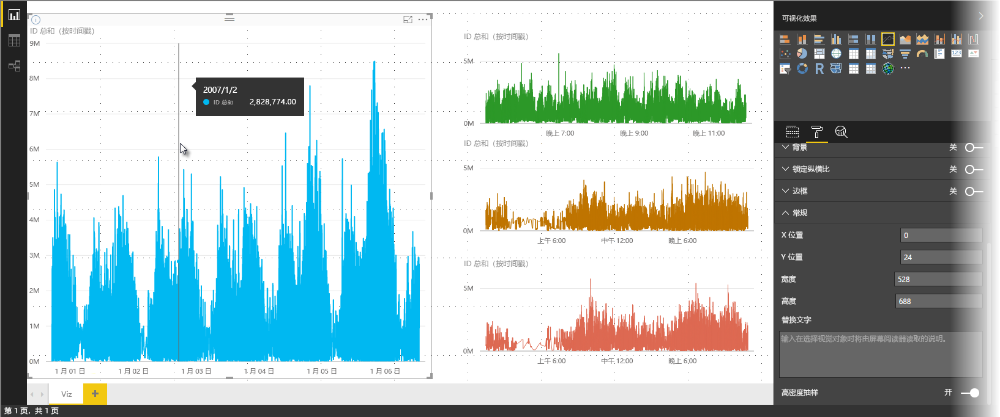
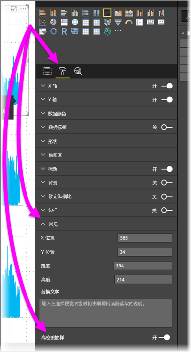

# Power BI 中的高密度行采样
从 2017 年 6 月发布 Power BI Desktop 版本和更新 Power BI 服务后，可使用新的采样算法来改进采样高密度数据的视觉对象。 例如，每个零售店每年的销售额超过一万，可以根据零售店的销售业绩创建一个折线图。 此类销售信息的折线图将从每个零售店的数据中采样数据（选择数据中有意义的代表，以展示销售情况如何随时间变化），并创建一个多系列折线图表示基础数据。 这是将高密度数据可视化的常见做法，Power BI Desktop 改进了高密度数据的采样，本文详细介绍了相关信息。

> [!NOTE]
> 本文所述的高密度采样算法适用于 Power BI Desktop 和 Power BI 服务，两者中都可使用。
> 
> 

## 高密度行采样的工作方式
以前，Power BI 以确定性方式在所有基础数据中选择采样数据点的集合。 例如，对于视觉对象跨越一个日历年的高密度数据，视觉对象中可能会显示 350 个示例数据点，选择每个数据点才能确保视觉对象中呈现出所有数据（基础数据的整体系列）。 为方便理解，假设要绘制一年内的股票价格，并选择 365 个数据点来创建折线图视觉对象（一天对应一个数据点）。

在这种情况下，每天的股票价格都有很多值。 当然每天都有最高价和最低价，而且可能出现在开市后的任何时间。 在高密度行采样中，如果每天都在上午 10:30 和中午12:00 获取基础数据采样，则会得到基础数据的代表快照（上午 10:30 和中午12:00 的价格），但可能不会捕获到实际的最高股价和最低股价作为当天的代表数据点。 在此类情况下，采样是基础数据的代表，但不保证它始终能捕获到重要的点，在此示例中即每日最高股价和最低股价。

根据定义，对高密度数据进行采样，以快速合理地创建能响应交互操作的视觉对象（视觉对象上过多的数据点可能会阻碍它并降低趋势的可见性）。 如何对数据进行采样才能提供最佳的视觉对象体验，这推动了采样算法的创建。 Power BI Desktop 中对该算法进行了改进，将每个时间片段中重要点的响应、表示和清楚保存以最佳方式组合。

## 新的行采样算法的工作方式
高密度行采样的新算法可以使用具有连续 x 轴的折线图和面积图视觉对象。

对于高密度视觉对象，Power BI 会智能地将数据拆分为高分辨度区块，然后选取重要的点来表示每个区块。 拆分高分辨度数据的过程经过专门优化，可确保生成的图表在外观上与所有基础数据点的呈现方式没有区别，但速度更快，交互性更强。

### 高密度行视觉对象的最小值和最大值
以下限制适用于任何给定的视觉对象：

* 无论基础数据点或系列的数值是多少，3,500 是视觉对象上显示的数据点的最大数值。 因此，如果有 10 个系列，每个系列有 350 个数据点，则视觉对象已达到其总体数据点的上限。 如果有一个系列，则可以有多达 3,500 个数据点，只要新算法认为这是基础数据的最佳采样。
* 一个视觉对象最多可以有 60 个系列。 如果有超过 60 个系列，则拆分数据并创建多个视觉对象，使每个视觉对象拥有少于或等于 60 个系列。 使用切片器来只显示数据段是个好方法（仅适用于特定系列）。 例如，如果要在图例中显示所有子类别，则可以使用切片器根据同一报表页上的整体类别进行筛选。

这些参数能让 Power BI Desktop 中的视觉对象快速呈现，能响应与用户的交互，并且不会在呈现视觉效果的计算机上导致不必要的计算开销。

### 评估高密度行视觉对象的代表数据点
当基础数据点的数量超过视觉对象中能够表示的数据点（超过 3,500）时，将开始执行名为“装箱”的过程，该过程会将基础数据拆分成组（被称作“箱”），然后以迭代方式对这些箱进行优化。

算法会创建尽可能多的箱，以便为视觉对象创建最大粒度。 算法会查找每个箱中的最小和最大数据值，确保视觉对象捕获到并显示出重要的值（例如异常值）。 根据装箱结果和 Power BI 对数据的后续评估，系统会确定视觉对象 x 轴的最小分辨度，以确定视觉对象的最小粒度。

如前所述，每个系列的最小粒度为 350 点，最大粒度为 3,500 点。

每个箱由两个数据点表示，这些数据点即视觉对象中箱的代表数据点。 数据点只是该箱的最高值和最低值。通过选择最高值和最低值，装箱过程可确保视觉对象能够捕获和呈现出所有重要的最高值或最低值。

是否觉得这很像通过大量分析确保能够捕获偶尔的异常值，并在视觉对象中正确显示出该值，这种想法是正确的 - 这正是使用新算法和进行装箱过程的原因。

## 工具提示和高密度行采样
请务必注意在此装箱过程会，视觉对象会捕获并显示给定箱中的最小值和最大值，并且将鼠标悬停在数据点上时，工具提示显示数据的方式可能会受影响。 为解释这种情况发生的方式和原因，我们重新回顾一下本文前面介绍的股票价格示例。

假设要根据股票价格创建一个视觉对象，并且比较两支使用高密度采样的不同股票。 每个系列的基础数据都有大量数据点（也许一天中每秒都在捕获股票价格）。 高密度行采样算法会对每个系列执行独立装箱。

现在假设第一支股票价格在 12:02 上涨，并在十秒后迅速下跌 - 这是一个重要的数据点。 对该股票装箱时，12:02 的最高值将是该箱的代表数据点。

但对第二支股票而言，12:02 的值在包含该时段的箱中既不是最高值，也不是最低值 - 可能包含 12:02 的箱的最高值和最低值出现在三分钟之后。 在这种情况下，创建折线图之后，将鼠标悬停在 12:02 上时，只能在工具提示中看到第一支股票的值（因为股价在 12:02 上涨到最高，系统选择该值作为该箱的最高数据点），但是在工具提示中看不到第二支股票在 12:02 的值。 因为在包含 12:02 的箱中，第二支股票既没有出现最高值，也没有出现最低值。 所以在 12:02 时，第二支股票没有任何数据显示，因此不会显示任何工具提示数据。

工具提示经常发生这种情况。 给定箱的最高值和最低值可能与均匀缩放的 x 轴值点不完全匹配，因此工具提示不会显示该值。  

## 如何启用高密度行采样
默认情况下，新算法处于“开启”状态。 若要更改此设置，请转到“常规”卡中的“格式设置”窗格，可以在底部看到一个名为“高密度采样”的切换滑块。 若要将其关闭，将滑块滑动到“关闭”。

## 注意事项和限制
高密度行采样的新算法是 Power BI 的一个重要改进，但在使用高密度值和数据时需要了解以下注意事项。

* 由于粒度增加和装箱过程，“工具提示”只能在代表数据与光标对齐时显示值。 有关详细信息，请参阅本文前面关于“工具提示”的部分。
* 当整个数据源的大小太大时，新算法会通过删除系列（图例元素）来最大限度导入数据。
  
  * 在这种情况下，新算法会按字母顺序对图例排序，并按字母顺序从前往后导入图例元素，直到达到数据导入上限，之后将不再导入其他系列。
* 当基础数据集的系列超过 60 个（如前所述，这是最大系列数）时，新算法会按字母顺序对系列排序，并删除字母排序在 60 之后的系列。
* 如果数据中的值的类型不是数字或日期/时间，则 Power BI 将不使用新算法，并恢复为以前的（非高密度采样）算法。
* 新算法不支持“显示不含数据的项目”设置。
* 与 SQL Server Analysis Services（2016 版或更早版本）中托管的模型进行实时连接时，不支持新算法。 Power BI 或 Azure Analysis Services 中托管的模型支持此算法。

## 后续步骤
有关散点图中高密度采样的信息，请参阅以下文章。

* [Power BI 散点图中的高密度采样](desktop-high-density-scatter-charts.md)

