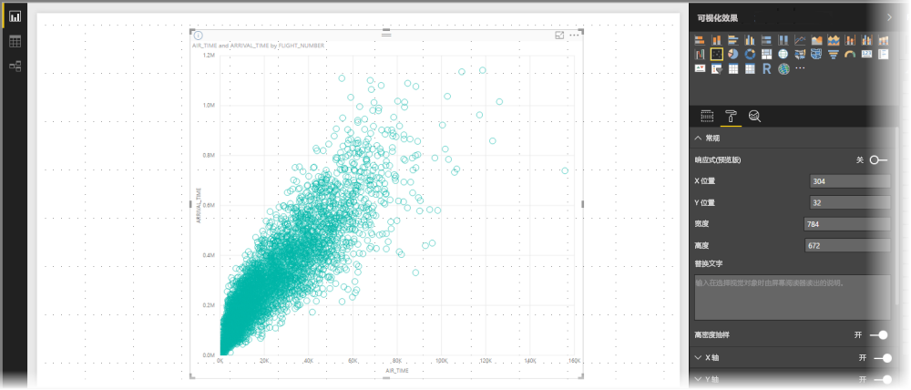
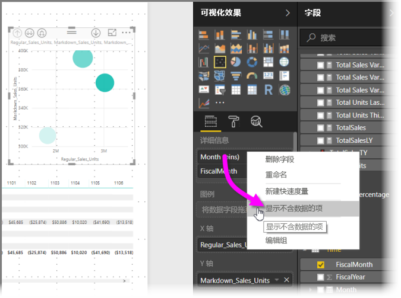
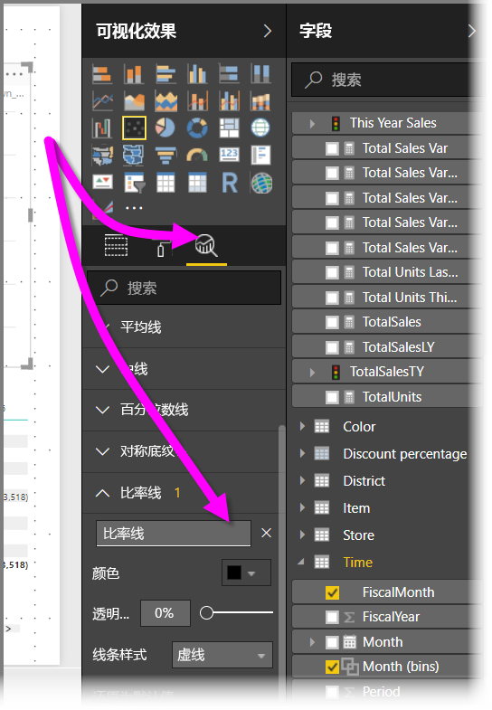
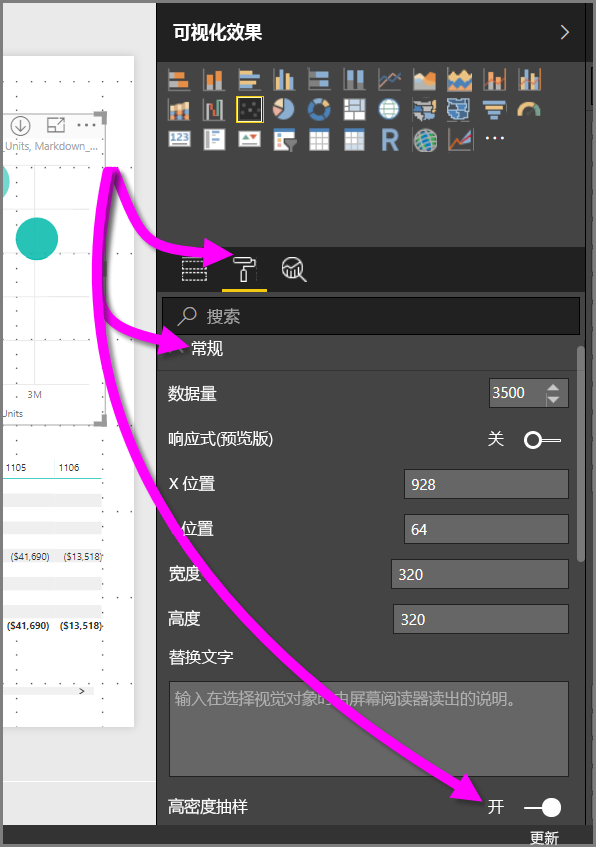

# Power BI 散点图中的高密度采样
从 2017 年 9 月发布 Power BI Desktop 版本和 Power BI 服务更新后，可使用新的采样算法来改进散点图显示高密度数据的方式。

例如，可以通过组织的销售活动创建一个散点图，其中每个商店每年都有成千上万个数据点。 此类信息的散点图将从可用数据中采样数据（选择数据中有意义的代表，以展示销售情况如何随时间变化），并创建一个散点图表示基础数据。 这是高密度散点图中的常见做法，Power BI 改进了高密度数据的采样，本文详细介绍了相关信息。

> [!NOTE]
> 注意：本文所述的高密度采样算法适用于 Power BI Desktop 和 Power BI 服务中的散点图，在两者中都可以使用。
> 
> 

## 高密度散点图的工作方式
以前，Power BI 以确定性方式在所有基础数据中选择采样数据点的集合来创建散点图。 具体而言，Power BI 会在散点图系列中选择第一行和最后一行数据，然后将剩余的行平均分配，以便在散点图上绘制总共 3,500 个数据点。 例如，如果示例有 35,000 行，则选择第一行和最后一行进行绘制，然后每 10 行绘制一个数据点（35,000 / 10 = 每 10 行 = 3,500 个数据点）。 另外，在此之前，在数据系列中无法绘制的 null 值或点（如文本值）不会显示出来，因此在生成视觉对象时不会加以考虑。 通过此类采样，散点图的感知密度同样会基于代表性数据点，因此隐含的可视化密度属于采样点，而不是基础数据的完整集合。

启用“高密度采样”时，Power BI 会执行一种算法来消除重叠点，并确保与视觉对象交互时可以访问视觉对象上的点。 此外，它还确保数据集中的所有点都会显示在视觉对象中，从而为所选点的含义提供上下文，而不是仅仅绘制一个代表性的样本。

根据定义，对高密度数据进行采样，以快速合理地创建能响应交互操作的视觉对象（视觉对象上过多的数据点可能会阻碍它并降低趋势的可见性）。 如何对数据进行采样才能提供最佳的视觉对象体验并确保显示所有数据，这些疑问促使了采样算法的创建。 Power BI 中对该算法进行了改进，将整体数据集中重要点的响应、表示和清楚保存以最佳方式组合。

> [!NOTE]
> 使用高密度采样算法的散点图最好在方形视觉对象上绘制（类似于所有散点图的方式）。
> 
> 

## 新的散点图采样算法的工作方式
适用于散点图的“高密度采样”的新算法采用能够更有效地捕获和表示基础数据的方法，此类方法还可以消除重叠点。 具体操作方法为：首先为每个数据点绘制一个小型半径（可视化效果上给定点的可视圆圈大小）。 然后增加所有数据点的半径大小；当两个（或多个）数据点重叠时，用一个（增加了半径大小的）圆圈表示这些重叠的数据点。 该算法继续增加数据点的半径，直到半径值产生的合理数量的数据点（3,500）显示在散点图中。

此算法中的方法可确保在生成的视觉对象中显示离群值。 该算法在确定重叠的同时还会设置比例，完全按照基础可视化点直观显示指数比例。

该算法还将保留散点图的整体形状。

> [!NOTE]
> 将高密度采样算法用于散点图时，目标是准确分发数据，而不是隐含的可视化密度。 例如，你可能会看到一个散点图，其中有许多圆圈在某个区域重叠（密度），并想像肯定有许多数据点聚集在那里；由于高密度采样算法可以使用一个圆圈来表示许多数据点，因此隐含的可视化密度（或“群集”）将不会出现。 若要在给定区域获得更多详细信息，可以使用切片器执行放大操作。
> 
> 

此外，会忽略不能绘制的数据点（例如 null 或文本值），因此选择另一个可以绘制的值，从而进一步确保散点图的真实形状保持不变。

### 使用散点图的标准算法时
在一些情况下，高密度采样不能应用于散点图，而是使用原始算法。 这些情况如下所示：

* 如果右键单击“详细信息”，然后从显示的菜单中选择“显示不含数据的项”，那么散点图将恢复为原始算法。
  
  
* “播放”轴中的任何值都将导致散点图恢复为原始算法。
* 如果散点图上缺少 X 轴和 Y 轴，则图表将恢复为原始算法。
* 使用“分析”窗格中的“比率线”会导致图表恢复为原始算法。
  
  

## 如何为散点图启用高密度采样
若要启用“高密度采样”，请选择散点图，然后转到“格式设置”窗格，并展开“常规”卡。 在卡的底部附近，有一个名为“高密度采样”的切换滑块可供使用。 若要启用，请将滑块滑动到“打开”。

> [!NOTE]
> 启用滑块后，Power BI 将在可能的情况下尝试使用“高密度采样”算法。 如果该算法无法使用（例如，在“播放”轴添加一个值），滑块将停留在“打开”位置，即使图表已恢复为标准算法也是如此。 如果之后你从“播放”轴删除一个值（或者情况变为允许使用高密度采样算法），由于滑块处于打开状态，图表将自动为该图表使用高密度采样。
> 
> [!NOTE]
> 数据点按照索引进行分组和/或选择。 包含图例不会影响算法采样，它只影响视觉对象的排序。
> 
> 

## 注意事项和限制
高密度采样算法是 Power BI 的一个重要改进，但在使用高密度值和散点图时需要了解以下注意事项。

* 高密度采样算法仅适用于到基于 Power BI 服务的模型、导入的模型或 DirectQuery 的实时连接。

## 后续步骤
有关其他图表中高密度采样的详细信息，请参阅以下文章。

* [Power BI 中的高密度行采样](desktop-high-density-sampling.md)

