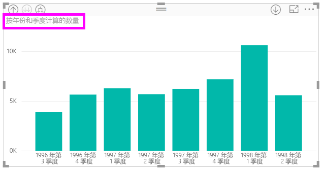
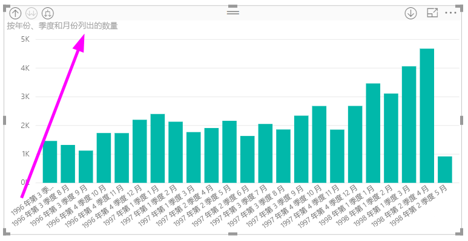
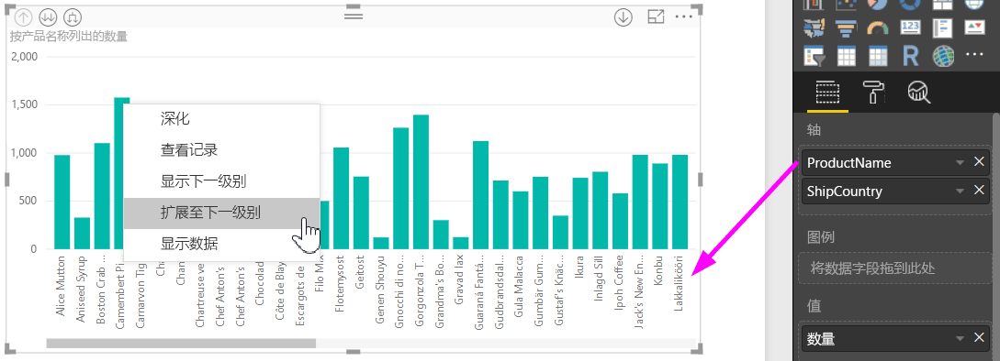
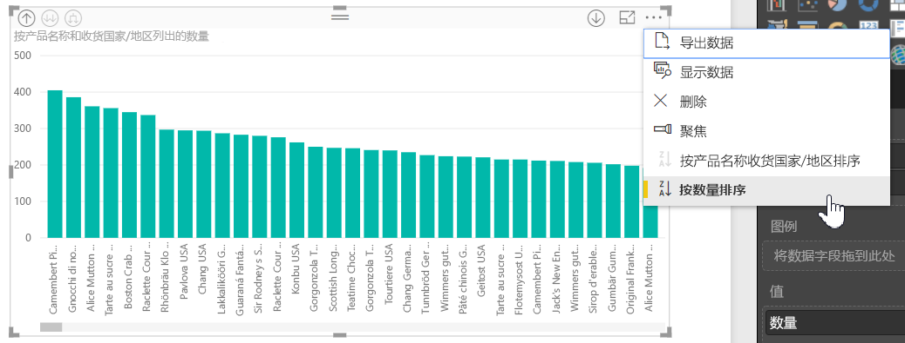

# 在 Power BI Desktop 中使用内联层次结构标签
**Power BI Desktop** 支持使用**内联层次结构标签**，它是旨在提升分层钻取的两种功能中的第一种。 第二种功能当前正处于开发阶段，即使用嵌套层次结构标签的功能（请持续关注 - 我们经常发布更新）。   

## 内联层次结构标签的工作方式
利用内联层次结构标签，当你使用**全部展开**功能展开视觉对象时，你可以看到层次结构标签。 看到这些层次结构标签的重大好处之一是，当展开分层数据时，你可以选择按这些不同的层次结构标签**排序**。

### 使用内置的“展开”功能（无需按层次结构标签进行排序）
在操作中查看内联层次结构标签之前，我们来看一下默认的“展开到下一级别”功能的行为方式。 这样会帮助我们了解（和意识到）内联层次结构标签能起到多大的作用。

下图展示了年销售额的条形图视觉对象。 右键单击条形图时，可以选择“展开到下一级别”。

> [!NOTE]
> 作为右键单击条形图的替代方法，可以选择可视化左上方的“展开”按钮。

  

选择“展开到下一级别”后，视觉对象将展开从年到季度的数据层次结构，如下图所示。

请注意，年和季度标签是内联在一起显示的 - 随着向下展开全部层级直到层次结构底部，此标记方案会持续运用。

这就是与具有 *日期/时间* 数据类型的字段相关联的内置 *日期* 层次结构的行为方式。 我们前往下一章节，了解新的内联层次结构标签功能有什么不同。

### 使用内联层次结构标签
现在让我们看一份不同的图表 - 该图表使用具有非正式层次结构的数据。 在下面的视觉对象中，我们可以看到“数量”条形图，其使用产品名称作为轴。 在此数据中，产品名称和发运国家构成了非正式层次结构。 在此处，可以再次选择“展开到下一级别”，进入层次结构的下个层级。

选择“展开到下一级别”将显示内联层次结构标签的下一级别。 默认情况下，内联层次结构按照度量值进行排序 - 在此示例中按照“数量”排序。 启用内联层次结构标签后，也可以通过选择右上角的省略号 (...)，然后选择“按产品名称和发运国家排序”，进而选择按层次结构对此数据进行排序，如下图所示。

选择“发运国家”之后，数据将基于非正式层次结构选择进行排序，如下图所示。

> [!NOTE]
> 内联层次结构标签功能尚不允许内置时间层次结构按值排序；只能按层次结构顺序排序。
> 
> 

## 故障排除
在展开的内联层次结构级别状态中，你的视觉对象可能出现卡顿。 在某些情况下，你可能发现在展开模式时，某些视觉对象会出现卡顿，向上钻取也不起作用。 如果你碰巧执行了以下步骤则会出现此问题（解决方法位于这些步骤 *下面* ）：

在展开状态下可能会使你的视觉对象出现卡顿的操作：

1. 启用**内联层次结构标签**功能
2. 创建带有层次结构的视觉对象
3. 然后**全部展开**并保存文件
4. 随后 *禁用* **内联层次结构标签** 功能，并重新启动 Power BI Desktop
5. 然后重新打开文件

如果碰巧执行了这些步骤，并且在展开模式中视觉对象出现卡顿，则可以执行以下操作来解决：

1. 重新启用**内联层次结构标签**功能，然后重新启动 Power BI Desktop
2. 重新打开你的文件，并钻取回受影响的视觉对象顶部
3. 保存文件
4. 禁用**内联层次结构标签**功能，然后重新启动 Power BI Desktop
5. 重新打开文件

或者，你可以删除你的视觉对象并重新创建。

