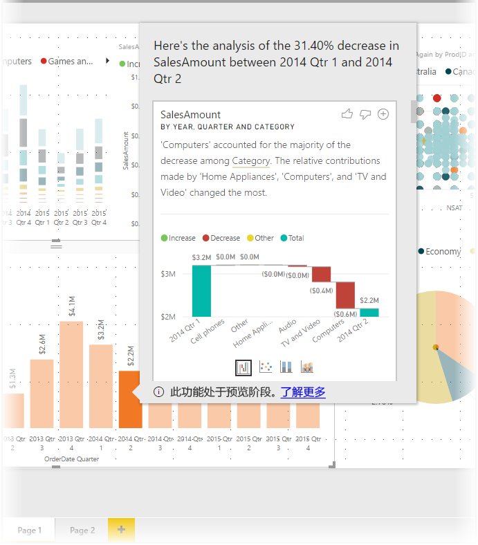
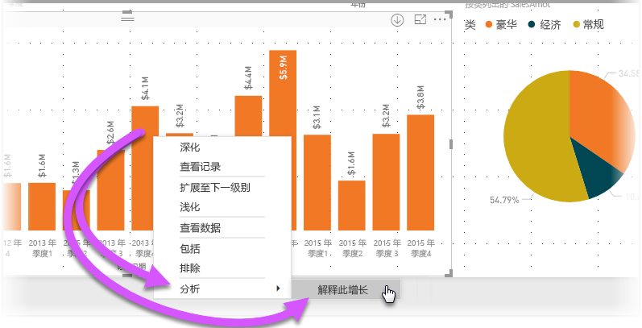
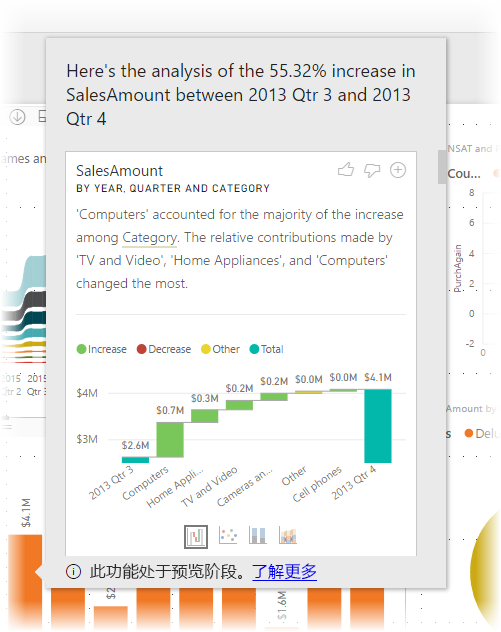
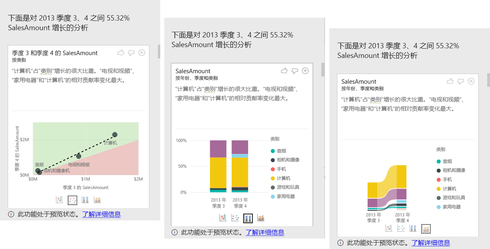

# 在 Power BI Desktop（预览版）中使用见解
可以让 Power BI Desktop 解释图表中出现的增加或减少情况，并获得有关数据的快速、自动化且深入的分析。 只需右键单击数据点，然后选择“分析”>“解释此减少情况”（或者如果前一栏较低，则选择“解释此增长情况”），就可以在易用窗口中收到见解。

见解功能与上下文相关，并且以紧位于前面的数据点（例如上一栏或列）为基础。

> [!NOTE]
> 此功能处于预览状态，可能会发生更改。 从 Power BI Desktop 2017 年 9 月版本开始，见解功能将默认启用并打开（无需勾选“预览”框来启用它）。
> 
> 

## 使用见解
要使用见解，只需右键单击条状或线状视觉对象中的任意数据点，然后选择“分析”>“解释此增加情况”（或“解释此减少情况”，因为所有见解都基于上一个数据点的变化）。

然后，Power BI Desktop 针对数据运行其机器学习算法，并使用视觉对象和说明（介绍哪些类别对增加情况或减少情况的影响最大）填充窗口。 默认情况下，见解以*瀑布*视觉对象形式提供，如下图所示。

通过选择瀑布视觉对象底部的小图标，可以选择使见解显示为散点图、堆叠柱形图或功能区图。

在页面顶部提供“很棒”和“很差”图标，这样你就可以提供关于视觉对象和功能的反馈。

请注意，视觉对象顶部的“+”按钮可让你将选定的视觉对象添加到报表中，就像你手动创建视觉对象一样。 然后，可以格式化或调整添加的视觉对象，类似于在报表上对任何其他视觉对执行的操作。 在 Power BI Desktop 中编辑报表时，只能添加选定的见解视觉对象。

如果报表处于阅读或编辑模式，则可以将见解用于分析数据和创建可轻松添加到报表中的视觉对象。

## 注意事项和限制
由于见解是根据上一数据点变化得出，因此在视觉对象中选择首个数据点时，见解不可用。 

以下列表列出了见解目前不受支持的所有情形：

* 前 n 个筛选器
* 包括/排除筛选器
* 度量值筛选器
* 非累加性度量值和聚合
* 值显示为
* 筛选的度量值（这是在见解的散点图中使用的新内容）
* X 轴上的类别列（根据列将排序定义为标量的情况除外）。 如果使用层次结构，则有效层次结构中的每一列必须与此条件相匹配
* 非数值度量值

此外，目前不支持见解的以下模型类型和数据源：

* DirectQuery
* 实时连接
* 本地 Reporting Services
* 嵌入

## 后续步骤
有关 Power BI Desktop 以及如何入门的详细信息，请查看以下文章。

* [Power BI Desktop 入门](desktop-getting-started.md)
* [Power BI Desktop 的查询概述](desktop-query-overview.md)
* [Power BI Desktop 中的数据源](desktop-data-sources.md)
* [连接到 Power BI Desktop 中的数据](desktop-connect-to-data.md)
* [使用 Power BI Desktop 调整和合并数据](desktop-shape-and-combine-data.md)
* [Power BI Desktop 中的常见查询任务](desktop-common-query-tasks.md)   

