# 在 Power BI Desktop 中使用“矩阵”视觉对象
借助“矩阵”视觉对象功能，可以在“Power BI Desktop”报表中创建矩阵视觉对象（有时亦称为“表”），并能使用其他视觉对象交叉突出显示矩阵内的元素。 此外，还可以选择行、列和各个单元格进行交叉突出显示。 最后，为了更好地利用布局空间，矩阵视觉对象支持阶梯布局。

矩阵有许多相关功能，我们将在本文的下面各部分中逐一介绍它们。

> [!NOTE]
> 自 2017 年 7 月发布的 Power BI Desktop 起，矩阵和表视觉对象可以反映已应用的“报表主题”中的样式（包括颜色）。 这些颜色可能与对矩阵视觉对象的预期不符，可以在“报表主题”配置中进行更改。 有关主题的详细信息，请参阅[在 Power BI Desktop 中使用报表主题](desktop-report-themes.md)。
> 
> 

## 了解 Power BI 计算总计的方式

在进入如何使用“矩阵”视觉对象的步骤之前，请务必了解 Power BI 在表格和矩阵中如何计算总计和小计的值。 对于总计和小计行，在基础数据的全部行上求取度量值，这不仅仅是在可见的或显示的行中简单地相加值。 这意味着最终总计行的值与预计的值存在差异。 

请查看以下矩阵视觉对象。 

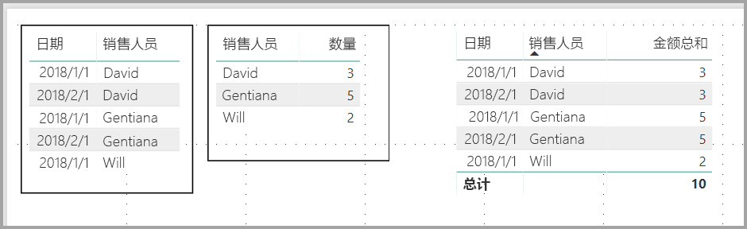

在本示例中，最右边的矩阵视觉对象中的各行显示了每个销售人员/日期组合的金额。 但是，由于显示的一个销售人员对应多个日期，这些数字可以出现不止一次。 因此，基础数据的准确总计并不等于可见值的简单相加。 当要求和的值位于一对多关系的“一”这一侧时，这是一种常见模式。

查看总计和小计时，请注意这些值是基于基础数据的，并不仅仅基于可见值。 

## 结合使用向下钻取功能和矩阵视觉对象
借助“矩阵”视觉对象，可以执行之前无法实现的各种有意思的向下钻取活动。 这包括向下钻取行、列、单独分区和单元格。 让我们来看看每种向下钻取活动的工作原理。

### 向下钻取行标题
在“**可视化效果**”窗格中，如果你向“**字段**”的“**行**”部分添加多个字段，可以为矩阵视觉对象的行启用向下钻取功能。 这类似于创建层次结构，以便于你可以向下钻取（然后备份）层次结构，并分析每个级别的数据。

在下图中，“ **行** ”部分包含“ *类别* ”和“ *子类别* ”，形成了我们可以向下钻取的行分组（或层次结构）。

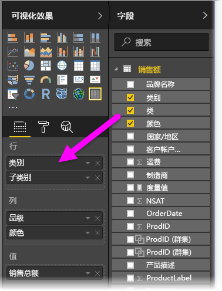

如果视觉对象在“ **行** ”部分中形成了分组，那么视觉对象本身会在其左上角显示“ *钻取* ”和“ *扩展* ”图标。

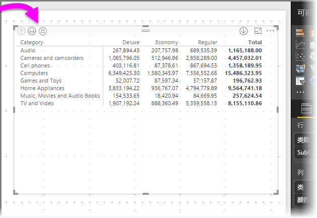

选择这些按钮可以向下钻取（或备份）层次结构，类似于其他视觉对象中的钻取和扩展行为。 在此示例中，我们可以从“类别”向下钻取到“子类别”，如下图所示，其中我们选择了向下钻取一个级别图标（草耙图标）。

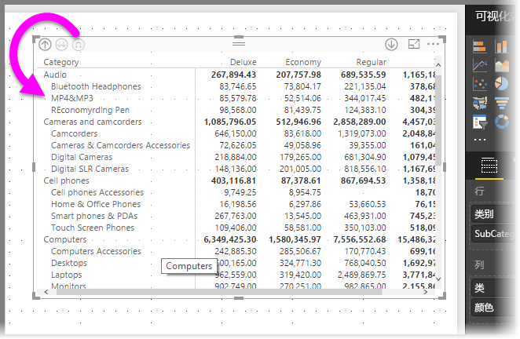

除了使用这些图标，还可以右键单击任意行标题，然后从显示的菜单中进行选择来向下钻取。

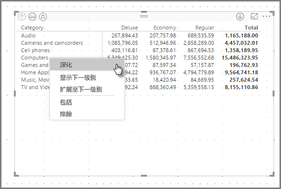

请注意，显示的菜单中有多个选项，分别用于执行不同的操作：

选择“ **向下钻取** ”扩展的是 *该* 行级别的矩阵，其他所有行标题 *除外* ，只会扩展右键单击的行标题。 在下图中，我们右键单击“ *计算机* ”，然后选择了“**向下钻取**”。 请注意，其他顶层行不会再出现在矩阵中。 这是一项十分有用的功能，当我们介绍“**交叉突出显示**”部分时，你会发现这项功能特别棒。

可以单击“向上钻取”图标，返回到上一顶层视图。 如果选择右键单击菜单中的“显示下一级别”，系统会按字母顺序列出所有下一级项（在此示例中，为“子类别”字段），不含更高级别的层次结构分类。

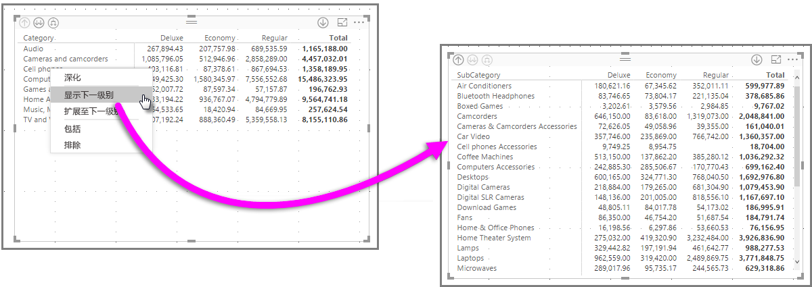

单击左上角的“向上钻取”图标让矩阵显示所有顶层类别，然后再次右键单击并选择“扩展至下一级别”，将看到以下内容：

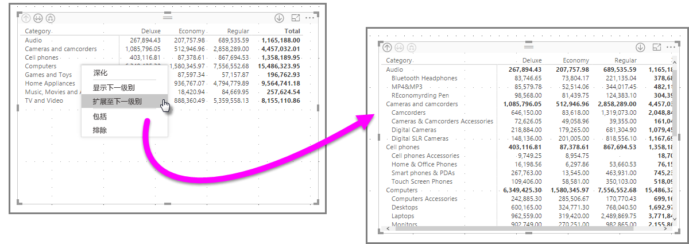

还可以使用“**包括**”和“**排除**”菜单项，在矩阵中保留（或删除）右键单击的行（和所有子类别）。

### 向下钻取列标题
还可以向下钻取**列**，类似于向下钻取行。 在下图中，你会发现，“**列**”字段中也有两个字段，形成了类似于我们在本文前面使用的行层次结构。 “ **列** ”字段中包含“ *类别* ”和“ *颜色* ”。

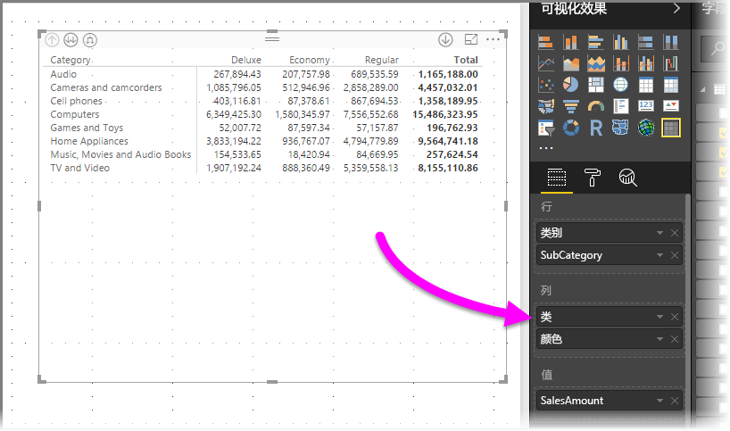

在矩阵视觉对象中，当我们右键单击某列时，可以看到向下钻取选项。 在下图中，我们右键单击“ *奢华版* ”，然后选择“ **向下钻取** ”。

选择“向下钻取”后，系统会显示“奢华版”列层次结构的下一级项（在此示例中，为“颜色”）。

其余的右键单击菜单项对列和行的工作方式均相同（请参阅上一部分“向下钻取行标题”）。 可以对列选择“显示下一级别”、“扩展至下一级别”、“包括”或“排除”，就像对行选择这些选项一样。

> [!NOTE]
> 矩阵视觉对象左上角的“向下钻取”和“向上钻取”仅对行有效。 必须使用右键单击菜单，才能向下钻取列。
> 
> 

## 使用矩阵视觉对象实现阶梯布局
“矩阵”视觉对象自动缩进层次结构中每个父级下的子类别，这就是所谓的“阶梯布局”。

在 *旧* 版矩阵视觉对象中，子类别显示在完全不同的列中，占用视觉对象更多空间。 下图展示了旧版“矩阵”视觉对象中的表；请注意，子类别位于完全不同的列中。

下图展示了采用“阶梯布局”的“矩阵”视觉对象的实际效果。 请注意，类别“ *计算机* ”将其子类别（“计算机附件”、“台式机”、“笔记本电脑”、“显示器”等）略微缩进，让视觉对象变得更简洁紧凑。

可以轻松调整“阶梯布局”设置。 选择“矩阵”视觉对象后，在“可视化效果”窗格的“格式”部分（滚动油漆刷图标）中，展开“行标题”部分。 下面有两个选项：“阶梯布局”开关（用于启用或禁用阶梯布局）和“阶梯布局缩进”（用于指定缩进量，以像素为单位）。

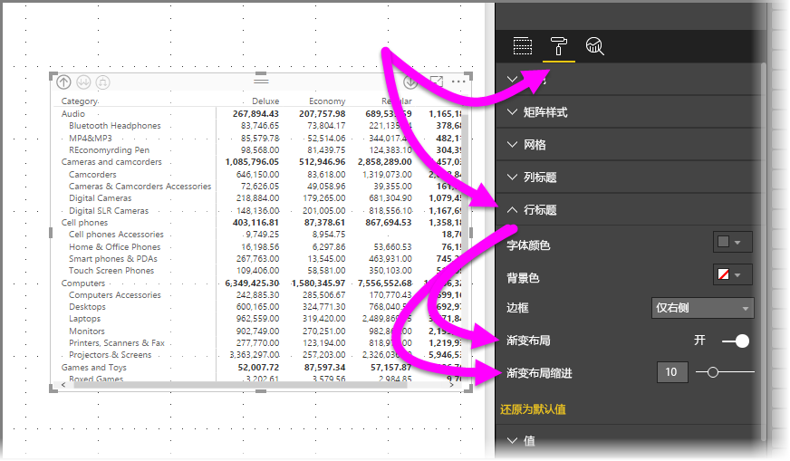

如果禁用“**阶梯布局**”，子类别会显示在另一列中，而不是在父类别下缩进。

## 矩阵视觉对象小计
可以在矩阵视觉对象中，打开或关闭行和列的小计。 在下图中，可以看到行小计已设置为“打开”。

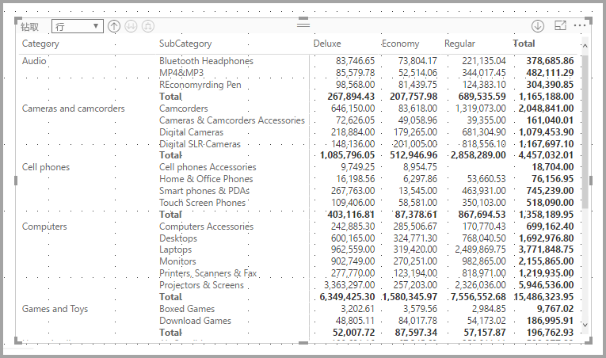

在“可视化效果”窗格的“格式”部分中，展开“小计”卡，并将“行小计”滑块移动至“关闭”。 执行此操作后，将不显示小计。

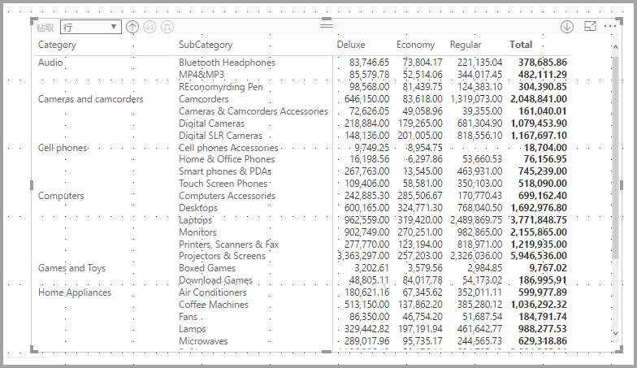

相同的操作过程适用于列小计。

## 使用矩阵视觉对象进行交叉突出显示
借助“矩阵”视觉对象，可以选择矩阵中的任意元素，作为交叉突出显示的依据。 在“矩阵”中选择一列即可突出显示它，报表页上的其他任何视觉对象也会予以反映。 这一直是其他视觉对象和数据点选择的常见功能，因此现在“矩阵”视觉对象也可以提供此相同功能。

此外，还可以在按住 Ctrl 的同时单击鼠标进行交叉突出显示。 例如，在下图中，我们选择了“矩阵”视觉对象中的一组子类别。 请注意，视觉对象中未选择的项为灰显，报表页上的其他视觉对象也会反映“矩阵”视觉对象中选择的项。

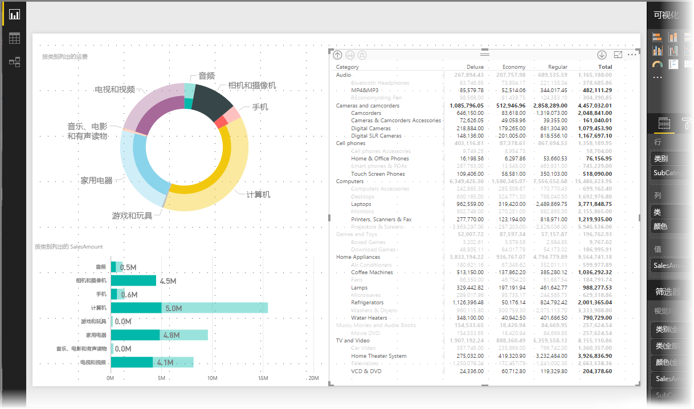

## 矩阵视觉对象的底纹和字体颜色
借助“矩阵”视觉对象，可以将条件格式（颜色和底纹）应用于矩阵中的单元格背景，还能将条件格式应用于文本和值本身。

要应用条件格式，可以在选中矩阵视觉对象后执行以下任一操作：

* 在“字段”窗格中，右键单击“字段”，然后在菜单中选择“条件格式”。
  
  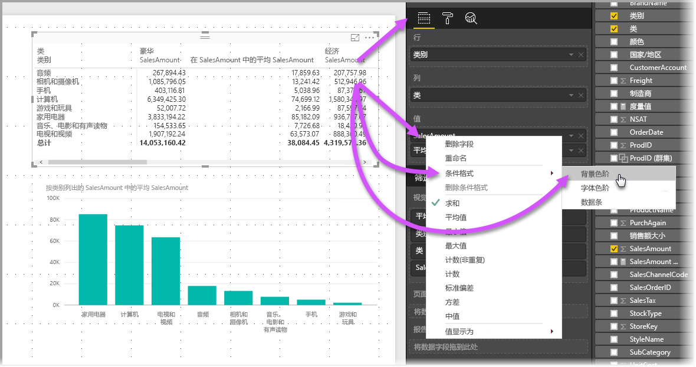
* 或者，在“格式”窗格中，展开“条件格式”卡，然后，将“背景色阶”或“字体色阶”的滑块移动至“打开”。 启用上述任一选项会显示“高级控件”的链接，转到该链接可以对颜色格式的颜色和值进行自定义。
  
  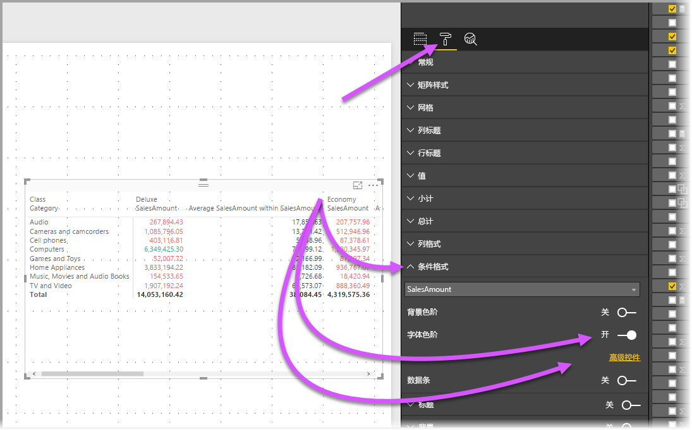

两种方法都能达到相同的结果。 选择“高级控件”会显示以下对话框，可在其中进行调整：

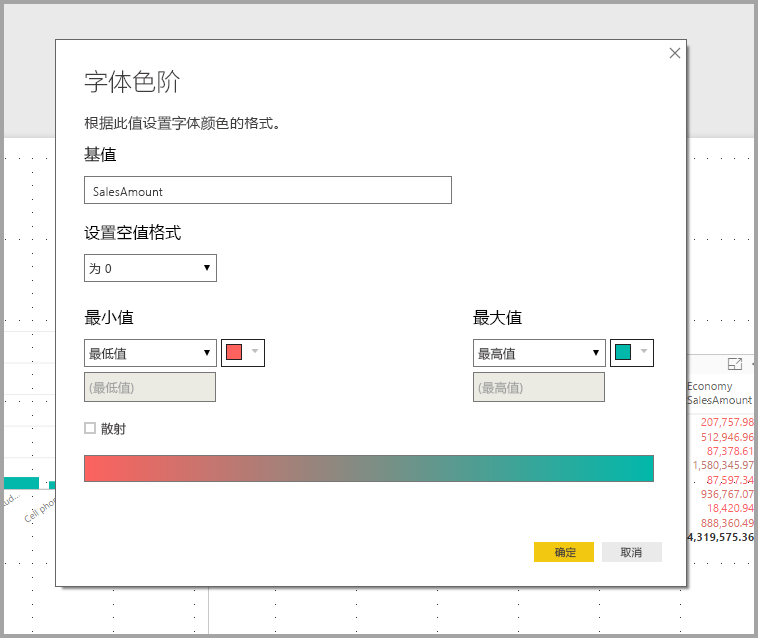

## 后续步骤

你可能还会对以下文章感兴趣：

* [在 Power BI Desktop 报表中使用网格线和对齐网格](desktop-gridlines-snap-to-grid.md)
* [Power BI Desktop 中的数据源](desktop-data-sources.md)
* [Power BI Desktop 中的数据类型](desktop-data-types.md)

 