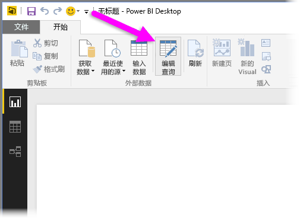
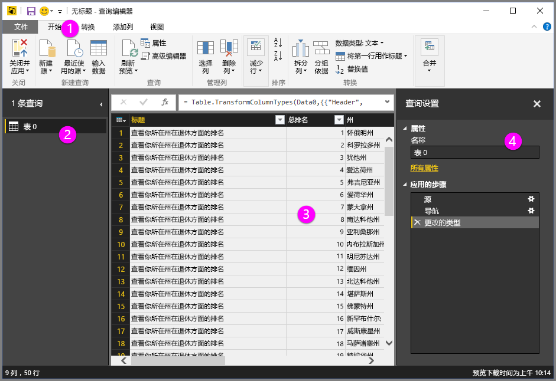
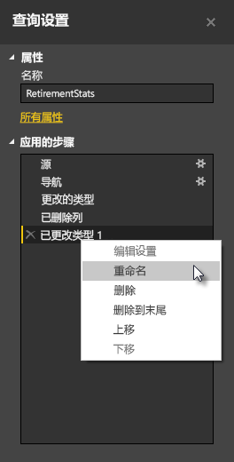
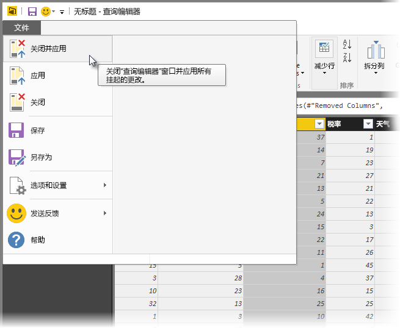

# Power BI Desktop 中的查询概述
借助 **Power BI Desktop**，可以连接到世界上的数据，创建具有吸引力的基础报表，与依赖你的工作、扩展自身商业智能工作的其他人共享你的工作。

Power BI Desktop 具有三种视图：

* **报表**视图 - 此处你可使用创建的查询来构建具有吸引力的可视化效果，它们按照你所希望的方式进行排列，具有多个页面，你可与他人共享
* **数据**视图 - 以数据模型格式查看报表中的数据，其中你可添加度量值、创建新列和管理关系
* **关系**视图 - 获取已在数据模型中建立的关系的图形表示，并根据需要管理和修改它们。

选择 Power BI Desktop 左侧三个图标之一即可获取这些视图。 在下图中，选择了报表视图，因为图标旁显示黄色带区。  

Power BI Desktop 还附带有**查询编辑器**，其中你可连接到一个或多个数据源，调整和转换数据以满足自己的需要，然后将该模型加载到 Power BI Desktop。

本文档概述了处理**查询编辑器**中数据的相关内容。 当然还有更多需要了解，因此在本文档末尾提供有链接，你可了解有关受支持数据类型、连接到数据、调整数据、创建关系以及如何入门的详细指导。

但首先让我们了解**查询编辑器**。

## 查询编辑器
若要访问“查询编辑器”，请从 Power BI Desktop“开始”选项卡选择“编辑查询”。  

没有数据连接时，“查询编辑器”显示为空白窗格，准备处理数据。  

加载查询后，“查询编辑器”视图将变得更加有趣。 如果我们连接到以下 Web 数据源，“查询编辑器”将加载有关数据的信息，随后就可以开始调整数据。

[*http://www.bankrate.com/finance/retirement/best-places-retire-how-state-ranks.aspx*](http://www.bankrate.com/finance/retirement/best-places-retire-how-state-ranks.aspx)

下面是建立数据连接后“查询编辑器”的显示方式：

1. 在功能区中，许多按钮当前处于活动状态，以与查询中的数据进行交互
2. 在左窗格中，列出了查询，可供你选择、查看和调整
3. 在中央窗格中，将显示已选择查询中的数据，可供你调整
4. 将出现**查询设置**窗口，列出了查询的属性和所应用步骤  
   
   

在以下章节中，我们将了解这四个区域中的每一个 - 功能区、查询窗格、数据视图和查询设置窗格。

## 查询功能区
“查询编辑器”中的功能区包含四个选项卡 - “开始”、“转换”、“添加列”和“视图”。

**开始**选项卡提供了常见的查询任务，包括任何查询中的第一步，即**获取数据**。 下图显示**开始**功能区。  

若要连接到数据并开始查询构建过程，请选择**获取数据**按钮。 将出现一个菜单，提供最常见的数据源。  

有关可用数据源的详细信息，请参阅**数据源**。 有关连接到数据的信息，包括示例和步骤，请参阅**连接到数据**。

**转换**选项卡提供了对常见数据转换任务的访问，如添加或删除列、更改数据类型、拆分列和其他数据驱动任务。 下图显示**转换**选项卡。  

有关转换数据的详细信息，包括示例，请参阅**合并和调整数据**。

**添加列**选项卡提供了与添加列、设置列数据格式和添加自定义列相关联的其他任务。 下图显示**添加列**选项卡。  

功能区上的**视图**选项卡用于切换显示的窗格或窗口。 它还用于显示高级编辑器。 下图显示**视图**选项卡。  

很多从功能区上进行使用的任务还可通过在中央窗格右键单击列或其他数据进行使用，知道这点很有帮助。

## 左窗格
左窗格显示处于活动状态的查询数以及查询的名称。 当从左窗格选择查询时，其数据显示在中央窗格，可以在此调整并转换数据以满足需要。 下图显示含多个查询的左窗格。  

## 中央（数据）窗格
在中央窗格中，将显示所选查询中的数据。 大部分查询视图工作在此处完成。

下图中，会显示以前建立的 Web 数据连接，选择了**总体评分**列，且右键单击其标头可显示可用菜单项。 请注意，其中许多用右击菜单项与功能区选项卡中的按钮相同。  

当选择右击菜单项（或功能区按钮）时，查询将对数据应用该步骤，并将其保存为查询本身的一部分。 这些步骤按顺序记录在**查询设置**窗格，如下一节中所述。  

## 查询设置窗格
**查询设置**窗格将显示与查询关联的所有步骤。 例如，下图中，**查询设置**窗格的**所应用步骤**部分反映了我们刚刚更改了**总体评分**列的类型。

当其他调整步骤应用于该查询时，它们将在**所应用步骤**部分反映。

务必了解基础数据不会更改；相反，查询编辑器调整其数据视图，并且与基础数据进行的任何交互将基于查询编辑器调整和修改的数据视图而发生。

在**查询设置**窗格中，可以根据你的需要重命名步骤、删除步骤，或对步骤重新排序。 若要执行此操作，请右键单击**所应用步骤**部分中的步骤，然后从出现的菜单中选择。 所有查询步骤将按照“所应用步骤”窗格中显示的顺序执行。

## 高级编辑器
如果想要查看查询编辑器正使用每个步骤创建的代码，或想要创建自己的调整代码，可以使用**高级编辑器**。 若要启动高级编辑器，从功能区中选择**视图**，然后选择**高级编辑器**。 此时，将会显示包含现有查询代码的窗口。  

可以直接编辑**高级编辑器** 窗口中的代码。 若要关闭该窗口，请选择**完成**或**取消**按钮。  

## 保存工作
当查询位于你希望的位置时，可使用查询编辑器将对数据模型的更改应用到 Power BI Desktop，并关闭查询编辑器。 若要执行此操作，请从查询编辑器的**文件**菜单选择**关闭并应用**。  

随着进度推进，Power BI Desktop 提供了一个对话框显示其状态。  

一旦查询位于你希望的位置，或者如果只是想确保工作是否保存，Power BI Desktop 可将你的工作保存为 .pbix 文件格式。

若要保存工作，请选择**文件\>保存**（或**文件\>另存为**），如下图所示。  

## 后续步骤
Power BI Desktop 可用于执行多种操作。 有关其功能的详细信息，请参阅下列资源：

* [Power BI Desktop 入门](desktop-getting-started.md)
* [Power BI Desktop 中的数据源](desktop-data-sources.md)
* [连接到 Power BI Desktop 中的数据](desktop-connect-to-data.md)
* [使用 Power BI Desktop 调整和合并数据](desktop-shape-and-combine-data.md)
* [Power BI Desktop 中的常见查询任务](desktop-common-query-tasks.md)   

