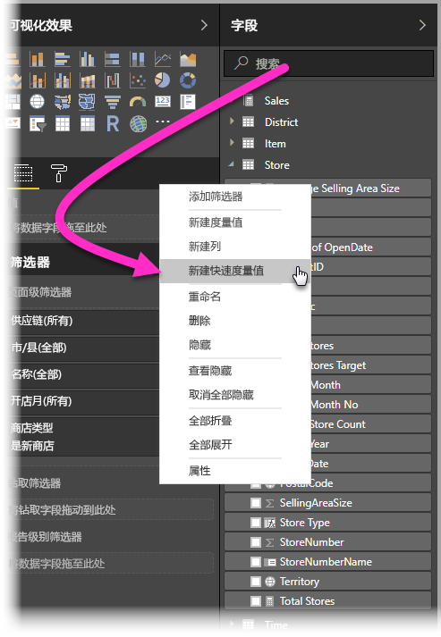
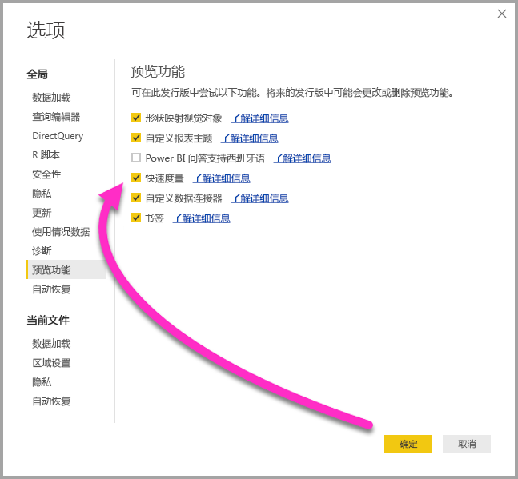
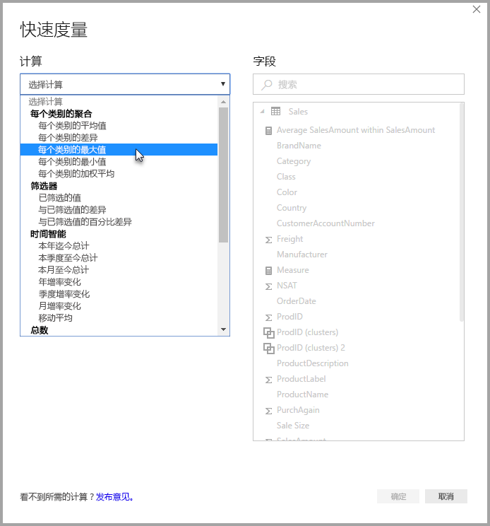
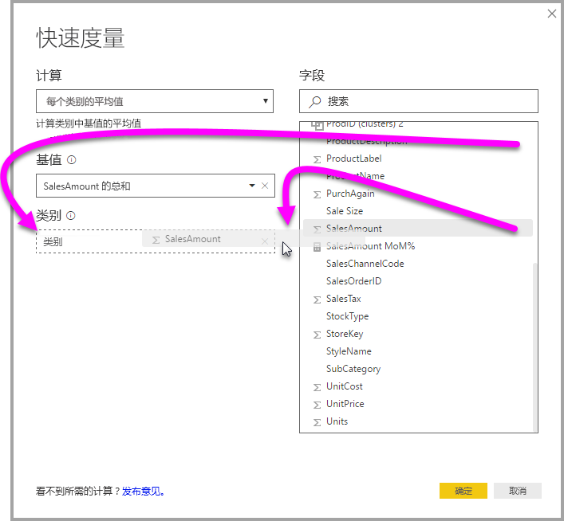
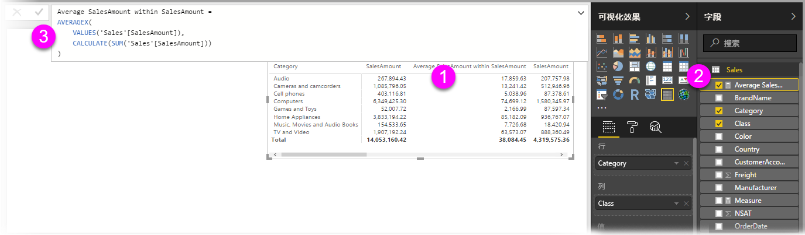
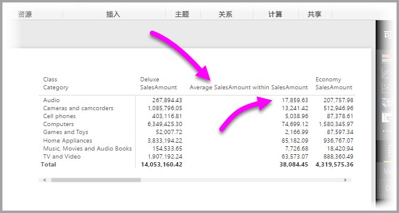
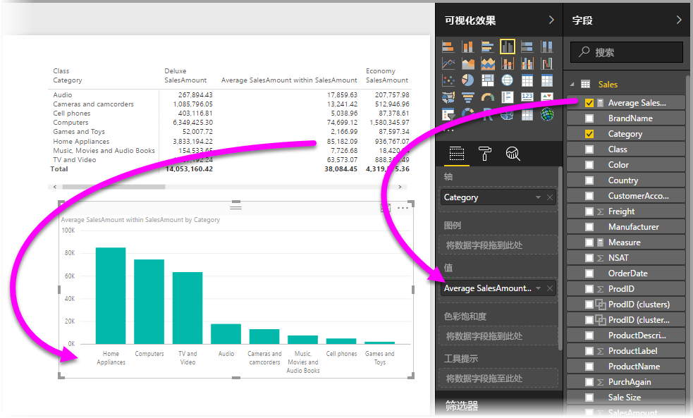
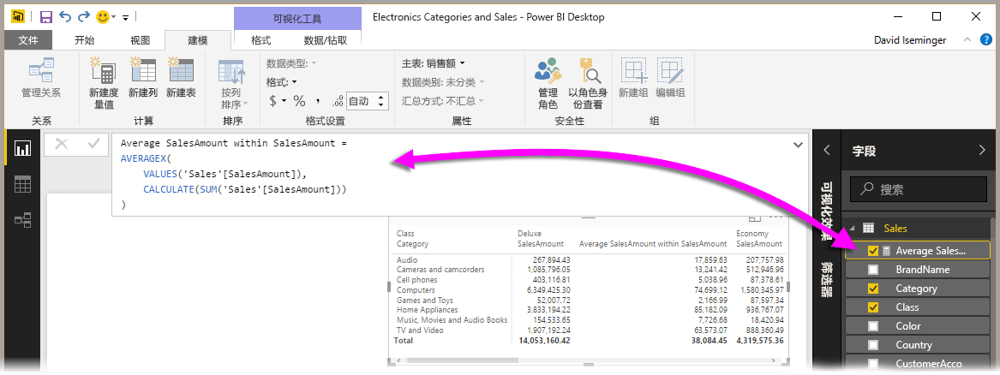

# 使用快速度量轻松执行常见的高效计算
可使用快速度量快速、轻松地执行常见的高效计算。 快速度量根据你在对话框中输入的内容，在后台运行一组 DAX 命令（有现成的 DAX，无需编写），然后显示结果以供你在报表中使用。 最重要的是，可以查看快速度量执行的 DAX，从而开始学习或拓展你自己的 DAX 知识。

可以右键单击“字段”井元素中的任意字段，然后从随即显示的菜单中选择“快速度量值”，从而创建**快速度量值**。 也可以右键单击现有视觉对象的“值”窗格（如“条形图”视觉对象中的“值”字段）中的任何值。 计算分为许多类别，可通过多种方式来根据自己的需求修改所有计算。

### 快速度量现已公开发布

自 2018 年 2 月版的 Power BI Desktop 开始，快速度量已公开发布（不再处于预览状态）。 如果你使用的是早期版本的 Power BI Desktop，可以通过选择“文件”>“选项和设置”>“选项”>“预览功能”，然后选择“快速度量”旁的复选框，尝试使用自 2017 年 4月版 Power BI Desktop 开始发布的快速度量功能。

选中此复选框后，需要重启 **Power BI Desktop**。

## 使用快速度量值
若要创建**快速度量值**，请在“Power BI Desktop”中右键单击“字段”井元素中的任意字段，然后从随即显示的菜单中选择“快速度量值”。

使用 SQL Server Analysis Services (SSAS) 实时连接时，可以使用一些快速度量。 Power BI Desktop 仅显示连接到的 SSAS 版本支持的一组快速度量。 因此，如果连接到 SSAS 实时数据源，但列表中没有显示特定的快速度量，这是因为连接到的 SSAS 版本不支持用于实现快速度量的 DAX 度量。

从右键单击菜单中进行选择后，将会看到以下“快速度量”窗口，在其中可以选择所需的计算，以及要对其执行计算的字段。

选择下拉菜单时，将会看到很长的“快速度量值”列表。

有五组不同的快速度量值计算类型，每组均包含一系列计算。 下面介绍了这五组及其中所含计算：

* **每个类别的聚合**
  * 每个类别的平均值
  * 每个类别的差异
  * 每个类别的最大值
  * 每个类别的最小值
  * 每个类别的加权平均
* **筛选器**
  * 已筛选的值
  * 与已筛选值的差异
  * 与已筛选值的百分比差异
  * 新类别的销售额
* **时间智能**
  * 本年迄今总计
  * 本季度至今总计
  * 本月至今总计
  * 年增率变化
  * 季度增率变化
  * 月增率变化
  * 移动平均
* **总数**
  * 汇总
  * 类别总数（应用筛选器）
  * 类别总数（未应用筛选器）
* **数学运算**
  * 相加
  * 减法
  * 乘法
  * 除法
  * 百分比差异
  * 相关系数
* **文本**
  * 星级评分
  * 值连接列表

我们预计会扩充这些计算，希望你可以告诉我们你想要使用的快速度量，以及在快速度量方面是否有要提交供审议的建议（包括基础 DAX 公式）。 如需了解详情，请查看本文末尾。

## 快速度量值的示例
让我们来看一下这些**快速度量值**的实际操作示例。

以下“矩阵”视觉对象显示一张表，其中包含各种电子产品的销售额。 这是包含每个类别的总计的基本表。

右键单击“Values”字段井元素并选择“快速度量”后，我们可以选择“每个类别的平均值”作为“计算”，选择“销售额总和”作为“基值”，然后将右侧窗格上“字段”框中的相应字段拖到左侧的“类别”部分中，从而指定“SalesAmount”。

选择“确定”后，发生了一些有趣的事情，如下图所示：

1. “矩阵”视觉对象现在有一个新列，其中展示了我们的计算（在此示例中，为“SalesAmount 内的平均销售额”）。
2. “字段”井元素中新建并突出显示了一个**度量值**（Power BI 用黄色框将其框住）。 此度量值适用于报表中的其他任何视觉对象，而不仅仅适用于最初创建它的视觉对象。
3. 编辑栏中显示了为此**快速度量值**创建的 DAX 公式。

首先，请注意，此**快速度量值**已应用于视觉对象。 出现了一个新列和相关值，均以所创建的**快速度量值**为依据。

其次，数据模型的“字段”井元素中显示此**快速度量值**，可用于其他任何视觉对象，如同模型中的其他任何字段一样。 在下图中，还使用此**快速度量值**新建的字段创建了快捷的“条形图”视觉对象。

让我们进入下一部分，介绍一下第三点 DAX 公式。

## 使用快速度量值查看 DAX
**快速度量值**功能的另一大好处是，直接显示为了实现度量值而创建的 DAX 公式。 在下图中，我们选择了**快速度量值**功能创建的度量值（它现在位于“字段”井元素中，我们只需单击它即可）。 执行此操作后，将会看到**编辑栏**，其中显示 Power BI 为了实现此度量值而创建的 DAX 公式。

此功能本身很有用，因为它揭示了度量值背后的公式。 但更为重要的是，这样一来，可以通过快速度量了解应如何创建基础 DAX 公式。

假设需要执行年增率计算，但不是相当确定该如何编写 DAX 公式（或者，一点头绪都没有！）。 无需坐在桌前冥思苦想，可以使用“年增率变化”计算创建快速度量，看看会发生什么。 就像是创建快速度量，看看它在视觉对象中的呈现方式，以及 DAX 公式的运行方式，然后直接更改 DAX，或创建其他度量值，直到计算能够满足需求或达到预期为止。

这就好像只需单击几下，即有老师迅速回答你的“假设”问题一样。 可以随时从模型中删除不想要的度量值。操作非常简单，右键单击相应的度量值并选择“删除”即可。

调整完度量值后，可以使用同一右键单击菜单，随意重命名度量值。

## 限制和注意事项
有几点要牢记的限制和注意事项。

* 只有在可修改模型的情况下才能使用快速度量，使用某些实时连接（如前所述，支持 SSAS 表格实时连接）的情况除外。
* 添加到“字段”井元素中的度量值可以与报表中的任意视觉对象结合使用。
* 选择“字段”井元素中创建的度量值，然后查看**编辑栏**中的公式，可以随时查看与**快速度量值**相关联的 DAX。
* 在 DirectQuery 模式下工作时，无法创建时间智能快速度量。 这些快速度量中使用的 DAX 函数在转换为发送到数据源的 T-SQL 语句时会影响性能。

> [!WARNING]
> 快速度量当前仅生成将逗号用作参数分隔符的 DAX 语句。 如果 Power BI Desktop 版本已本地化为将逗号用作十进制分隔符的语言，快速度量将无法正常运行。
> 
> 

### 时间智能和快速度量
自 2017 年 10 月发布的 Power BI Desktop 更新起，可以将自己的自定义日期表与时间智能快速度量结合使用。 如果使用的是外部表格模型，请确保在生成模型时，此表中的主日期列被标记为“日期”表，如[本文](https://docs.microsoft.com/sql/analysis-services/tabular-models/specify-mark-as-date-table-for-use-with-time-intelligence-ssas-tabular)所述。 如果要导入自己的日期表，请确保将其标记为“日期”表，如[本文](https://docs.microsoft.com/power-bi/desktop-date-tables)所述

### 其他信息和示例
我们预计将会提供每个**快速度量值**计算的相关示例和指南。因此，请隔几天再回来看看主题文章是否有更新。

对尚未提供的**快速度量值**有建议吗？ 很棒！ 请转到[此页](https://go.microsoft.com/fwlink/?linkid=842906)，提交你的建议（包括 DAX 公式），谈谈你想要在 **Power BI Desktop** 中使用的**快速度量值**。我们将会考虑是否在今后推出的版本中向提供的“快速度量值”列表添加你建议的快速度量值。

