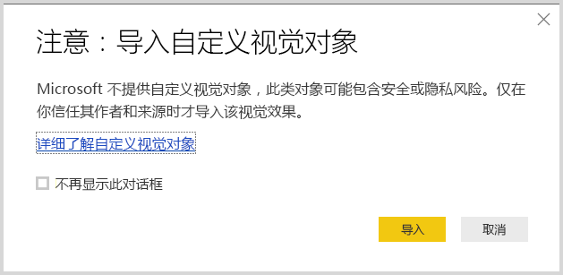
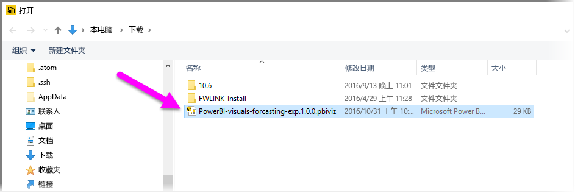
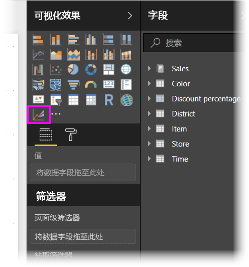
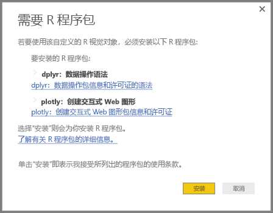
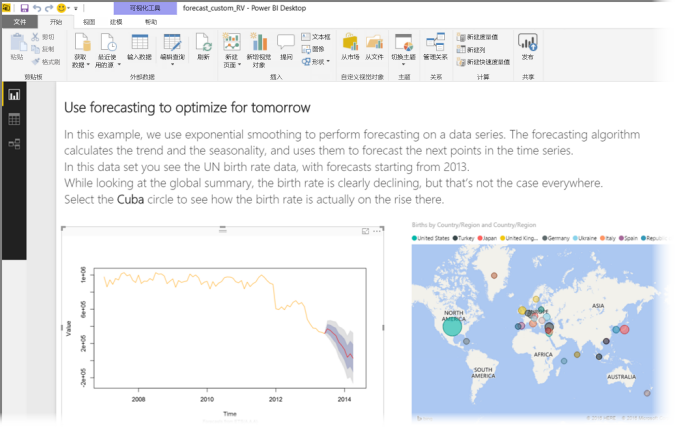
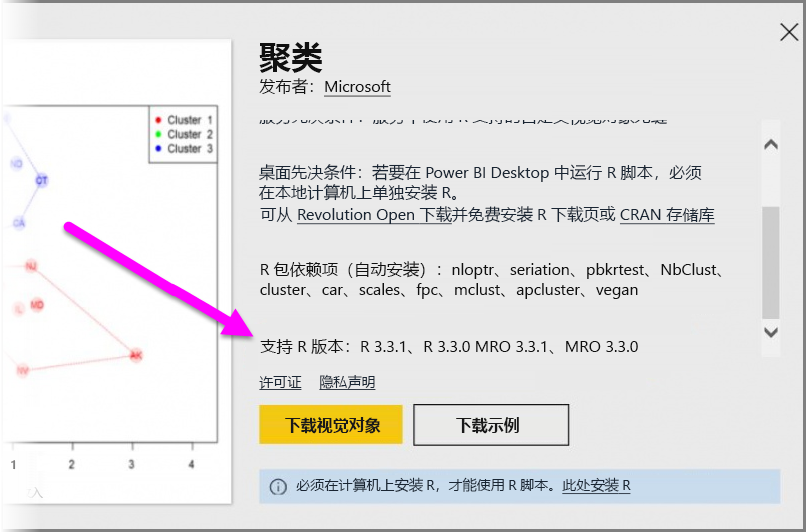

# 在 Power BI 中使用 R 驱动的自定义视觉对象
在 2016 年 10 月发布的 **Power BI Desktop** 和更高版本中，以及在 **Power BI 服务**中，无需掌握任何 R 知识，也无需使用任何 R 脚本，即可使用 R 驱动的自定义视觉对象。 这样一来，无需学习任何 R 知识，也无需自行进行任何编程，即可利用 R 视觉对象和 R 脚本的分析和视觉功能。

要使用 R 驱动的自定义视觉对象，你首先应从 Power BI **自定义视觉对象**库的 **R 驱动的视觉对象**部分选择和下载自己感兴趣使用的 R 自定义视觉对象。

以下部分介绍了如何在 **Power BI Desktop** 中选择、加载和使用 R 驱动的视觉对象。

### 使用 R 自定义视觉对象
若要使用 R 驱动自定义视觉对象，你需要从**自定义视觉对象**库下载每个视觉对象，然后可以在 **Power BI Desktop** 中如使用其他任何类型的视觉对象一样来使用此视觉对象。 步骤如下：

1. 转到[自定义视觉对象](http://app.powerbi.com/visuals)库，网址为 [http://app.powerbi.com/visuals](http://app.powerbi.com/visuals)。 选择页面顶部附近的“R 驱动的视觉对象”链接。
   
   
2. 从库中选择要使用的 **R 驱动的视觉对象**。 此时，系统会显示一个对话框，以提供更多详细信息。 选择“**下载视觉对象**”进行下载。
   
   > [!NOTE]
> 若要在 Power BI Desktop 中创作，需要在本地计算机上安装 R。 但用户要在 **Power BI 服务**中查看 R 驱动的视觉对象时，他们不需要在本地安装 R。
   > 
   > 
   
   
   
   无需安装 R 即可在 **Power BI 服务**中使用 R 驱动的自定义视觉对象。不过，如果要在 **Power BI Desktop** 中使用 R 驱动的自定义视觉对象，则必须在本地计算机上安装 R。 可以从以下位置下载 R：
   
   * [CRAN 3.3.1](https://cran.r-project.org/bin/windows/base/R-3.3.1-win.exe)
   * [MRO 3.3.1](https://mran.microsoft.com/install/mro/3.3.1/microsoft-r-open-3.3.1.msi)
3. 下载视觉对象（与从浏览器下载任何文件类似）后，转到 **Power BI Desktop**，右键单击“**可视化效果**”窗格中的省略号 (...)，然后选择“**导入自定义视觉对象**”。
   
   
4. 导入自定义视觉对象时的注意事项，具体如下图所示：
   
   
5. 导航到视觉对象文件保存的位置，然后选择该文件。 **Power BI Desktop** 自定义可视化效果具有.pbiviz 扩展名。
   
   
6. 返回 Power BI Desktop 时，你可以在“**可视化效果**”窗格中看到新的视觉对象类型。
   
   
7. 在你导入新的视觉对象（或打开包含 R 驱动的自定义视觉对象的报表）后，**Power BI Desktop** 便会安装相应的 R 包。
   
   

在这里，你将数据添加到视觉对象，如添加到任何其他 **Power BI Desktop** 视觉对象一样。 完成后，你可以在画布上看到完成的视觉对象。 在下面的视觉对象中，R 驱动的视觉对象 **Forecasting** 与联合国 (UN) 出生速率预测一同使用（左侧的视觉对象）。

如任何其他 **Power BI Desktop** 视觉对象一样，你可以将此报表及其 R 驱动的视觉对象发布到 **Power BI 服务**并与他人共享。

经常查看 [R 驱动的自定义视觉对象](https://app.powerbi.com/visuals/R-powered)库，因为新的视觉对象不断地加入其中。

### 贡献 R 驱动的自定义视觉对象
如果你创建自己的 R 视觉对象以供在报表中使用，则可以向**自定义视觉对象库**提供你的自定义视觉对象，从而与全世界共享你的视觉对象。 通过 GitHub 进行贡献，相应过程在以下位置有所讲述：

* [贡献到 R 驱动的自定义视觉对象库](https://github.com/Microsoft/PowerBI-visuals#building-r-powered-custom-visual-corrplot)

### 对 R 驱动的自定义视觉对象进行故障排除
必须满足 R 驱动的自定义视觉对象的特定依存关系，视觉对象才能正常运行。 如果 R 驱动的自定义视觉对象未运行或未正常加载，通常是出现下面的一种问题：

* R 引擎缺失
* 视觉对象基于的 R 脚本出错了
* R 包缺失或已过期

下面的部分介绍了你可以用来解决所遇到的问题的故障排除步骤。

#### R 包缺失或已过期
在尝试安装 R 驱动的自定义视觉对象时，如果 R 包缺失或已过期，则可能会看到错误；通常可能是由于如下一种原因所致：

* R 安装与 R 包不兼容
* 防火墙、防病毒软件或代理设置阻止 R 连接 Internet
* Internet 连接速度慢，或无法连接 Internet

Power BI 团队正在努力降低你遇到这些问题的可能性，下一版 Power BI Desktop 将包含用于解决这些问题的更新程序。 在此之前，你可以按以下一个或多个步骤操作，从而降低遇到这些问题的可能性：

1. 删除自定义视觉对象，然后重新安装。 这会重新开始安装 R 包。
2. 如果安装的 R 不是最新版，请升级 R 安装，然后删除/重新安装自定义视觉对象，如上一步所述。
   
   * 每个 R 驱动的自定义视觉对象的描述中列出了支持的 R 版本，如下图所示。
     
     > [!NOTE]
> 可以保留原始 R 安装，仅将 Power BI Desktop 与当前安装的版本相关联。 依次转到“**文件 > 选项和设置 > 选项 > R 脚本**。
3. 使用任意 R 控制台手动安装 R 包。 此方法的具体步骤如下所示：
   
   a.  下载 R 驱动的视觉对象安装脚本，然后将该文件保存到本地驱动器。
   
   b.  在 R 控制台中运行以下命令：
   
       > source(“C:/Users/david/Downloads/ScriptInstallPackagesForForecastWithWorkarounds.R”)    
   
   典型的默认安装位置如下所示：
   
       c:\Program Files\R\R-3.3.x\bin\x64\Rterm.exe (for CRAN-R)
       c:\Program Files\R\R-3.3.x\bin\x64\Rgui.exe (for CRAN-R)
       c:\Program Files\R\R-3.3.x\bin\R.exe (for CRAN-R)
       c:\Program Files\Microsoft\MRO-3.3.x\bin\R.exe (for MRO)
       c:\Program Files\Microsoft\MRO-3.3.x\bin\x64\Rgui.exe (for MRO)
       c:\Program Files\RStudio\bin\rstudio.exe (for RStudio)
4. 如果上述步骤不起作用，请尝试按以下步骤操作：
   
   a. 使用 **R Studio**，按上述 3.b. 中所述的步骤操作 （在 R 控制台中运行脚本代码）。
   
   b. 如果上一步不起作用，请更改 **R Studio** 中的“**工具 > 全局选项 > 包**”，并选中**将 Internet Explorer 库/代理用于 HTTP** 复选框，然后重复执行 上述 3.b. 中的步骤。

### 后续步骤
查看以下更多信息，了解有关 Power BI 中的 R。

* [Power BI 自定义视觉对象库](https://app.powerbi.com/visuals/)
* [在 Power BI Desktop 中运行 R 脚本](desktop-r-scripts.md)
* [在 Power BI Desktop 中创建 R 视觉对象](desktop-r-visuals.md)
* [将外部 R IDE 与 Power BI 一起使用](desktop-r-ide.md)

