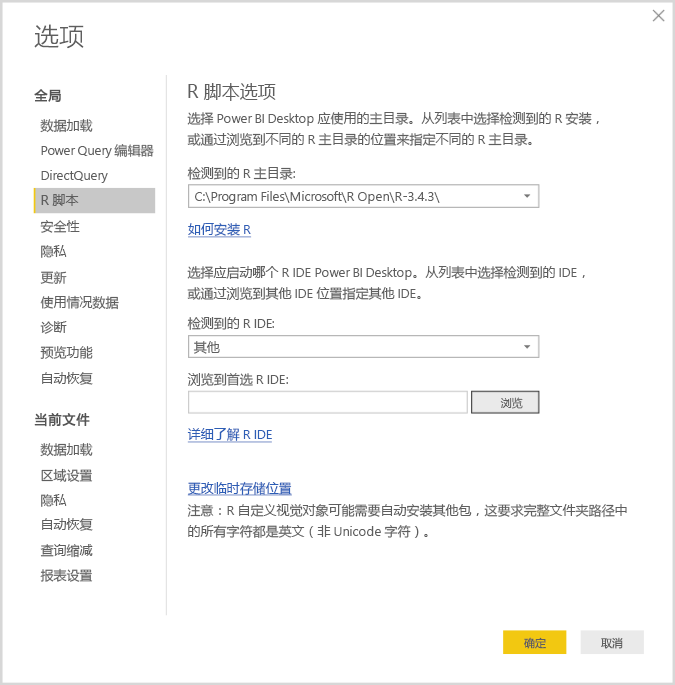
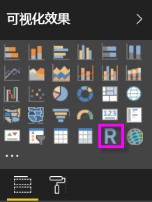
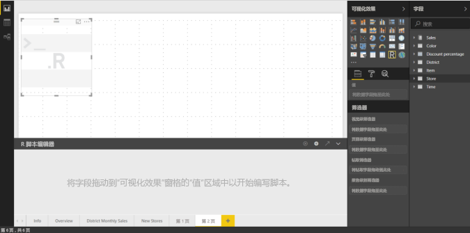
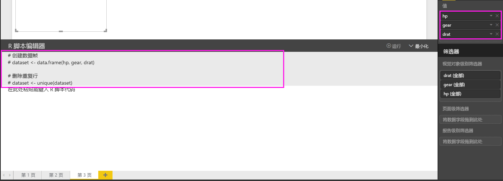
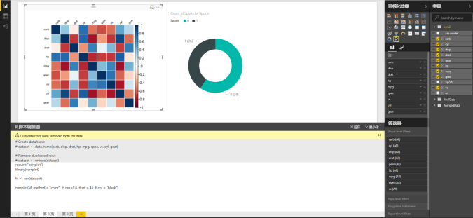
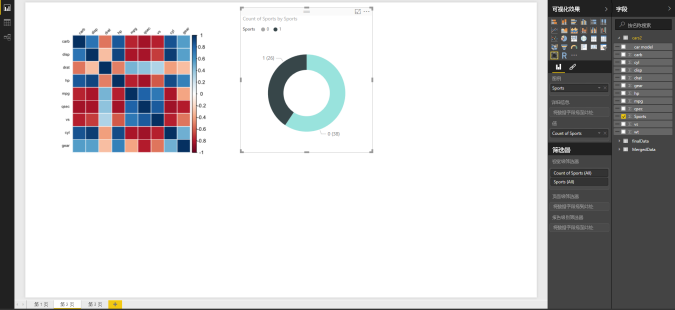
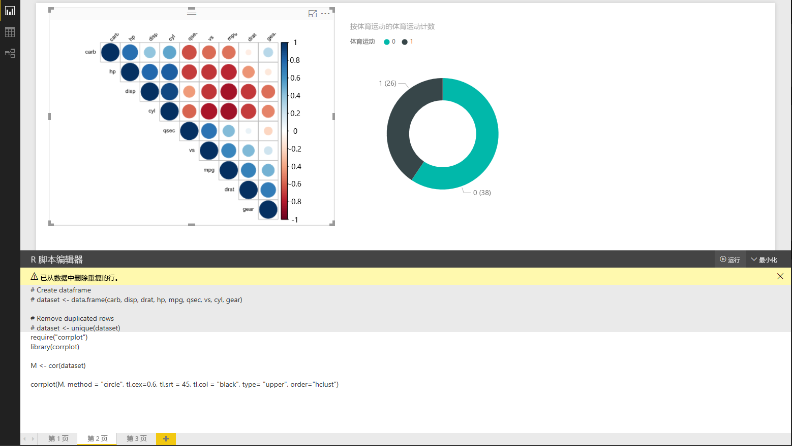
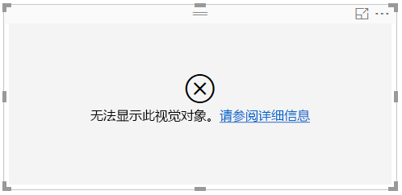

# 使用 R 创建 Power BI 视觉对象
借助 **Power BI Desktop**，可以使用 **R** 将数据可视化。

## 安装 R
Power BI Desktop 既不包括，也不会部署或安装 R 引擎。 若要在 **Power BI Desktop** 中运行 R 脚本，必须在本地计算机上单独安装 **R**。 可以从很多位置免费下载并安装 **R**，其中包括 [Revolution Open 下载页](https://mran.revolutionanalytics.com/download/)，以及 [CRAN 存储库](https://cran.r-project.org/bin/windows/base/)。 **Power BI Desktop** 中的最新版 R 脚本支持在安装路径中使用 Unicode 字符以及空格（空字符）。

## 启用 R 视觉对象
若要启用 R 视觉对象，请选择**文件 > 选项和设置 > 选项**，并在出现的**选项**页中确保本地 R 安装在**选项**窗口的 **R 脚本**部分中指定，如下图所示。 下图中，R 的本地安装路径是 **C:\Program Files\R\R-3.2.0**，并在文本框中显式提供该路径。 请确保显示的路径正确地反映了想要 **Power BI Desktop** 使用的本地 R 安装。
   
   

一旦指定 R 安装，就可以开始创建 R 视觉对象。

## 在 Power BI Desktop 中创建 R 视觉对象
1. 在**可视化效果**窗格中选择 **R 视觉对象**图标以添加 R 视觉对象，如下图中所示。
   
   

   向报表添加 R 视觉对象后，**Power BI Desktop** 执行以下任务：
   
   - 占位符 R 视觉对象图像位于报表画布上。
   
   - R 脚本编辑器位于中央窗格底部边缘处。
   
   

2. 接下来，在“**字段**”的“**值**”部分中添加要在 R 脚本中使用的字段，就像处理其他任何 **Power BI Desktop** 视觉对象一样。 
    
    只有已添加到“字段”的字段才可供 R 脚本使用。 可以在 Power BI Desktop R 脚本编辑器中处理 R 脚本的同时，添加新字段，或从“字段”中删除不必要的字段。 **Power BI Desktop** 会自动检测已添加或删除的字段。
   
   > [!NOTE]
   > R 视觉对象的默认聚合类型是“不汇总”。
   > 
   > 
   
3. 现在你可以使用你选择用来创建绘图的数据。 

    选择了字段，**R 脚本编辑器**将基于编辑器窗格顶部旁边灰色部分中的选择生成支持 R 脚本绑定代码。 随着你选择或删除其他字段，R 脚本编辑器中的支持代码将相应地被自动生成或删除。
   
   下图所示示例中，选择了三个字段：hp、gear 和 drat。 由于这些选择，R 脚本编辑器将生成以下绑定代码：
   
   * 创建了名为**数据集**的数据帧
     * 该数据帧由用户选择的不同字段组成
   * 默认聚合是*不求和*
   * 类似于表格视觉对象，字段将进行分组，并且重复行只出现一次
   
   
   
   > [!TIP]
   > 在某些情况下，你可能不希望进行自动分组，或者可能希望所有行都出现，包括重复项。 在这种情况下，你可以向将导致所有行被视为唯一且阻止分组的数据集添加索引字段。
   > 
   > 
   
   生成的数据帧被称为“数据集”，并且可以通过相应所选列名称访问所选列。 例如，gear 字段可通过在 R 脚本中编写 dataset$gear 进行访问。 对于具有空格或特殊字符的字段，请使用单引号。

4. 借助所选字段自动生成的数据帧，就可以编写将导致绘制到 R 默认设备的 R 脚本。 该脚本完成时，从 **R 脚本编辑器**标题栏选择**运行**（**运行**位于标题栏右侧）。
   
    选择“运行”后，Power BI Desktop 会识别绘图，并在画布上予以呈现。 由于该过程是在本地 R 安装上执行，请确保安装了所需的包。
   
   当以下任一事件发生时，**Power BI Desktop** 会重新绘制视觉对象：
   
   * 当从“R 脚本编辑器”标题栏选择“运行”
   * 每当数据更改发生时（由于数据刷新、筛选或突出显示所导致）

    下图显示相关绘图代码的示例，并绘制不同类型汽车特征间的关联。

    

5. 若要获取可视化效果的较大视图，你可以尽量减小 **R 脚本编辑器**。 当然，如同 Power BI Desktop 中的其他视觉对象，你可以只选择环形视觉对象（在上面的示例图像中，为右侧的圆形视觉对象）中的跑车，交叉筛选相关绘图。

    

6. 还可修改 R 脚本，自定义视觉对象，并通过向绘图命令添加参数来利用 R 的强大功能。

    原始的绘图命令如下所示：

    corrplot(M, method = "color",  tl.cex=0.6, tl.srt = 45, tl.col = "black")

    R 脚本中进行了一些更改，该命令现如下所示：

    corrplot(M, method = "circle", tl.cex=0.6, tl.srt = 45, tl.col = "black", type= "upper", order="hclust")

    结果是，R 视觉对象现在绘制圆形，只考虑了上半部分，对矩形图重新排序以集中相关特征，如下图中所示。

    

    如果执行 R 脚本时导致错误，则不会绘制 R 视觉对象，并且画布上将显示一条错误消息。 有关错误详细信息，请从画布上 R 视觉对象选择**查看详细信息**。

    

    > **R 脚本安全性：** R 视觉对象从 R 脚本创建，这可能包含具有安全风险或隐私风险的代码。 当尝试查看 R 视觉对象或首次与其交互时，用户会看到一条安全警告消息。 仅当你信任作者和来源，或者在查看并了解 R 脚本之后，才启用 R 视觉对象。
    > 
    > 

## 已知限制
**Power BI Desktop** 中的 R 视觉对象有一些限制：

* 数据大小限制 - R 视觉对象用于绘制的数据仅限 150,000 行。 如果选择了 150,000 行以上，则只会使用前 150,000 行，且在图像上显示一条消息。
* 计算时间限制 - 如果 R 视觉对象计算时间超过 5 分钟，则执行将超时，从而导致错误。
* 关系 - 如同其他 Power BI Desktop 视觉对象，如果选择的不同表中数据字段间没有定义关系，则会发生错误。
* R 视觉对象在数据更新、筛选和突出显示时进行刷新。 但是，图像本身不是交互的并且不能为交叉筛选的源。
* R 视觉对象响应突出显示的其他视觉对象，但你不能单击 R 视觉对象中的元素以进行其他元素的交叉筛选。
* 只有绘制到 R 默认显示设备的绘图会正确地显示在画布上。 避免显式使用不同的 R 显示设备。
* 在此版本中，RRO 安装未由 32 位版本的 Power BI Desktop 自动标识，因此你必须在**选项和设置 > 选项 > R 脚本**中手动提供 R 安装目录的路径。

## 后续步骤
查看以下更多信息，了解有关 Power BI 中的 R。

* [在 Power BI Desktop 中运行 R 脚本](desktop-r-scripts.md)
* [将外部 R IDE 与 Power BI 一起使用](desktop-r-ide.md)

