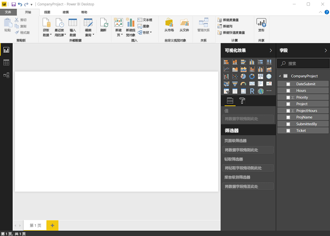
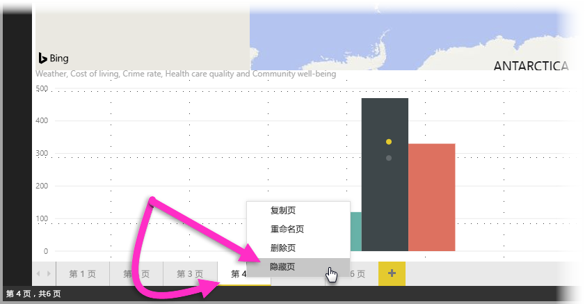

# Power BI Desktop 中的报表视图
如果你一直在使用 Power BI，就知道它非常便于创建可为数据提供动态透视和深入见解的报表。 在 Power BI Desktop 中，Power BI 还具有更高级的功能。 通过 Power BI Desktop，可创建高级查询、混合多个源中的数据和创建表格之间的关系等。

Power BI Desktop 提供**报表视图**，可在其中创建任何数量具有可视化内容的报表页。 此处报表视图所提供的设计体验与 Power BI 中报表的编辑视图所提供的几乎相同。 可四处移动可视化内容，进行复制粘贴、合并等。

两者的区别在于当使用 Power BI Desktop 时，可运用查询并对数据建模以确保数据支持报表中的最佳见解。 无论在本地驱动器还是云中，都可在任何位置保存 Power BI Desktop 文件。

## 我们来看一下吧！
首次在 Power BI Desktop 中加载数据时，将显示具有空白画布的**报表视图**。

通过选择左侧导航栏中的图标，可在报表视图、数据视图和关系视图之间切换：

添加一些数据后，可在画布中新的可视化对象内添加字段。

要更改可视化对象的类型，可在功能区的“可视化”组中将其选中，或者右键单击并从“更改可视化类型”图标中另选一种类型。

> [!TIP]
> 请务必试用不同的可视化类型。 可视化对象可清楚传达数据中的信息，这一点非常重要。
> 
> 

报表将至少具有一个可供使用的空白页。 页面将显示在画布左侧的浏览器窗格中。 可向页面添加各种类型的可视化效果，但请不要过度编写。 如果页面上的可视化效果太多，将使其看起来杂乱，很难找到正确信息。 可以将新的页面添加到报表中。 只需单击功能区上的“新建页面”。

若要删除页面，请单击报表视图底部页面的选项卡上的 **X**。

> [!NOTE]
> 报表和可视化对象均不可固定到 Power BI Desktop 中的仪表板上。 为此，需要[从 Power BI Desktop 发布](desktop-upload-desktop-files.md)到 Power BI 站点。

## 隐藏报表页

创建报表时，还可以隐藏报表中的页面。 如果需要在报表中创建基础数据或视觉对象，但你不希望这些页面对其他人可见时（例如创建在其他报表页中使用的表格或支持视觉对象时），此功能可能很有用。 还有许多其他富有新意的原因：你可能想要创建报表页，然后在要发布的报表中隐藏该报表页。 

隐藏报表页的操作很简单。 只需右击报表页选项卡，然后在显示的菜单中选择“隐藏”。

隐藏报表页时需要牢记以下几点注意事项：

* 在 Power BI Desktop 中，即使页面标题变灰，仍然可以看见隐藏的报表视图。在下图中，第 4 页是隐藏的。

    

* 查看 Power BI 服务中的报表时，无法查看隐藏的报表页。

* 隐藏报表页不是一种安全措施。 用户仍然可以访问该页面，并且仍可以使用钻取和其他方法访问页面的内容。

* 页面处于隐藏状态时，在视图模式下，不显示任何视图模式导航箭头。

