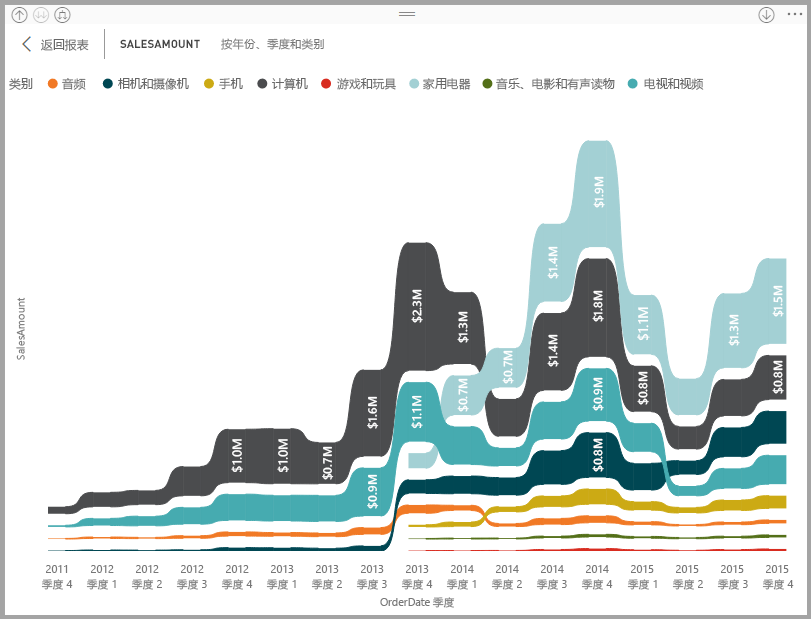
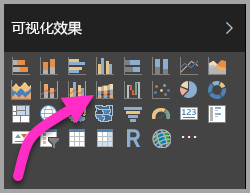
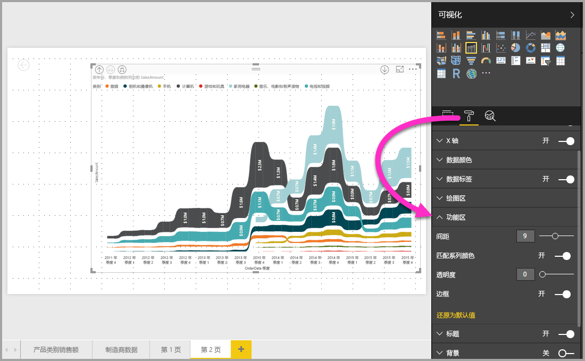

# 在 Power BI 中使用功能区图表
可以在 Power BI 中使用“功能区图表”来直观显示数据，并快速确定哪个数据类别具有最高排名（最大值）。 功能区图表能够高效地显示排名变化，并且会在每个时间段内始终将最高排名（值）显示在最顶部。 2017 年 9 月发行版 Power BI Desktop 开始提供功能区图表，后续 Power BI 服务更新版本中也会提供此图表。

## 创建功能区图表
若要创建功能区图表，请在“可视化效果”面板中选择“功能区图表”。

功能区图表使用功能区在可视化时间连续区间内连接一个数据类别，从而使你可以看到某个给定的类别在图表的 x 轴（通常是时间线）范围内是如何排名的。

## 设置功能区图表格式
在创建功能区图表时，可以在“可视化效果”窗格的“格式”部分使用格式设置选项。 功能区图表的格式设置选项类似于堆叠柱状图中的相应选项，只不过它还具有特定于功能区的其他格式设置选项。

可以使用功能区图表的这些格式设置选项调整以下各项：

* “间距”可调整功能区之间的间隔大小。 数值为列的最大高度的百分比。
* “匹配系列颜色”可以将功能区的颜色与系列颜色进行匹配。 关闭时，功能区为灰色。
* “透明度”指定功能区的透明度，默认设置为 30。
* “边框”可以在功能区的顶部和底部使用深色边框。 默认情况下，边框为关闭状态。

## 后续步骤
有关 Power BI Desktop 以及如何入门的详细信息，请查看以下文章。

* [Power BI Desktop 入门](desktop-getting-started.md)
* [Power BI Desktop 的查询概述](desktop-query-overview.md)
* [Power BI Desktop 中的数据源](desktop-data-sources.md)
* [连接到 Power BI Desktop 中的数据](desktop-connect-to-data.md)
* [使用 Power BI Desktop 调整和合并数据](desktop-shape-and-combine-data.md)
* [Power BI Desktop 中的常见查询任务](desktop-common-query-tasks.md)   

