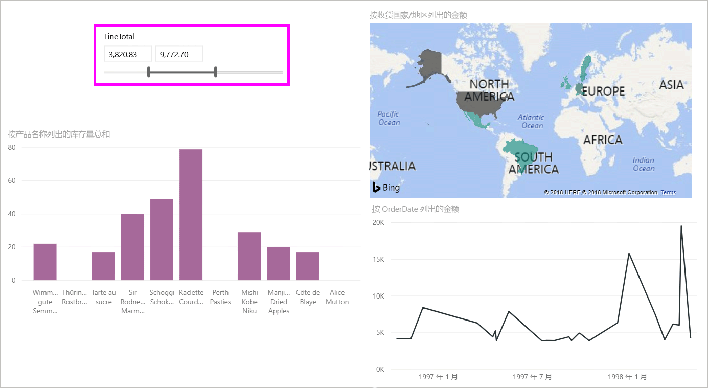
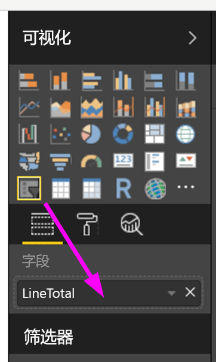
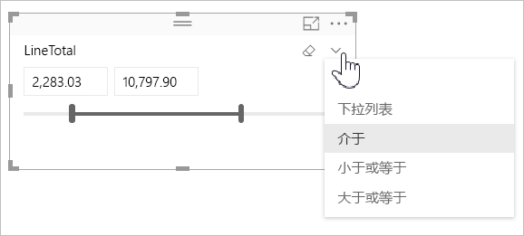
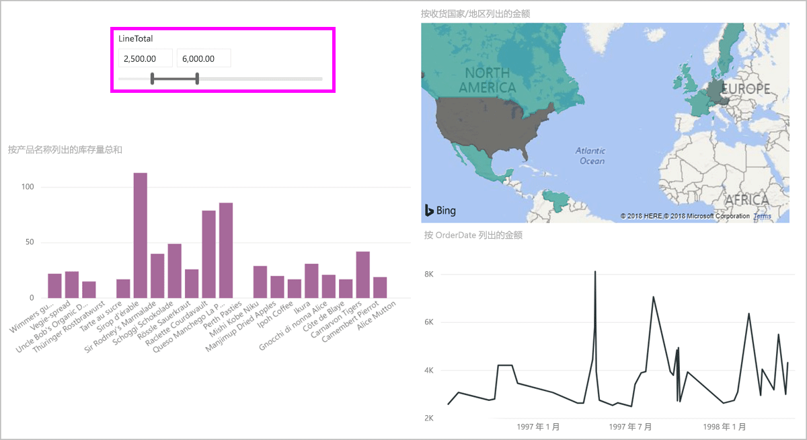
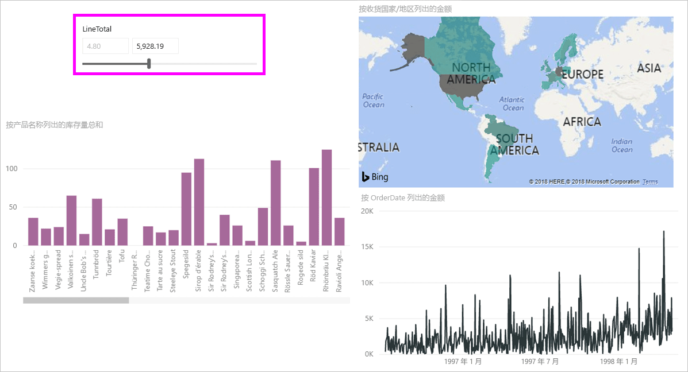
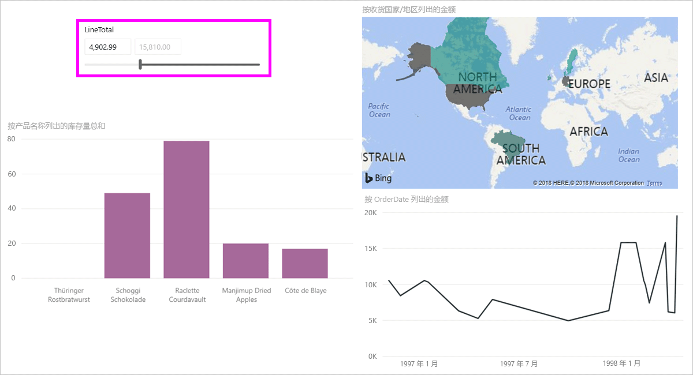

# 在 Power BI Desktop 中使用数值范围切片器
借助**数值范围切片器**，可以将各种类型的筛选器应用于数据模型中的任意数值列。 可以选择“介于”（某数字范围）、“小于或等于”（某数字）或“大于或等于”（某数字）来进行筛选。 虽然这听起来可能很简单，但在筛选数据方面这却是功能十分强大的一种方法。

## 使用数值范围切片器
数值范围切片器的使用方法与其他任何切片器均相同。 只需为报表创建**切片器**视觉对象，然后选择一个数值作为“**字段**”值即可。 在下图中，选择了 LineTotal 字段。

选择“数值范围切片器”右上角的向下箭头。此时，系统会显示一个菜单。

对于数值范围，可以从以下三个选项中进行选择：

* 介于
* 小于或等于
* 大于或等于

选择菜单中的“**介于**”后，便会看到一个滑块条，可以筛选出介于某数字范围的数值。 除了使用滑块条本身，还可以单击任一框，然后键入值。 如果要进行切片以筛选出特定数字，但滑块条的粒度不够细化，难以精确地滑到相应的数字，键入值就非常方便。

在下图中，我们在报表页中筛选出了介于 2500.00 到 6000.00 的 LineTotal 值。

选择“**小于或等于**”后，滑块条的左侧（下限值）图柄消失，我们只能调整滑块条的上限值。 在下图中，我们将滑块条最大值设置为 5928.19。

最后，如果我们选择“**大于或等于**”，滑块条的右侧（上限值）图柄消失，我们可以调整下限值，如下图所示。 现在，报表页的视觉对象中仅显示 LineTotal 大于或等于 4902.99 的项。

## 使用数值范围切片器对齐到整数

数值范围切片器将对齐到整数，除非它属小数范围。 这样一来，切片器就可以清晰地对齐整数。 

## 限制和注意事项
目前，数值范围切片器存在下面的限制和注意事项：

* **数值范围切片器**目前筛选所有基础行数据，而不筛选任何汇总值。 例如，如果使用的是“*销售额*”字段，那么筛选的是每个交易的“*销售额*”，而不会筛选视觉对象中每个数据点的“*销售额*”总和。
* 暂不支持度量值。
