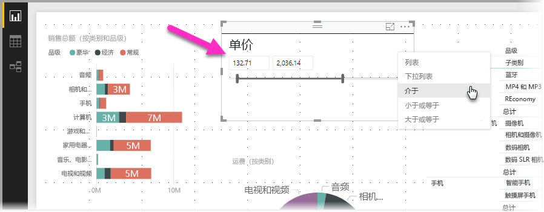
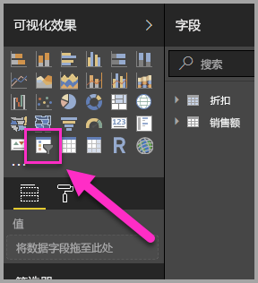
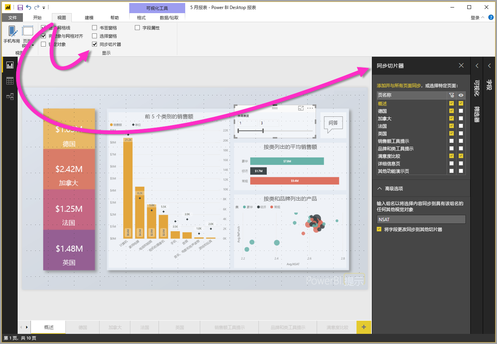
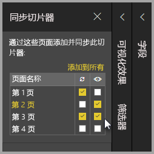

# 在 Power BI Desktop 中使用切片器

可以在 Power BI Desktop 中使用切片器筛选报表页上视觉对象的结果。 此外，借助切片器，可以通过与切片器本身交互来轻松调整应用的筛选器。 还可以指定切片器如何显示以及如何与切片器进行交互的选项。 下图显示了一个切片器，可以看到它的“类型”下拉列表。 

切片器可以在以下任一类型中显示：

* 列表
* 下拉列表
* 介于
* 小于或等于
* 大于或等于

可以通过单击“可视化”窗格中的“切片器”视觉对象向报表添加切片器。

切片器在 Power BI Desktop 和 Power BI 服务中的操作类似。 有关使用切片器的教程，请参阅 [Power BI 服务中的切片器（教程）](power-bi-visualization-slicers.md)。

## 跨报表页同步切片器

在 Power BI Desktop 中，可以跨多个报表页同步切片器。 若要同步切片器，请在功能区的“视图”窗格中，选择“同步切片器”。 在同步切片器时，将出现“同步切片器”窗格，如下图所示。

在“同步切片器”窗格中，可以指定应如何跨报表页同步切片器。 可以指定每个切片器是否应该应用于各个独立的报表页，以及切片器是否应该在各个独立的报表页上可见。

例如，可以将切片器放置在报表的第 2 页上，如下图所示。 然后，可以选择该切片器是否应该应用于每个所选页面，以及该切片器是否应在报表中的每个所选页面上可见。 可以为每个切片器应用上述任意组合。 

使用窗格中的“添加到全部”链接将所选切片器应用到报表中的所有页面。

请注意，在“同步切片器”窗格上显示的选择仅适用于所选切片器。 可以将多个切片器应用于不同页面，并使用窗格定义每个切片器如何分别应用于报表中的不同页面。 

尽管可以同步所选的切片器，但不会同步样式、编辑和删除等其他选择。 

## 后续步骤

你可能还会对以下文章感兴趣：

* [Power BI 服务中的切片器（教程）](power-bi-visualization-slicers.md)
* [在 Power BI Desktop 中使用数值范围切片器](desktop-slicer-numeric-range.md)
* [在 Power BI Desktop 中使用相对日期切片器和筛选器](desktop-slicer-filter-date-range.md)

