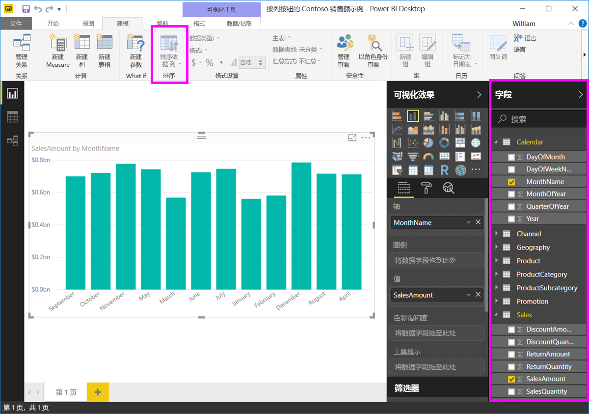

# 在 Power BI Desktop 中按列排序
在 **Power BI Desktop** 和 **Power BI 服务**中，你可以更改视觉对象的外观，方法是按不同的数据字段对其进行排序。 通过更改视觉对象的排序方式，可以突出显示想要表达的信息，并确保视觉对象反映相关趋势（或重点）。

无论使用数值数据（如销售数据）还是文本数据（如州名），都可按所需的方式对可视化进行排序，并将其设置为所需的外观。  **Power BI** 为你提供排序和快速菜单方面的灵活性。 在任何视觉对象上，选择省略号菜单 (...)，然后选择要用作排序依据的字段，如下图所示。

## 更多深入分析的示例
让我们举个具有更多深入分析的例子，并了解该示例在 **Power BI Desktop** 中的工作方式。

以下可视化效果按制造商名称显示成本、数量和金额。 未进行任何进一步排序之前，可视化内容的显示效果如下。

视觉对象当前按 SalesQuantity 进行排序 - 可将降序条的颜色与图例相匹配来进行分辨，但还有种更好的方式来确定当前排序列：视觉对象右上角的省略号菜单 (...)。 选择省略号时，将显示以下内容：

* 当前排序字段为 SalesQuantity，以下事实表明了这一点：“按 SalesQuantity 排序”以粗体显示，且包含黄色条形。 

* 当前排序方向为由小到大，如小图标 A/Z（A 在 Z 上方）和向下箭头所示。

下面两节将分别介绍排序字段和方向。

## 选择要用于排序的列
详细你已注意到“更多选项”菜单中“按 SalesQuantity 排序”旁边的黄色栏，它指示视觉对象按 SalesQuantity 列排序。 按其他列进行排序非常简单 - 选择省略号以显示省略号菜单，然后选择其他列即可。

在下图中，我们选择了 DiscountAmount 作为排序依据列。 此列恰好是视觉对象中的一行，而不是其中的某栏。 选择“按 DiscountAmount 排序”后的外观效果如下。

请注意视觉对象的更改方式。 现在，这些值从最高到最低 DiscountAmount 值排列，在此视觉对象中即为 Fabrikam Inc. 到 Northwind Traders。 

但如果想要按升序（而非降序）进行排序，该怎么办呢？ 下一部分展示了此操作是多么的简单。

## 选择排序顺序 - 最小到最大，最大到最小
如果更仔细地查看上图中的“选项”菜单，可以注意到“按 DiscountAmount 排序”旁的图标显示了 Z/A（Z 在 A 上方）。 来看一下：

显示 **Z/A** 时，表示视觉对象正在依据所选列按最大值到最小值的顺序进行排序。 想要进行更改？ 毫无问题 - 只需点击或单击 **Z/A** 图标，它就会将排序顺序更改为 **A/Z** 并按从最大值到最大值对视觉对象进行排序（基于所选列）。

还是相同的视觉对象，这次可点击“按 DiscountAmount 排序”菜单项上的 Z/A 图标来更改其排序顺序。 请注意，现在，Northwind Traders 是列出的第一个制造商，而 Fabrikam Inc. 是最后一个 - 与之前排序相反。

可按视觉对象中的任意列进行排序 - 点击“按 SalesQuantity 排序”，即可将“SalesQuantity”选作排序依据列，以便首先显示销售量最大的制造商，同时使视觉对象中的其他列仍对应于相应制造商。 下面来看看具有这些设置的视觉对象。

## 使用“排序依据列”按钮进行排序
对数据进行排序的另一个方法是通过使用“**建模**”功能区中的“**排序依据列**”按钮。

此排序方法要求你从“**字段**”窗格中选择一个列，然后选择“**排序依据列**”按钮来选择（通过哪一列）对视觉对象进行排序的方式。 必须选择要从“**字段**”窗格中进行排序的列（字段）才能启用“**排序依据列**”按钮，否则此按钮处于非活动状态。

下面介绍一个常见示例：假设你拥有来自一年中每个月的数据，并想按时间顺序对其进行排列。 以下步骤演示了操作过程。

1. 首先，请注意，如果选择了视觉对象但没有选择“**字段**”窗格中的列，“**排序依据列**”按钮将处于非活动状态（灰色）。
   
   

2. 在选择所需的排序依据列时，“**字段**”窗格中的“**排序依据列**”按钮将变为活动状态。
   
   
3. 选择视觉对象后，即可选择“MonthOfYear”，而不是默认值 (MonthName)，这样，视觉对象就会按所需顺序（按月份）进行排序。
   
   

就是这么简单。 请记住，必须选择“**字段**”窗格中的列，以使“**排序依据列**”按钮变为活动状态。

## 返回默认列进行排序
可按所需的任意列进行排序，但有时你可能也会想要将视觉对象返回到其默认的排序列。 没问题。 对于包含已选排序列的视觉对象（如上所述，在省略号菜单中，已选排序列旁有一个黄色条形），打开“更多选项”菜单并再次选择该列，可视化内容即会返回其默认排序列。

例如，下面是先前的图表：

返回菜单并再次选择“SalesQuantity”后，视觉对象默认按“制造商”字母顺序排列，如下图所示。

有如此多可用于排序视觉对象的选项，创建所需图表或图像轻而易举。

