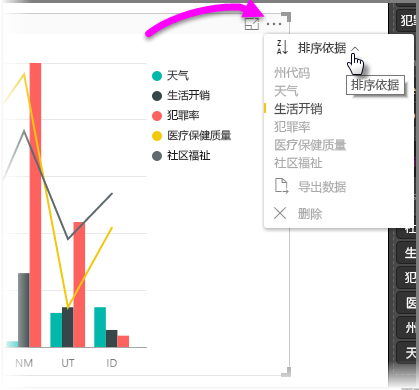
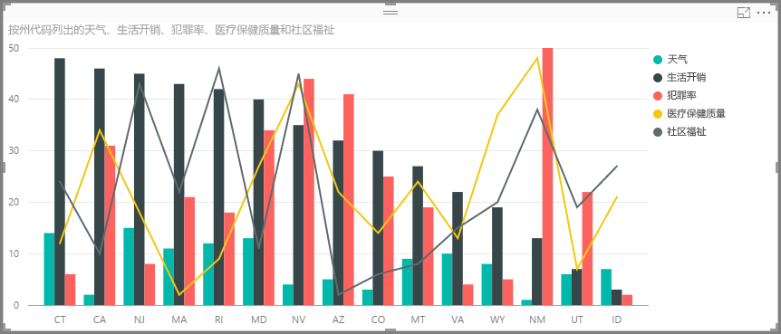
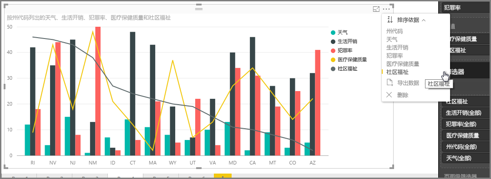
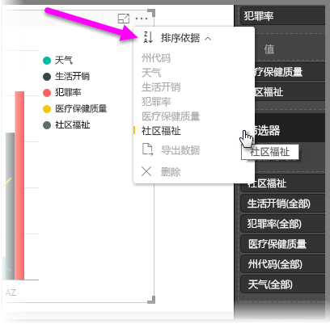
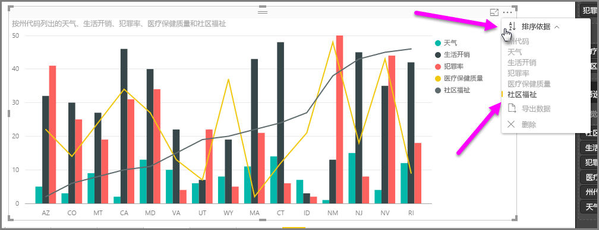
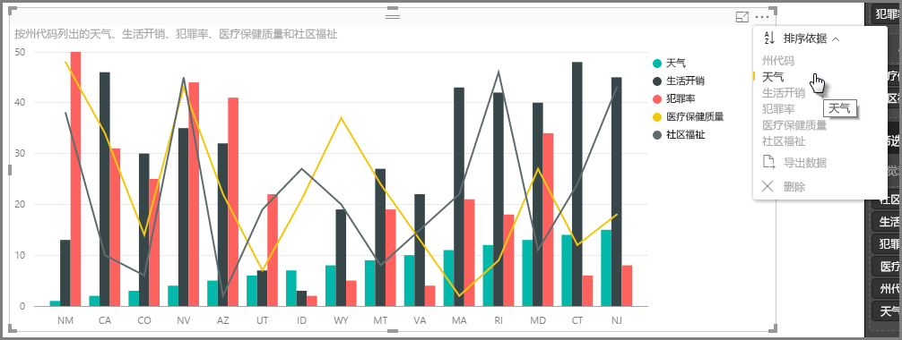
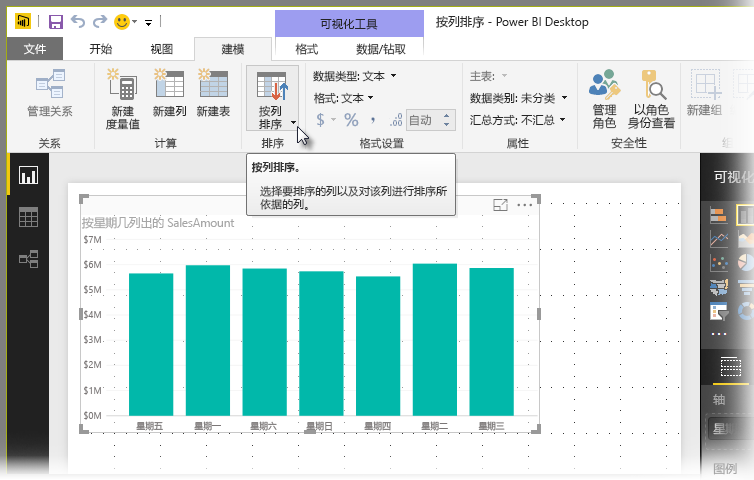
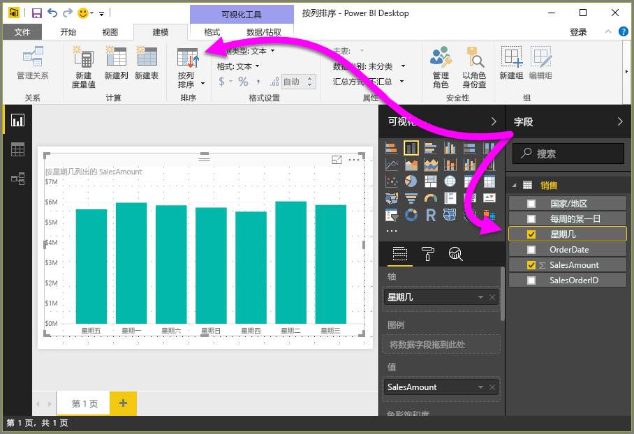
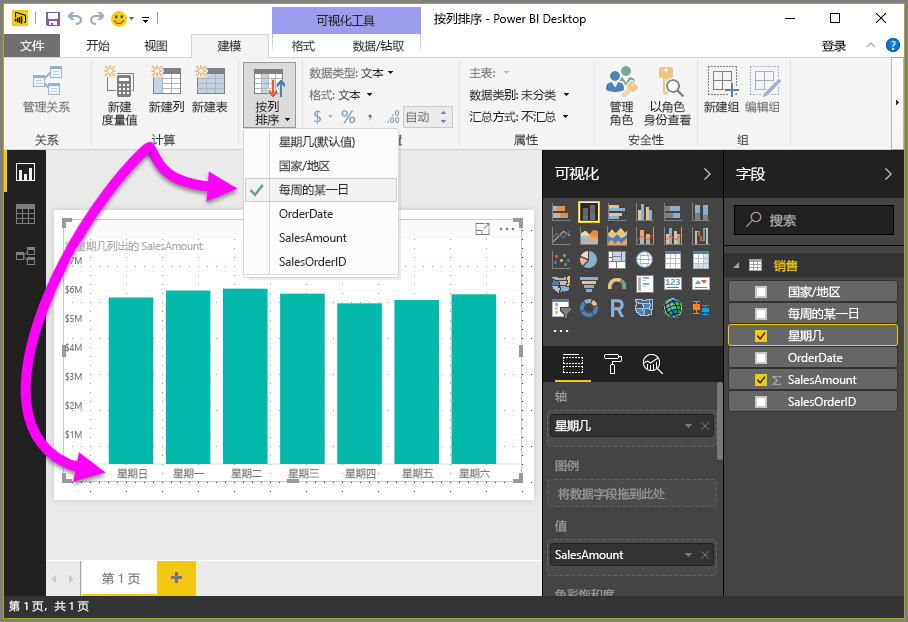
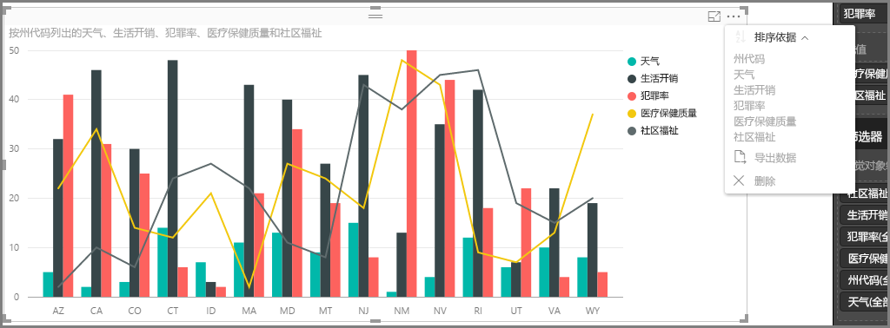

# 在 Power BI Desktop 中按列排序
在 **Power BI Desktop** 和 **Power BI 服务**中，你可以更改视觉对象的外观，方法是按不同的数据字段对其进行排序。 通过更改视觉对象的排序方式，可以突出显示想要表达的信息，并确保视觉对象反映想要传达的任何趋势（或重点）。

无论使用的是数值数据（如销售图表）还是文本数据（如州名），都可按所需的方式对可视化进行排序，并将其设置为所需的外观。  **Power BI** 为你提供排序和快速菜单方面的灵活性。 在任何视觉对象上，依次选择省略号菜单 (...)、“排序依据”以及排序所依据的字段，如下图中所示。

## 更多深入分析的示例
让我们举个具有更多深入分析的例子，并了解该示例在 **Power BI Desktop** 中的工作方式。

下述可视化内容列出了在天气方面排名靠前的 15 个州（最多晴天，从 1 到 50 排名，其中 1 表示晴天最多）。 下面是可视化内容在未进行任何排序之前的显示效果。

视觉对象当前按**生活成本**进行排序 - 可将降序条的颜色与图例相匹配来进行分辨，但还有种更好的方式来确定当前排序列：使用位于视觉对象右上角处省略号菜单 (...) 的**排序依据**对话框。 选择省略号时，将显示以下内容：

在选择省略号时出现的菜单中，需要注意以下几项：

* **生活成本**旁边的黄色栏，以及**生活成本**按粗体显示这一事实
* **排序依据**字词旁的小图标，它显示了 **Z/A**（从 Z 到 A 降序）和向下箭头。

我们将在以下两部分中分别探索其中每一项。

## 选择要用于排序的列
你注意到**排序依据**菜单中的**生活成本**旁边有个黄色栏，它表示可视内容正在使用**生活成本**列来对自身进行排序。 按其他列进行排序非常简单 - 只需选择省略号以显示**排序依据**菜单，然后选择其他列。 就是这么简单。

在下图中，我们选择了**社区幸福感**作为要依此进行排序的列。 此列恰好是视觉对象中的一行，而不是其中的某栏。 下面就是选择**社区幸福感**之后的外观效果。

请注意视觉对象的更改方式。 现在，对于此视觉对象中所含的这些州，值从“社区幸福感”最高值（本例中是 RI，即罗得岛州）到最低值（本例中是 AZ，即亚利桑那州）进行排序。 请记住，整张图表仍然仅包括具有最多晴天的 15 个州 - 我们只是按视觉对象中的其他列进行排序。

但如果想要按升序（而非降序）进行排序，该怎么办呢？ 下一部分展示了此操作是多么的简单。

## 选择排序顺序 - 最小到最大，最大到最小
如果更深入地查看上图中的**排序依据**菜单，可以注意到**排序依据**旁边的图标显示了 **Z/A**（从 Z 到 A 降序）。 来看一下：

显示 **Z/A** 时，表示视觉对象正在依据所选列按最大值到最小值的顺序进行排序。 想要进行更改？ 毫无问题 - 只需点击或单击 **Z/A** 图标，它就会将排序顺序更改为 **A/Z** 并按从最大值到最大值对视觉对象进行排序（基于所选列）。

还是相同的视觉对象，这次可点击**排序依据**菜单上的 **Z/A** 图标来更改其排序顺序。 请注意，现在首先列出的州是 AZ（亚利桑那州），而最后列出的是 RI（罗得岛州） - 与之前的完全相反。

可按视觉对象中的任意列进行排序 - 可轻松地将“天气”选为要按其进行排序的列，然后选择**排序依据**中的 **Z/A**，以首先显示具有最多晴天的州（最高值 - 天气等同于此数据模型中的晴天天数）；同时仍可保留视觉对象中的其他列（无论它们按何种方式应用到此州）。 下面来看看具有这些设置的视觉对象。

## 使用“排序依据列”按钮进行排序
对数据进行排序的另一个方法是通过使用“**建模**”功能区中的“**排序依据列**”按钮。

此排序方法要求你从“**字段**”窗格中选择一个列，然后选择“**排序依据列**”按钮来选择（通过哪一列）对视觉对象进行排序的方式。 必须选择要从“**字段**”窗格中进行排序的列（字段）才能启用“**排序依据列**”按钮，否则此按钮处于非活动状态。

让我们看一下常见的示例：你拥有一周中每一天的数据，并且想要基于时间顺序进行排序。 以下步骤演示了操作过程。

1. 首先，请注意，如果选择了视觉对象但没有选择“**字段**”窗格中的列，“**排序依据列**”按钮将处于非活动状态（灰色）。
   
   
2. 在选择所需的排序依据列时，“**字段**”窗格中的“**排序依据列**”按钮将变为活动状态。
   
   
3. 在选择视觉对象后，现在可以选择“每周的某一日”，而不是默认值（星期几），并且视觉对象现在会按照所需顺序进行排序：依据每周的某一日。
   
   

就是这么简单。 请记住，必须选择“**字段**”窗格中的列，以使“**排序依据列**”按钮变为活动状态。

## 返回默认列进行排序
可按所需的任意列进行排序，但有时你可能也会想要将视觉对象返回到其默认的排序列。 没问题。 对于已选中排序列的视觉对象（正如所示内容，在**排序依据**菜单中，所选排序列的旁边具有一个黄色栏），只需打开**排序依据**菜单并再次选择此列，可视化内容即可返回到其默认的排序列。

例如，下面是先前的图表：

返回菜单并再次选择“天气”后，视觉对象默认为按“州代码”字母顺序进行排序，如下图所示。

有如此多可用于排序视觉对象的选项，创建所需图表或图像轻而易举。

