# 根据 Power BI Desktop（预览版）中的报表页创建工具提示
根据 Power BI Desktop 中创建的报表页，可创建直观丰富的报表工具提示，这些提示在你将鼠标悬停在视觉对象上时显示。 通过创建用作工具提示的报表页，使自定义工具提示包含视觉对象、图像以及在报表页中创建的项的所有其他集合。 

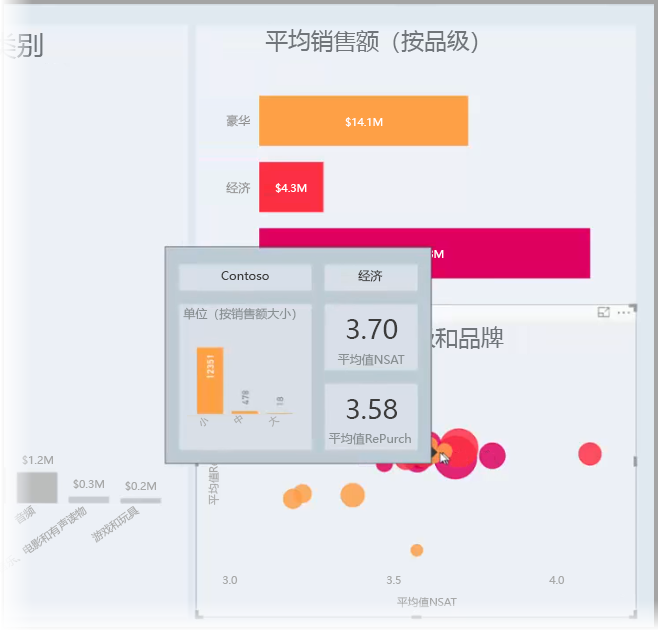

可根据需要创建任意数量的工具提示页。 每个工具提示页都可与报表中的一个或多个字段关联，以便在你将鼠标悬停在包含所选字段的视觉对象上时，将显示在工具提示页上创建的工具提示。在将鼠标悬停在该视觉对象上时，将根据鼠标悬停在其上的数据点进行筛选。 

可通过报表工具提示执行各种有趣的操作。 接下来介绍如何创建工具提示以及配置工具提示时的必备操作。

### 启用工具提示预览 
由于报表工具提示当前处于预览状态，因此在创建报表工具提示之前，需要先启用它们。 若要启用报表工具提示预览功能，请在 Power BI Desktop 中依次选择“文件”>“选项和设置”>“选项”>“预览功能”，然后选择“报表页工具提示”旁的复选框。 

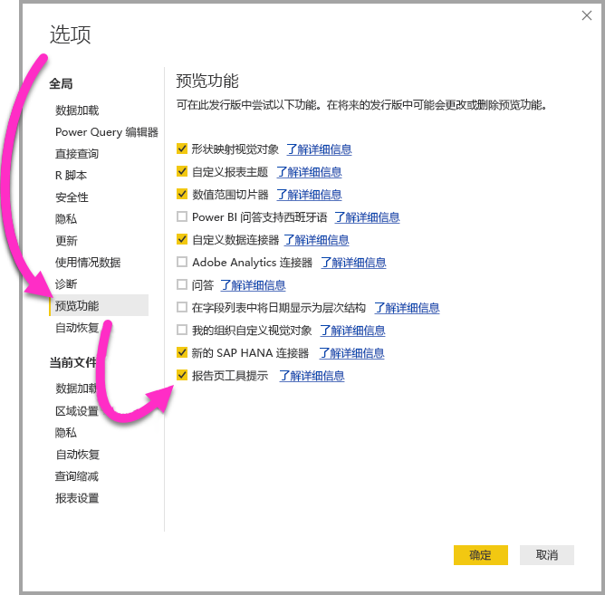

选择启用报表工具提示的预览版本后，需重启 Power BI Desktop。

## 创建报表工具提示页
首先，通过单击 + 按钮创建新的报表页（该按钮位于页选项卡区域的 Power BI Desktop 画布底部）。 该按钮位于报表最后一页的旁边。 

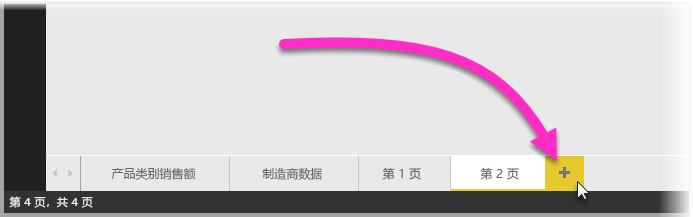

工具提示的大小不定，但请记住，工具提示要悬停在报表画布上方，因此可能需要将其调整为足够小。 在“页面大小”卡的“格式”窗格中，可看到一个名为“工具提示”的新页大小模板。 模板中具有可用于工具提示的报表页画布大小。

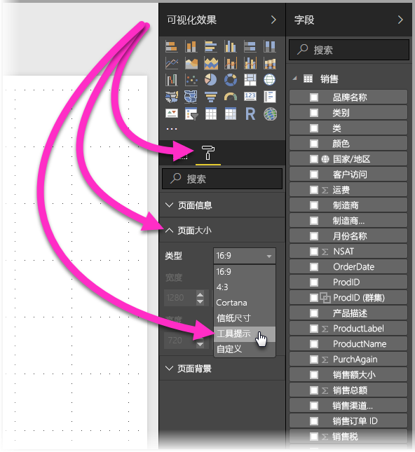

默认情况下，Power BI Desktop 将报表画布调整为适合可用页面空间的大小。 通常这是一个不错的选择，但是不适用于工具提示。 若要更好地了解完成之后工具提示的外观，可将“页面视图”更改为实际大小。 

为此，请在功能区中选择“视图”选项卡。 然后依次选择“页面视图”和“实际大小”，如下图所示。

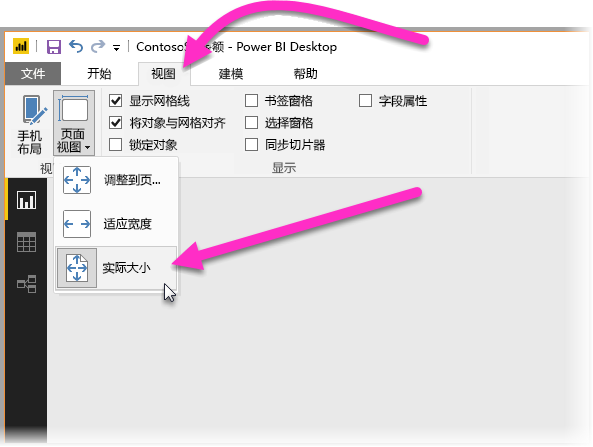

还可为报表页命名，以便更清楚其用途。 在“格式”窗格中选择“页面信息”卡，然后将名称键入此处的“名称”字段。 下图中，工具提示报表名称为“工具提示 1”，但可随意赋予更具创意的名称。

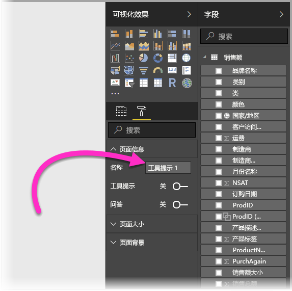

可在此处创建想在工具提示中显示的任意视觉对象。 下图中，工具提示页上有两张卡和一个簇状条形图，页面还自带背景颜色，且每个视觉对象也有背景颜色，进而呈现所需的外观。

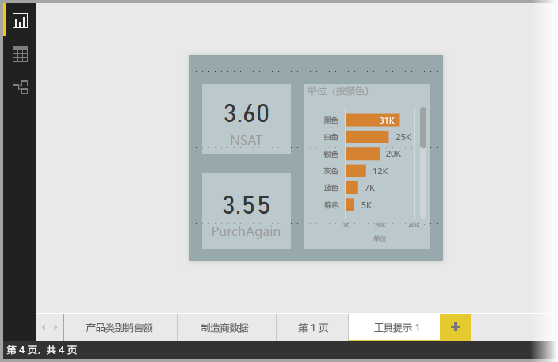

还需完成几个步骤，才能将工具提示报表页用作工具提示。 需按几种方式配置工具提示页，如下节所述。 

## 配置工具提示报表页

创建好工具提示报表页之后，需要配置页，让 Power BI Desktop 将其注册为工具提示，并确保它显示在正确的视觉对象上方。

首先，需要将“页面信息”卡中的“工具提示”滑块滑动到“开”，将页用作工具提示。 

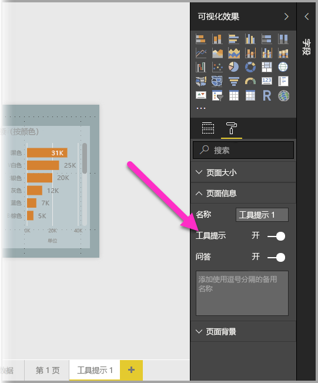

将该滑块滑动到“开”之后，可指定要对其显示报表工具提示的字段。 对于报表中包含指定字段的视觉对象，将显示工具提示。 可通过将字段拖到“可视化效果”窗格的“字段”部分中的“工具提示字段”存储桶，指定要应用的字段。 下图中，已将“SalesAmount”字段拖到“工具提示字段”存储桶。

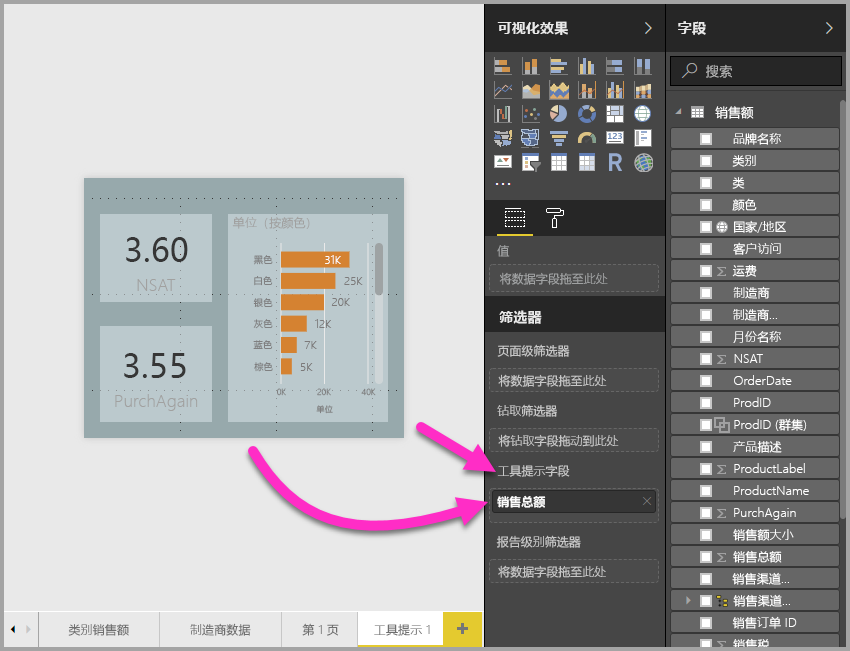
 
可在“工具提示字段”存储桶（包括度量值）中同时添加类别字段和数值字段。

完成操作后，创建的工具提示报表页将在报表中用作的视觉对象的工具提示，它使用“工具提示字段”存储桶中放置的任意字段替换默认的 Power BI 工具提示。

## 手动设置报表工具提示

除了创建将鼠标悬停在包含指定字段的视觉对象上时自动显示的工具提示之外，还可手动设置工具提示。 

现在，支持报表工具提示的视觉对象均在“格式设置”窗格中具有一个“工具提示”卡。 

若要手动设置工具提示，请选择要指定手动工具提示的视觉对象，然后在“可视化效果”窗格中选择“格式”部分并展开“工具提示”卡。

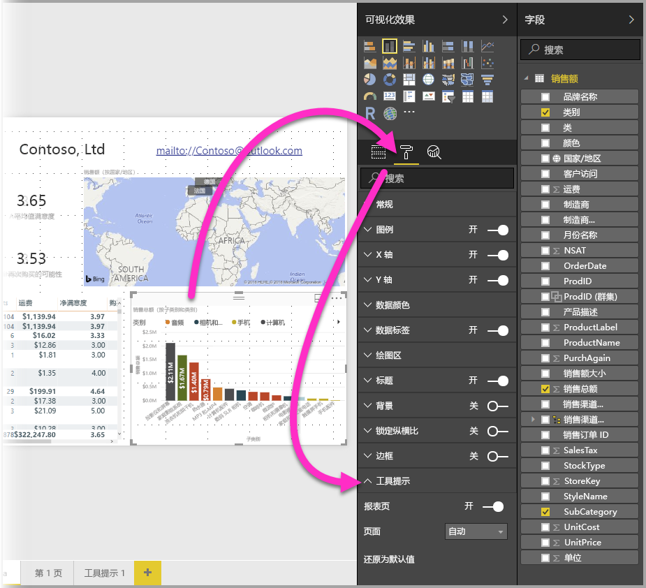

再在“页面”下拉列表中，选择要用于所选视觉对象的工具提示页。 请注意，对话框中仅显示指定为“工具提示”页的报表页。

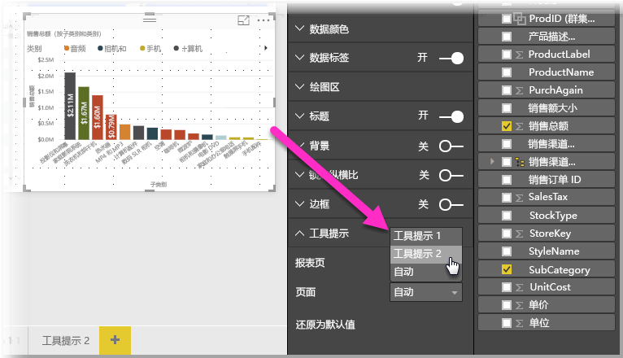

可手动设置工具提示的功能具有多种用途。 可设置空白的工具提示页，从而替代默认的 Power BI 工具提示选项。 还可在不希望 Power BI 自动选择的工具提示成为工具提示时使用。 例如，如果具有包含两个字段的视觉对象，且这两个字段均关联有工具提示，则 Power BI 仅显示其中一个。 你可能不希望出现此情况，因此可手动选择应显示的工具提示。

## 还原为默认的工具提示

如果创建视觉对象的手动工具提示，但希望改为默认的工具提示，可随时返回到 Power BI 提供的默认工具提示。 为此，在已选择视觉对象且已展开“工具提示”卡时，只需从“页面”下拉列表选择“自动”即可返回默认设置。

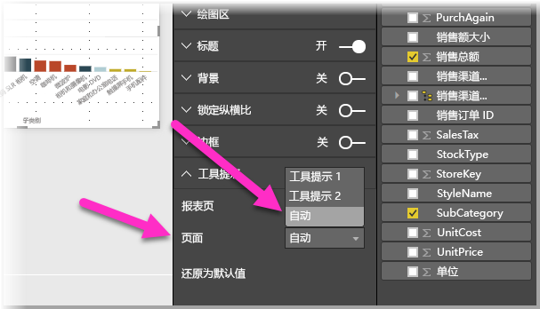

## 自定义报表工具提示和折线图

在报表工具提示与折线图视觉对象交互时，以及在交叉突出显示的情况下与视觉对象交互时，请记住以下几点注意事项。

### 报表工具提示和折线图

显示折线图的报表工具提示时，针对图形中的所有线条仅显示一个工具提示。 此行为与用于折线图的默认工具提示的行为类似，后者也只显示一个工具提示。 

这是因为图例中的字段不会作为工具提示的筛选项传递。 下图中，所示工具提示针对报告工具提示中所示的所有三个类别（本例中为 Deluxe、Economy 和 Regular）显示当天所售的全部数量。 

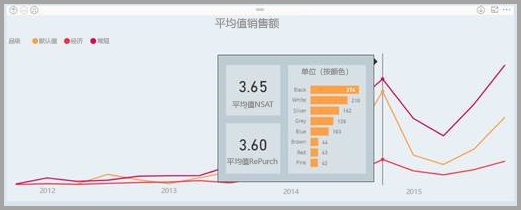

### 报表工具提示和交叉突出显示

视觉对象在报表中交叉突出显示时，报表工具提示始终显示交叉突出显示的数据，即使鼠标悬停在数据点的灰显部分上方也是如此。 下图中，鼠标悬停在条形图的灰显部分（未突出显示部分），但报表工具提示仍显示该数据点中已突出显示部分的数据（已突出显示的数据）。

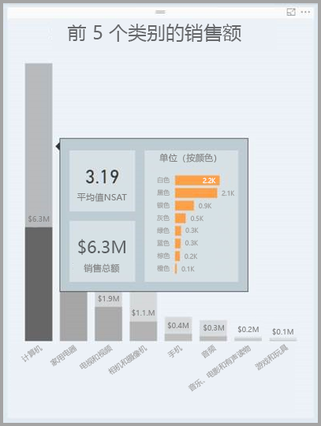

## 限制和注意事项
在这款报表工具提示预览版中需注意以下一些限制和事项。

* 在移动应用或嵌入式环境（包括“发布到 Web”）中查看报表时，不支持报表工具提示。 
* 自定义视觉对象不可使用报表工具提示。 
* 当前不支持将群集作为可在报表工具提示中显示的字段。 
* 选择要显示的报表工具提示字段，以及使用字段和类别时，包含该字段的视觉对象在带所选字段的摘要匹配的情况下仅显示所指定的工具提示。 

## 后续步骤
若要详细了解与报表工具提示类似或与其交互的功能，请参阅以下文章：

* [在 Power BI Desktop 中使用钻取](desktop-drillthrough.md)
* [在“焦点”模式下显示仪表板磁贴或报表视觉对象](service-focus-mode.md)

