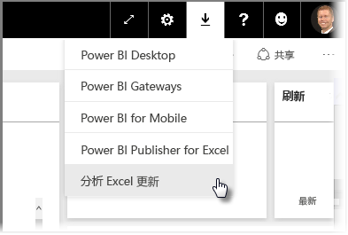
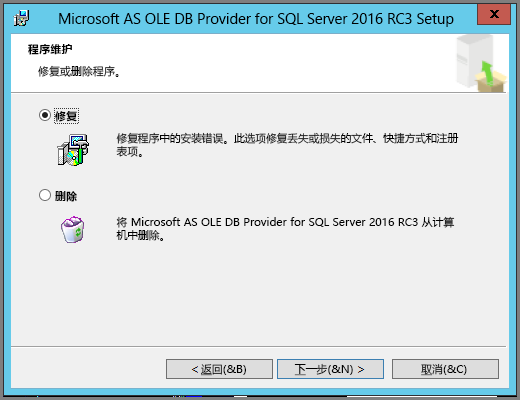
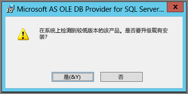

# Analyze in Excel 故障排除
有时，在使用 Analyze in Excel 期间可会能收意外的结果，或功能未按预期工作。 此页提供针对 Analyze in Excel 常见问题的解决方案。

> [!NOTE]
> 提供专门用于描述和启用[在 Excel 中分析](service-analyze-in-excel.md)的单独页面。
> 
> 如果遇到未在下面列出会导致问题的情况，你可以在[社区文章](http://community.powerbi.com/)上寻求进一步的帮助，或者也可以创建[支持票证](https://powerbi.microsoft.com/support/)。
> 
> 

本文包含以下故障排除部分：

* 更新 OLE DB 提供程序的 Excel 库
* 确定你是否需要更新 Excel 库
* “无法建立连接”错误
* “已禁止”错误
* 无数据模型
* 令牌过期错误
* 无法访问本地 Analysis Services
* 不能将任何对象拖动到数据透视表值区域（没有度量值）

## 更新 OLE DB 提供程序的 Excel 库
要使用 **Analyze in Excel**，必须在计算机上安装最新的 AS OLE DB 提供程序。 此[社区文章](http://community.powerbi.com/t5/Service/Analyze-in-Excel-Initialization-of-the-data-source-failed/m-p/30837#M8081)提供了大量用于验证你的 OLE DB 提供程序安装的信息，并提供最新版本的下载。

Excel 库的位级别必须与 Windows 版本的位级别匹配。 如果已经安装 64 位版本的 Windows，则需要安装 64 位版本的 OLE DB 提供程序。

要下载最新的 Excel 库，请访问 Power BI，并选择 Power BI 服务右上角的**向下箭头**，然后选择 **Analyze in Excel 更新**。

在出现的对话框中，选择**下载（预览版）**。

## 确定你是否需要更新 Excel 库
可从上一节中的链接下载 Excel OLE DB 提供程序库的最新版本。 在下载相应 OLD DB 提供程序库并开始安装之后，请根据你当前安装的版本执行检查。

如果你的 Excel OLE DB 提供程序客户端库是最新版本，则会显示一个对话框，如下所示︰

C:\Users\davidi\Desktop\powerbi-content-pr\articles\media\powerbi-desktop-troubleshooting-analyze-in-excel

或者，如果你正安装的版本比计算机上已安装的版本更高，将显示以下对话框︰

如果显示一个对话框并提示你进行升级，则应继续进行安装，在计算机上安装 OLE DB 提供程序的最新版本。

## “无法建立连接”错误
导致无法建立连接错误的主要原因是你计算机上的 OLE DB 提供程序客户端库不是最新版本。 有关如何确定正确更新的信息以及下载链接信息，请参阅本文前面的**更新 OLE DB 提供程序的 Excel 库**。

## “已禁止”错误
某些用户拥有多个 Power BI 帐户，并且当 Excel 尝试使用现有凭据连接到 Power BI 时可能会使用无权访问你要访问的数据集或报表的凭据。

当发生这种情况时，你可能会收到标题为**已禁止**的错误，这意味着你在登录 Power BI 时可能使用了无权访问数据集的凭据。 在发生**已禁止**错误之后，当系统提示你输入凭据时，请使用有权访问你要使用的数据集的凭据。

如果仍遇到错误，请使用拥有相应权限的帐户登录 Power BI 并确认你可以查看和访问正尝试在 Excel 中访问的 Power BI 中数据集。

## 无数据模型
如果发生“找不到 OLAP 多维数据集模型”错误，则表明你正尝试访问的数据集中不包含数据模型，因此不能在 Excel 中进行分析。

## 令牌过期错误
如果你收到**令牌过期**错误，表示你最近未在计算机上使用 **Analyze in Excel** 功能。 只需重新输入凭据或重新打开文件即可解决该错误。

## 无法访问本地 Analysis Services
如果尝试访问已连接到本地 Analysis Services 数据的数据集，可能会收到错误消息。 **在 Excel 中分析**确实支持使用连接字符串连接到本地 **Analysis Services** 上的数据集和报表，前提是你的计算机与 **Analysis Services** 服务器位于相同的域中，且你的帐户有权访问该 **Analysis Services** 服务器。

## 不能将任何对象拖动到数据透视表值区域（没有度量值）
**Excel 中的分析**连接到外部 OLAP 模型（Excel 以此连接到 Power BI）时，数据透视表[要求该外部模型中定义了**度量值**](https://support.microsoft.com/kb/234700)，因为所有计算都在服务器上执行。 这与处理本地数据源（如在 Excel 中处理格表，或在 **Power BI Desktop** 或 **Power BI 服务**中处理数据集）时不同，处理本地数据源时可使用本地表格模型，且[可使用隐式度量值](https://msdn.microsoft.com/library/gg399077.aspx)，这些度量值动态生成而不存储在数据模型中。 在这些情况下，Excel 中的行为与 **Power BI Desktop** 或 **Power BI 服务**中的行为不同：数据中可能有这样的列，在 Power BI 中可视为度量值，而在 Excel 中不能用作值（度量值）。

要解决此问题，有以下几个选项：

1. 在 [**Power BI Desktop**中创建数据模型中的度量值](desktop-tutorial-create-measures.md)，然后将数据模型发布到 **Power BI 服务**，并从 Excel 访问发布的数据集。
2. [从 Excel PowerPivot 创建数据模型中的度量值](https://support.office.com/article/Create-a-Measure-in-Power-Pivot-d3cc1495-b4e5-48e7-ba98-163022a71198)。
3. 如果从只有表格（而没有数据模型）的 Excel 工作簿导入数据，则可以[将表格添加到数据模型](https://support.office.com/article/Add-worksheet-data-to-a-Data-Model-using-a-linked-table-d3665fc3-99b0-479d-ba09-a37640f5be42)，然后按照以上选项 2 中所指示的步骤，在数据模型中创建度量值。

在 Power BI 服务中定义模型中的度量值后，即可将其用于 Excel 数据透视表中的“值”区域。

## 后续步骤
[在 Excel 中分析](service-analyze-in-excel.md)

[教程：在 Power BI Desktop 中创建自己的度量值](desktop-tutorial-create-measures.md)

[PowerPivot 中的度量值](https://msdn.microsoft.com/library/gg399077.aspx)

[在 PowerPivot 中创建一个度量值](https://support.office.com/article/Create-a-Measure-in-Power-Pivot-d3cc1495-b4e5-48e7-ba98-163022a71198)

[使用链接表将工作表数据添加到数据模型](https://support.office.com/article/Add-worksheet-data-to-a-Data-Model-using-a-linked-table-d3665fc3-99b0-479d-ba09-a37640f5be42)

[在 Excel 中的 OLAP 和非 OLAP 数据透视表的区别](https://support.microsoft.com/kb/234700)

