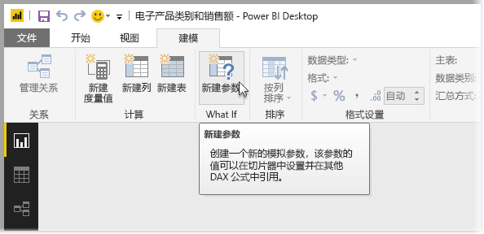
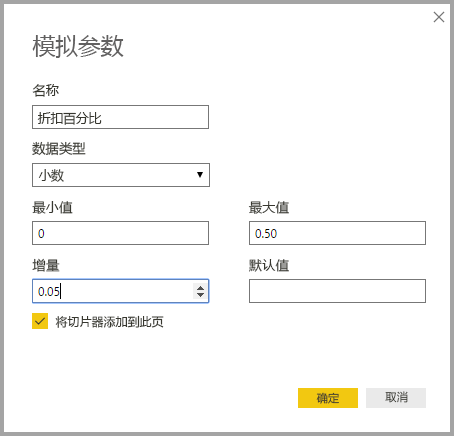
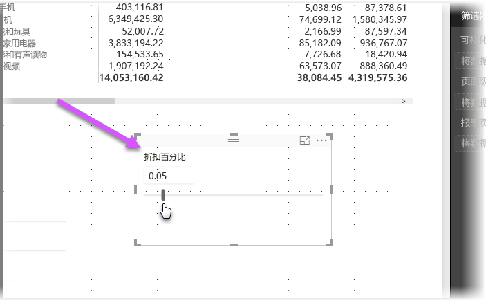
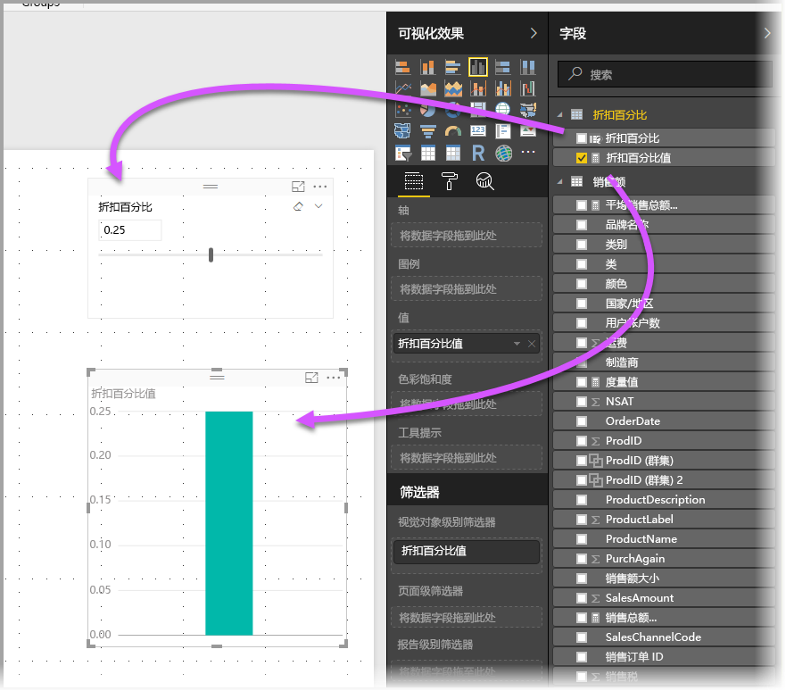
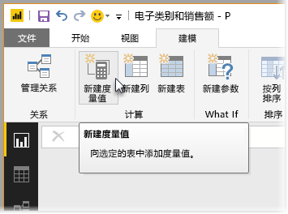
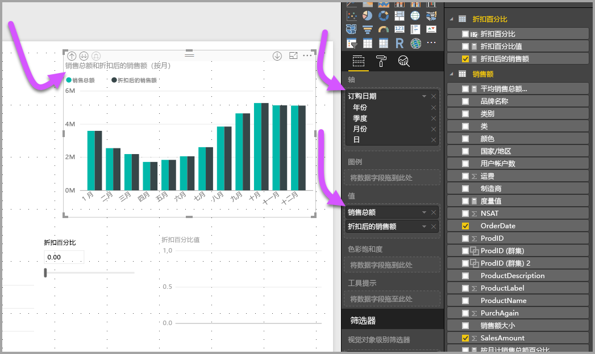
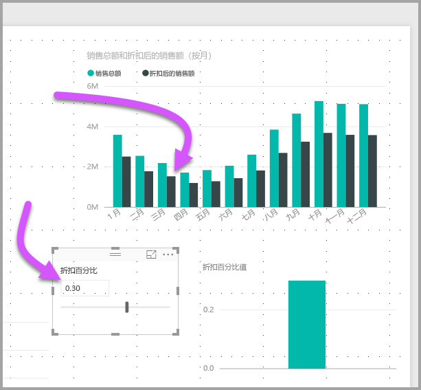

# 创建和使用 What if 参数可视化 Power BI Desktop 中的变量
从 Power BI Desktop 2017 年 8 月版开始，用户可以为报表创建 What if 变量、以切片器的形式与变量交互，从而可视化并量化报表中的不同键值。

可以在 Power BI Desktop 中的“建模”选项卡上找到 What if 参数。 执行此操作时，会显示一个对话框，可在其中配置该参数。

## 创建 What if 参数
要创建 What if 参数，请在 Power BI Desktop 中的“建模”选项卡上选择“What if”按钮。 在下图中，我们已创建名为“折扣率”的参数，并将其数据类型设置为十进制数字。 最小值为零，最大值为 0.50 (50%)。 我们还将增量设置为 0.05 或 5%。 这就是在报表中交互时将会调整的参数量。

> [!NOTE]
> 对于十进制数字，请务必在前面加上零，例如，此框中的 0.50 与 .50。 否则，该数字不会得到验证，且“确定”按钮将不可选。
> 
> 

为方便起见，“将切片器添加到此页”复选框会将切片器和 What if 参数自动放置在当前报表页上。

除创建参数外，创建 What if 参数还会创建一个度量值，可以用它来可视化 What if 参数的当前值。

注意，创建 What if 参数后，该参数和度量值都会成为模型的一部分，这是很重要且很有用的一点。 因此，它们可在整个报表上使用，并可用于其他报表页。 而且，由于它们是模型的一部分，用户可以从报表页中删除切片器，如果想恢复它，只需在“字段”列表中抓取 What if 参数并将其拖动到画布（然后将视觉对象更改为切片器），就能轻松地使 What if 参数重新回到报表中。

## 使用 What if 参数
让我们使用 What if 参数创建一个简单示例。 在上一节中，我们创建了 What if 参数，现在，我们将通过创建其值会根据切片器调整的新度量值来利用该参数。 要实现此目的，我们会创建新的度量值。

新的度量值只是应用了折扣率的总销售额。 当然，可以创建复杂且有趣的度量值，让报表的使用者可视化 What if 参数的变量。 例如，可以创建一个报表，让销售人员看到在达到特定销售目标或销售百分比时他们的薪酬，或看到销售额增加对更优厚折扣力度的影响。

当我们在公式栏中键入度量值公式，并将其命名为“折后销售额”后，我们会看到其结果：

然后，我们在轴上创建一个具有 OrderDate 的列视觉对象，并将 SalesAmount 和刚创建的度量值“折后销售额”作为值。

然后，当移动滑块时，我们会看到“折后销售额”列反映已折扣的销售额。

以上是其中包含的全部内容。 可以在各种情况中使用 What if 参数，以允许报表的使用者与在报表中创建的不同方案进行交互。

