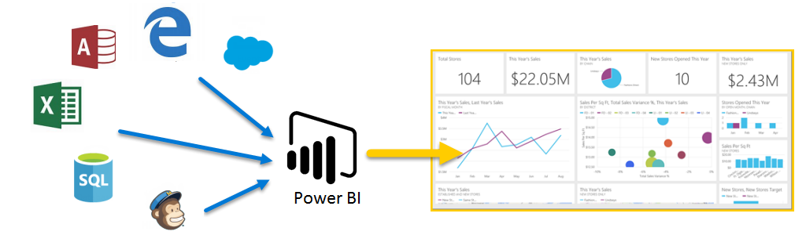

欢迎使用 Power BI 的**引导学习**。 自己控制进度的联机课程按照顺序介绍 Power BI，这样你可从零开始构建自己的知识。

本课程旨在提供有关可理解区块及逻辑流的指导，助你了解概念、详细信息和示例。 还包括大量有用的视觉对象和视频。

**引导学习**课程包含许多**部分**，每个部分具有许多**主题**。 **入门**部分的前几个主题之后，几乎每个主题都包括视频，介绍你将学习的内容。 视频下面的内容进一步阐释了概念，让你能够按照自己的节奏进行查看和学习。

如果你是 Power BI **初学者**，本课程将引导你入门，如果你是 Power BI **老手**，本课程将结合各个概念，弥合差距。 我们希望你喜欢课程，并期待在将来包含更多内容。

## 什么是 Power BI？
**Power BI** 是软件服务、应用和连接器的集合，它们协同工作以将相关数据来源转换为连贯的视觉逼真的交互式见解。 无论你的数据是简单的 Excel 电子表格，还是基于云和本地混合数据仓库的集合，**Power BI** 都可让你轻松地连接到数据源，直观看到（或发现）重要内容，与任何所希望的人进行共享。

**Power BI** 简单且快速，能够从 Excel 电子表格或本地数据库创建快速见解。 同时 **Power BI** 也是可靠的、企业级的，可进行丰富的建模和实时分析，及自定义开发。 因此它既是你的个人报表和可视化工具，还可用作组项目、部门或整个企业背后的分析和决策引擎。

## Power BI 的组成部分
Power BI 包含 Windows 桌面应用程序（称为 **Power BI Desktop**）、联机 SaaS（软件即服务）服务（称为 **Power BI 服务**），及移动 Power BI **应用**（可在 Windows 手机和平板电脑及 iOS 和 Android 设备上使用）。

这三个元素 - **Desktop**、**服务**和**移动**，旨在使用户通过最有效的方式创建、共享和使用商业见解。

## Power BI 如何与你的角色匹配
使用 Power BI 的方式取决于你在项目中的角色或你所在的团队。 不同角色的人们可能以不同方式使用 Power BI，这很正常。

例如，你可能主要使用 **Power BI 服务**，但处理数字、生成业务报表的同事可能主要使用 **Power BI Desktop**（并将 Desktop 报表发布到 Power BI 服务，然后你可查看）。 而另一个负责销售的同事可能主要使用 Power BI 手机应用，监视销售配额的进度，深入了解新的潜在销售顾客详细信息。

还可能会在不同时间使用 **Power BI** 的每个元素，具体取决于给定项目或工作中尝试实现的目标或你的角色。

也许你在服务的实时仪表板中查看库存和生产进度，也使用 **Power BI Desktop** 来为自己团队创建有关客户参与统计信息的报表。 如何使用 Power BI 基于哪项 Power BI 功能或服务是适用于所处情景的最佳工具，但是 Power BI 的每个部分都会提供给你，因此它非常灵活、令人无法抗拒。

我们稍后将在**引导学习**课程中更详细地讨论这三个元素 - **Desktop****服务**和**移动**。 在后面的文章中可看到，我们还将在 Power BI Desktop 中创建报表，在服务中共享它们，并在移动设备上进行深入了解。

## Power BI 中的工作流
Power BI 中的常见工作流开始于 **Power BI Desktop**，此处会创建报表。 然后此报表会发布到 Power BI **服务**中并进行共享，如此，**Power BI Mobile** 应用的用户便能使用该信息。

事实上工作流并非总是如此，但我们将使用该流程帮助你了解 Power BI 的各个部分，以及它们间如何互为补充。

好了，现在我们已经概述了本课程 - Power BI 是什么，以及它的三个主要元素，让我们再看一看使用 **Power BI**。

