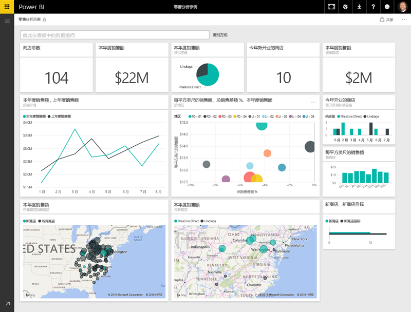
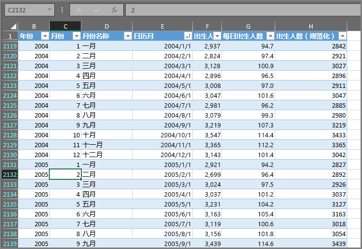
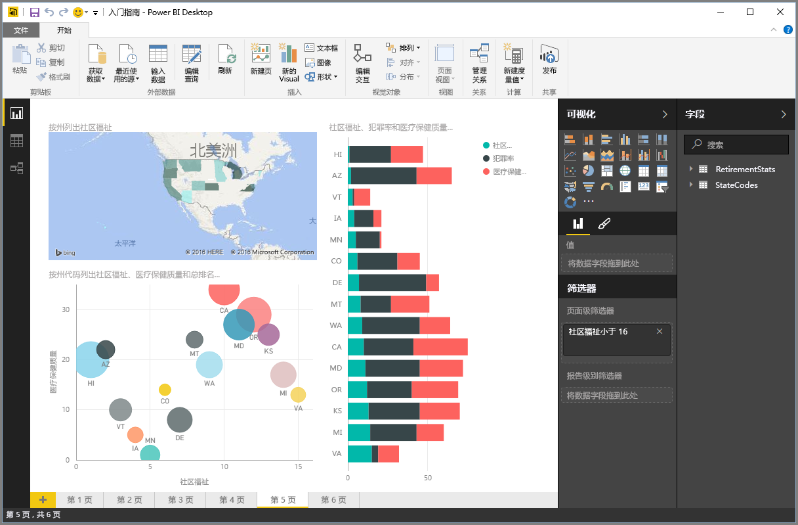
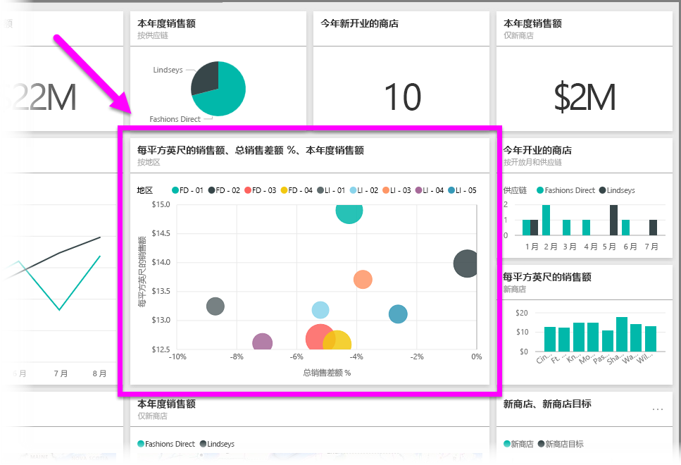

在 Power BI 中执行的所有操作可以分解为几个基本**构建基块**。 了解这些构建基块后，你可以对其中每个基块进行展开并开始创建详细且复杂的报表。 归根结底，即使是看似复杂的事物也是由基本构建基块构建而来 – 建筑物通过木材、钢、混凝土和玻璃建造。 车辆由从金属、织物和橡胶制成。 当然，建筑物和车辆也可有基本或复杂之分 - 具体取决于这些基本构造基块的排列方式。

让我们了解一下这些基本构建基块，讨论一些可使用它们构建的简单事物，然后也简单了解一下如何创建复杂事物。

Power BI 中的基本构建基块有：

* 可视化
* 数据集
* 报表
* 仪表板
* 磁贴

## 可视化效果
**可视化效果**（有时也称为 **视觉对象**）是数据的可视化表示形式，例如图表、图形、彩色编码的地图或其他你可创建用以直观呈现你的数据的有趣事物。 Power BI 有各种不同的可视化效果类型，并且随时在增加更多。 下图显示了在 Power BI 服务中创建的不同可视化效果的集合。

可视化效果可以很简单 - 如一个表示重要内容的数字 - 或者它们可以在视觉上很复杂 - 如一个颜色渐变图，表明选民对特定社交问题或顾虑的情绪。 视觉对象的目标是以提供上下文和见解（可能会很难将其中任一区别于数字或文本的原始表）的方式呈现数据。

## 数据集
**数据集** - Power BI 用来创建其可视化效果的数据集合。

基于 Excel 工作簿中的单个表，你可以有一个简单的数据集，类似于下图中所示。

**数据集**也可以是许多不同源的组合，你可以筛选和组合以提供一个用在 Power BI 中的唯一集合数据（数据集）。

例如，可以从三个不同的数据库字段、一个网站表、一个 Excel 表、和电子邮件市场营销活动的联机结果创建数据集。 该唯一组合仍被视为单个**数据集**，即使它是从许多不同的源组合在一起的。

在将数据导入 Power BI 前先进行筛选，让你重点关注对你重要的数据。 例如，你可以筛选你的联系人数据库，使该数据集中仅包含从市场营销活动接收到电子邮件的客户。 然后你可以基于营销活动中所包含的客户的该子集（该已筛选集合）创建视觉对象。 筛选可帮助你集中你的数据和精力。

Power BI 的一个重要且有利的部分是所包含的多个数据**连接器**。 无论所需的数据是位于 Excel 中还是位于 SQL 数据库中、Azure 或 Oracle 中或位于如 Facebook、Salesforce 或 MailChimp 之类的服务中，Power BI 的内置数据连接器可让你轻松连接到该数据，如有必要可筛选数据，并将其导入你的数据集。

有了数据集后，可以开始创建以不同方式显示该数据集的不同选项的可视化效果，并且通过所看到的内容，获得深入见解。 这就是报表产生的位置。

## 报表
在 Power BI 中，**报表**是一起显示在一个或多个页面的可视化效果集合。 就像你可能会对销售演示文稿创建的任何其他报表，或者你将对学校分配编写的报表一样，在 Power BI 中，**报表**是彼此相关的项的集合。 下图显示了一个 Power BI Desktop 中的**报表** - 在此情况下，这是第五页（共六页的报表）。 还可以在 Power BI 服务中创建报表。

报表使你可在多个不同页面（如有必要）创建多个可视化效果，并允许你以任何可最佳阐述你的情景的方式对它们进行排列。

你可能会有一个有关季度销售额的报表（一个有关产品在某一特定时间段的增长情况的报表）或者你可能会创建有关北极熊迁移模式的报表。 无论你的主题为何，报表都可让你将可视化效果收集和整理到一个（或多个）页面上。

## 仪表板
如果你已准备好共享报表的单个页面，或共享可视化效果的集合，则创建**仪表板**。 Power BI **仪表板**非常类似于汽车中的仪表板，是单个页面中你可与其他人共享的视觉对象的集合。 通常，这是提供对你尝试呈现的数据以及情景的快速了解的选定视觉对象组。

仪表板必须位于单个页面，通常称为画布（画布是 Power BI Desktop 或该服务中的空白背景，你在其中放置可视化效果）。 将其想像成艺术家或画家使用的画布 - 一个你在其中创建、组合和返工有趣且引人注目的视觉对象的工作区。
你可以与其他用户或组共享仪表板，然后当他们使用 Power BI 服务或其移动设备时可与你的仪表板进行交互。

## 磁贴
在 Power BI 中，**磁贴**是在报表或仪表板中找到的单个可视化效果。 它是包含每个单个视觉对象的矩形框。 在下图中，你将看到一个磁贴（亮框突出显示），其周围环绕有其他磁贴。

当你在 Power BI 中 *创建* 报表或仪表板时，可以以任何你想要呈现信息的方式来移动或排列磁贴。 可以使它们更大、更改它们的高度或宽度，以及将它们随意依附到其他磁贴。

当你 *查看* 或 *使用* 仪表板或报表时 - 这意味着你不是创建者或所有者，但它已与你共享 - 你可以与其进行交互，但不能更改磁贴的大小或更改其排列方式。

## 总的来说
这些是 Power BI 及其构建基块的基础知识。 让我们花些时间回顾。

Power BI 是服务、应用和连接器的集合，使你能够连接到你的数据 - 无论数据位于何处 - 如有必要可进行筛选，然后将它们导入到 Power BI，你可在其中创建可与他人共享的引人注目的可视化效果。  

现在，你了解了一些 Power BI 的基本构建基块，很显然，你可以创建 *对你来说* 有意义的数据集，并创建视觉上引人注目的报表来呈现你的情景。 借助 Power BI 来呈现情景无需复杂或繁琐就极具吸引力。

对于一些人来说，在数据集中使用单个 Excel 表，然后与他们的团队共享仪表板将是一种极其有价值的使用 Power BI 的方法。

对于其他人来说，使用与其他数据库和实时源组合的实时 Azure SQL 数据仓库表（然后进行实时筛选以构建可每时每刻监视制造进度的数据集）将是他们所寻求的 Power BI 中的价值。

对于两者来说，过程都是相同的：创建数据集、生成引人注目的视觉对象，然后与他人共享。 同样，这两者（对于每个）的结果是一样的：利用不断扩展的数据世界，并将其转换为可操作的见解。

无论数据见解是需要简单数据集还是复杂数据集，Power BI 均可帮助你快速开始，并且可如你的数据世界所要求的复杂性一样进行扩展。 因为 Power BI 是一款 Microsoft 产品，因此在可靠、可扩展、Office 友好以及企业级就绪方面可以信赖它。

现在，让我们了解一下它的工作方式。 我们将首先快速了解一下 Power BI 服务。

