在本主题中，我们将深入探讨一下 Power BI 的前两个部分如何结合在一起：

* 在 **Power BI Desktop** 中创建一个报表。
* 在 **Power BI 服务**中发布该报表。

我们将在 Power BI Desktop 中启动报表并选择 **获取数据**。 此时将显示数据源集合，允许你选择数据源。 下图显示了选择网页作为上述视频中的源，将选择 **Excel** 工作簿。

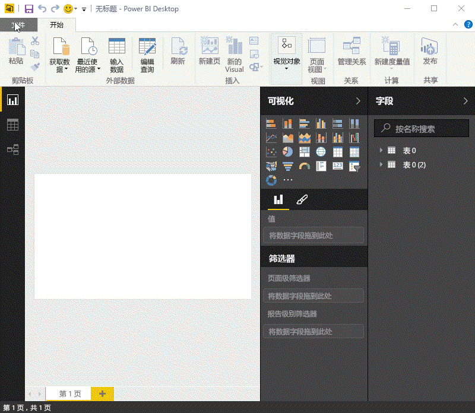

无论选择的数据源是什么，Power BI 都会连接到该数据源，并显示来自源的可用数据。 下图是另一个示例，该示例来自于一个网页，该网页分析了不同的国家和一些有趣的退休统计数据。

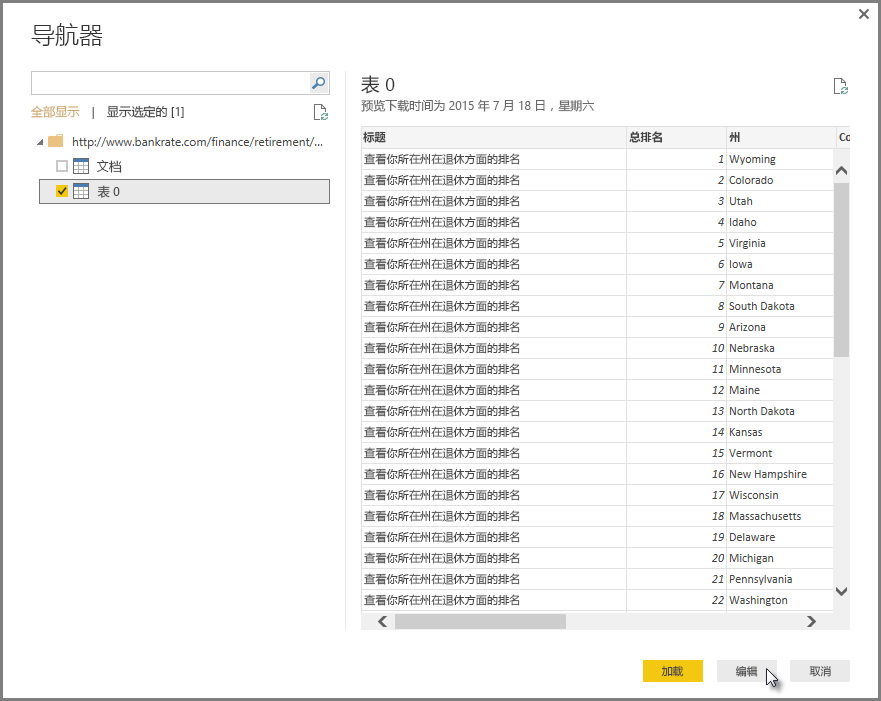

在 Power BI Desktop **报表** 视图中，你可以开始生成报表。

**报表**视图具有五个主要区域：

1. 功能区，用于显示与报表和可视化效果相关联的常见任务
2. **报表**视图或画布，可在其中创建和排列可视化效果
3. 底部的**页面**选项卡，用于选择或添加报表页
4. **可视化效果**窗格，你可以在其中更改可视化效果、自定义颜色或轴、应用筛选器、拖动字段等
5. **字段**窗格，可在其中将查询元素和筛选器拖到**报表**视图，或拖到**可视化效果**的**筛选器**窗格

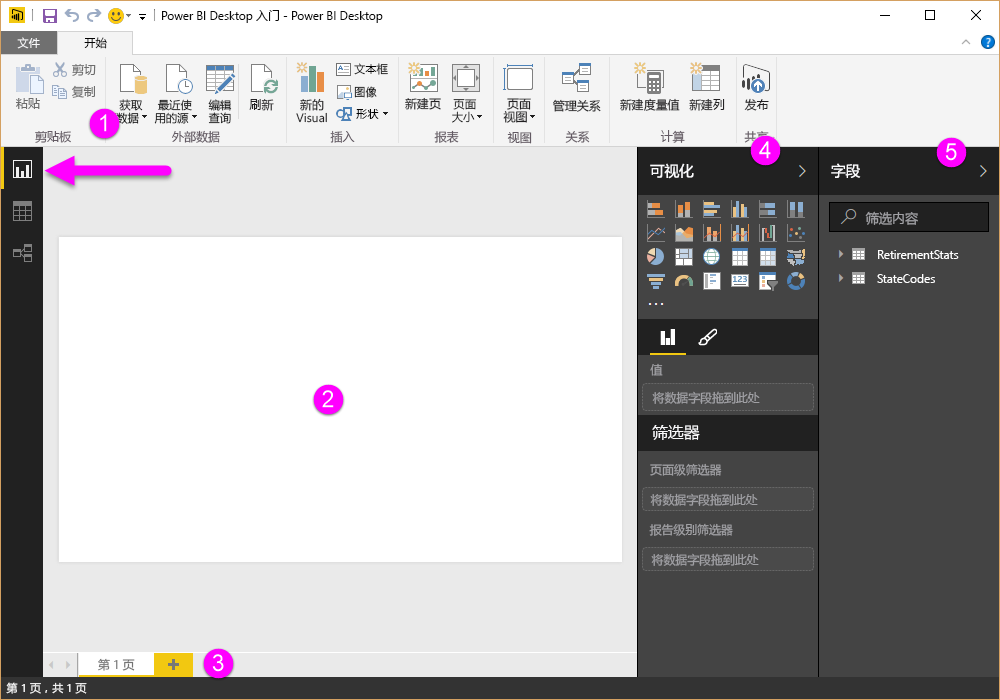

通过选择边缘的小箭头，可以折叠**可视化效果**和**字段**窗格，以便在**报表**视图中提供更多空间以生成炫酷的可视化效果。 修改可视化效果时，你会看到这些箭头朝上或朝下，这意味着你可以相应展开或折叠该部分。

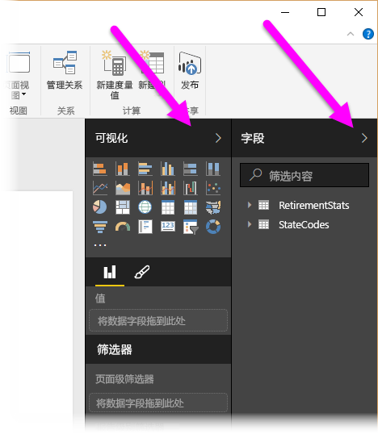

若要创建可视化效果，只需将字段从**字段**列表拖到**报表**视图即可。 此示例中，我们来拖动 *RetirementStats* 中的“状态”字段，看看会发生什么。

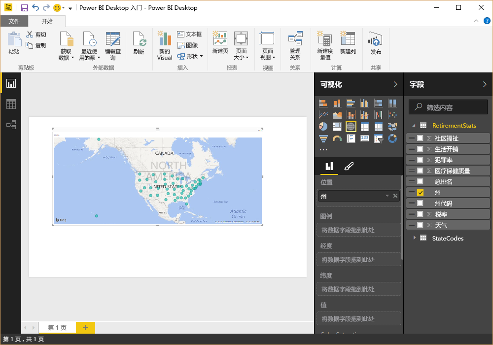

看一下...Power BI Desktop 自动创建了基于地图的可视化效果，因为它识别到“状态”字段包含地理位置数据。

快进一点，现在我们看到，创建具有几个可视化效果的报表之后，我们就可以将该报表发布到 Power BI 服务了。 在 Power BI Desktop 的**开始**功能区，选择**发布**。

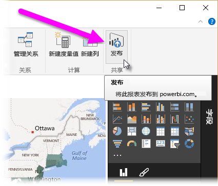

系统将提示你登录到 Power BI。

当你登录并完成此发布过程后后，你将看到以下对话框。 选择**成功!**下面的链接以进入 Power BI 服务，你可以在此处看到你刚刚发布的报表。

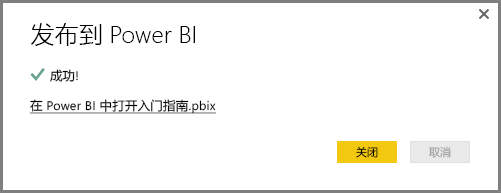

当登录到 Power BI 时，你将看到刚才你在该服务上发布的 Power BI Desktop 文件。 在下图中，在 Power BI Desktop 中创建的报表显示在**报表**部分。

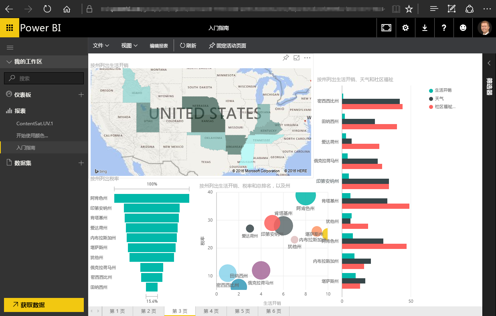

在该报表中，我可以选择**大头针**图标将该视觉对象固定到仪表板。 下图显示了用一个亮框突出显示的大头针图标和箭头。

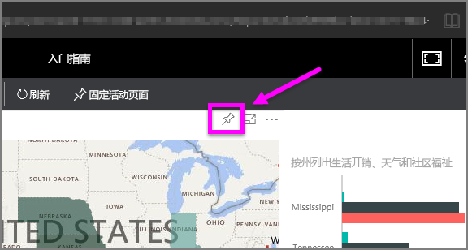

选择该图标时，将显示以下对话框，让我将视觉对象固定到现有仪表板，或创建新仪表板。

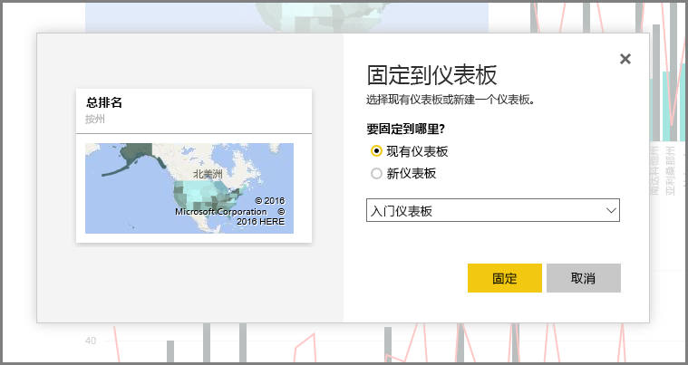

当我们从报告中固定几个视觉对象时，我们可以在仪表板中看到这些视觉对象。

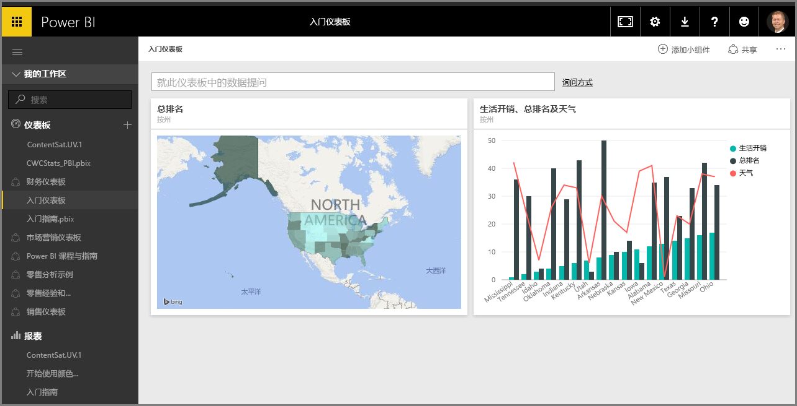

当然，使用 Power BI 还可以执行更多操作，例如，共享你创建的仪表板。 稍后，我们将在本课程讨论共享。

接下来，我们了解一下可以自动创建仪表板的功能，只需连接到云服务（如 Facebook、Salesforce）等服务即可。

