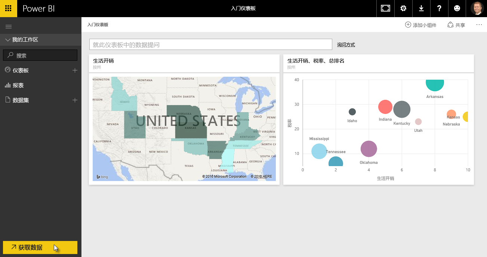
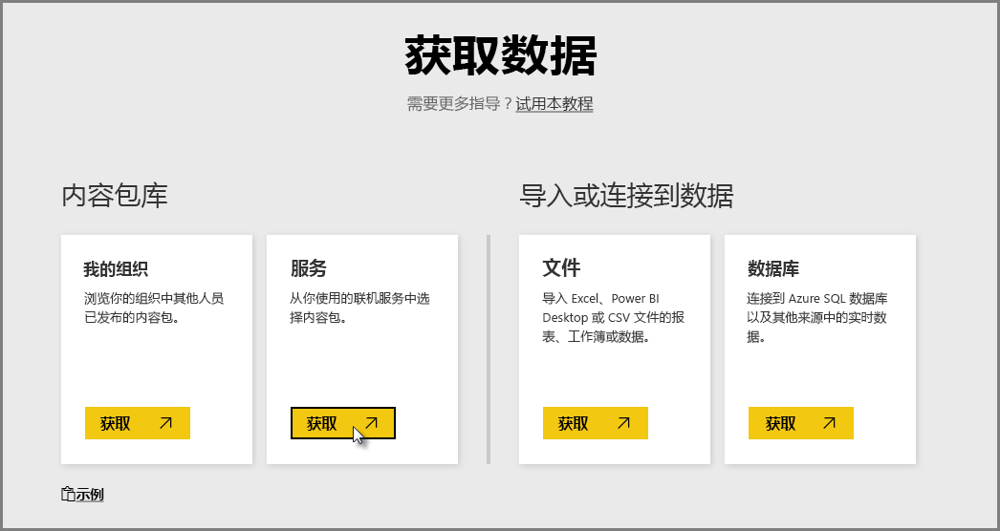
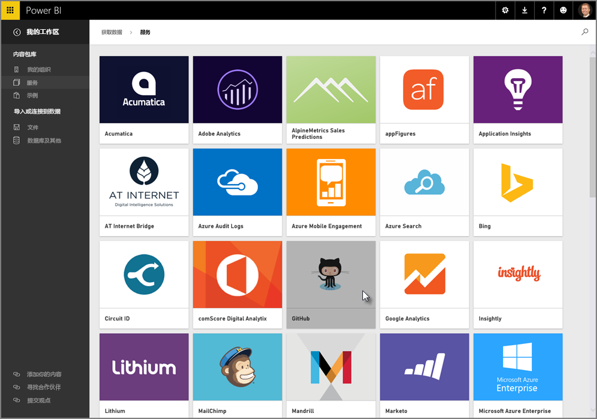
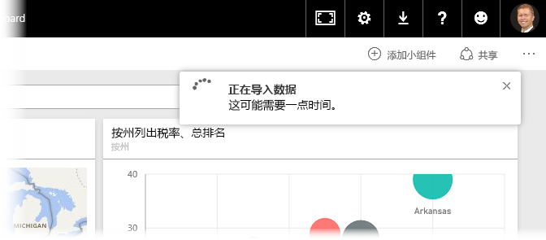
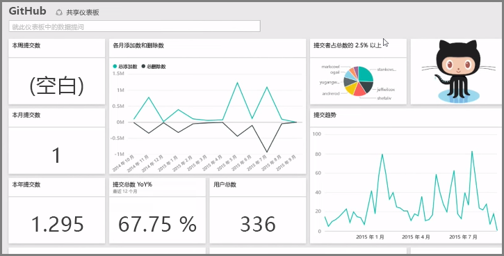
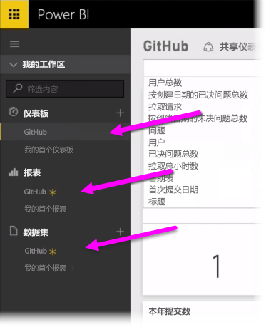
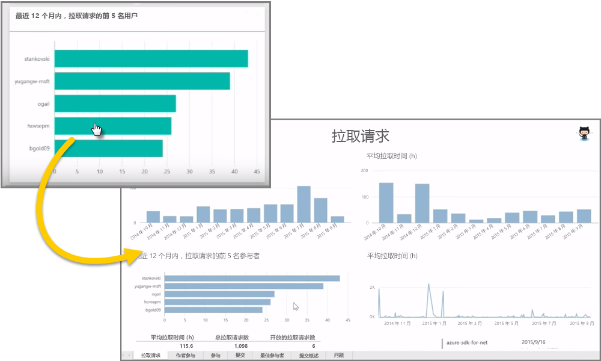
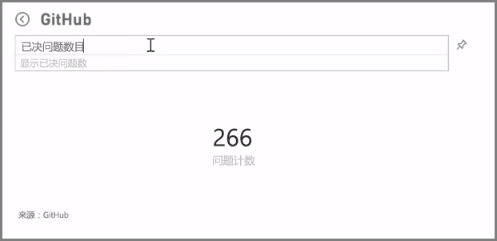
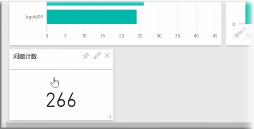
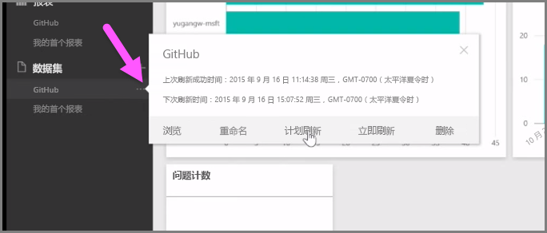

正如我们所了解的，Power BI 中的常见工作流是在 Power BI Desktop 中创建报表、将其发布到 Power BI 服务，然后与其他人进行共享，让他们可以在服务中或在移动应用上查看到。

有些人会在 Power BI 服务中开始，因此，让我们快速了解该服务，了解一种在 Power BI 中快速创建视觉对象的简单常用的方法： *内容包* 。

**内容包**是基于特定数据源（如 Salesforce）的预配置现成视觉对象和报表的集合。 使用内容包相当于微波加热一份冷冻快餐或者订购一份超值快餐套餐：只需几次单击操作和注释，就可以快速地为你提供一套搭配合理且所有菜式都在布局整洁且开袋即食的包装中的主菜。

因此，让我们快速了解下内容包、服务及其工作原理。 在后面几节，我们会更详细地介绍内容包（和服务）；将这个当做开胃的小菜吧。

## 使用云服务创建开箱即用型仪表板
借助 Power BI 很容易便可连接到数据。 从 Power BI 服务，你只需选择主屏幕左下角的**获取数据**按钮。

*画布* （Power BI 服务中心位置的区域）向你显示 Power BI 服务中的可用数据源。 除了常见的数据源（如 Excel 文件、数据库或 Azure 数据），Power BI 还可以轻松连接到**软件服务**（也称为 SaaS 提供商或云服务），如 Salesforce、Facebook、Google Analytics 和所有其他 SaaS 服务集合。

对于这些软件服务，**Power BI 服务**提供了一组现成的视觉对象，预先排列在名为**内容包**的仪表板和报表中。 通过内容包，你可以在 Power BI 快速启动和运行来自你所选服务的数据。 例如，当你使用 Salesforce 内容包时，（一旦你提供了凭据）Power BI 会连接到你的 Salesforce 帐户，然后填充 Power BI 中预先定义的视觉对象和仪表板集合。

Power BI 提供了适用于各种类型服务的内容包。 下图按字母顺序显示了服务的第一个屏幕，该屏幕在你从**服务**框中选择**获取**时显示（如上图所示）。 如你在下图中所见，有许多选项可供选择。

对于我们来说，我们将选择 **GitHub**。 GitHub 是用于在线源代码管理的应用程序。 一旦我为 GitHub 内容包输入信息和凭据，它将开始导入我的数据。

一旦加载了数据，将出现预定义的 GitHub 内容包仪表板。

除了**仪表板**，（作为 GitHub 内容包的一部分）生成用来创建仪表板的**报表**也可用，在数据导入期间创建，用于创建 GitHub 报表的**数据集**（从 GitHub 提取的数据集合）同样也可用。

在仪表板上，你可以单击任何视觉对象，并从创建视觉对象的位置自动转到**报表**页。 因此，在单击**按拉取请求排列的前 5 名用户**视觉对象时，Power BI 打开了“报表”（从中创建视觉对象的“报表”页）中的**拉取请求**页。

## 询问有关数据的问题
你还可以询问有关你数据的问题，Power BI 服务将基于你的问题实时创建视觉对象。 在下图中，你可以看到 Power BI 根据**自然语言查询**栏中键入的内容，创建了大量显示问题计数已关闭的视觉对象。

当你有喜欢的视觉对象时，可以选择“自然语言查询”栏右侧的**固定**图标，将该视觉对象固定到仪表板。 在这种情况下，视觉对象被固定到 GitHub 仪表板，因为它是当前选定的仪表板。

## 在 Power BI 服务中刷新数据
你也可以选择**刷新**内容包或在 Power BI 中使用的其他数据的数据集。 若要设置刷新设置，请选择数据集旁边的省略号（三个句点），然后出现一个菜单。

从该菜单底部选择**计划刷新**选项。 “设置”对话框将出现在画布上，让你可以设置符合你要求的刷新设置。

我们的快速了解 Power BI 服务就到这里。 使用该服务，你还可以执行许多其他操作，我们稍后将在本课程中介绍。 另外，也请记住，你可以连接到许多不同类型的数据，以及各种内容包正在变得越来越丰富。

好了，让我们继续下一个主题，在这个主题中，我们对此**入门**部分进行了汇总，并帮助你准备好进行下一步。

