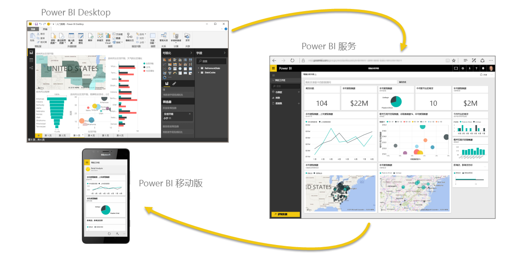
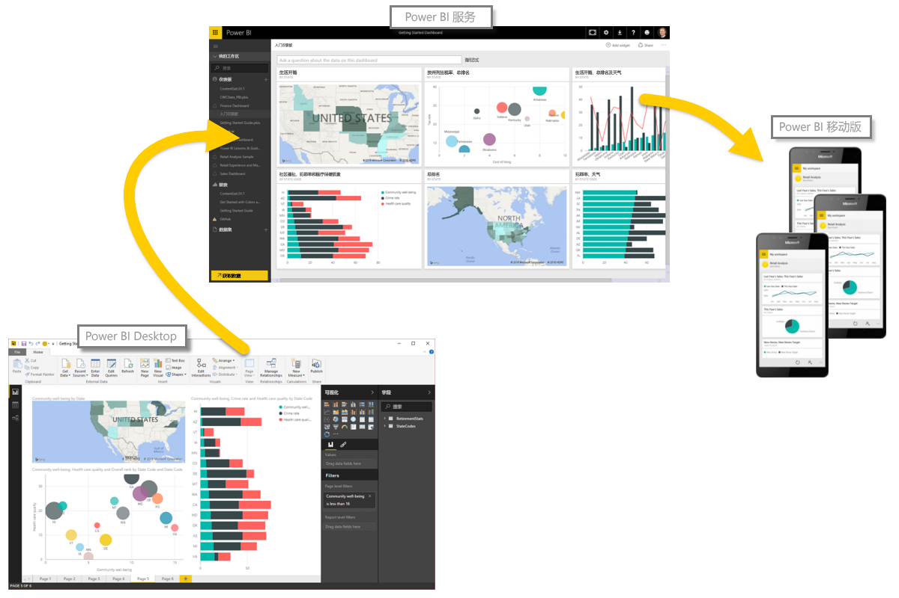

让我们快速回顾一下我们在此第一部分中涵盖的内容。

**Power BI** 是软件服务、应用和连接器的集合，它们协同工作以将你的数据转换为交互式见解。 你可使用单一基本源（如 Excel 工作簿）中的数据，或从多个数据库和云源提取数据以创建复杂数据集和报表。 Power BI 可如你想要的那么简单，或者可如你的复杂全局业务所要求的企业级就绪。

Power BI 包括三个主要元素 – **Power BI Desktop**、**Power BI 服务**和 **Power BI Mobile** – 均协同工作以让你可以按所需方式创建、交互、共享以及使用你的数据。

我们也讨论了 Power BI 中的基本构建基块，它们是：

* **可视化效果** - 数据的可视化表示形式，有时简称为视觉对象
* **数据集** - Power BI 用来创建可视化效果的数据集合
* **报表** - 来自跨一个或多个页面的数据集的视觉对象集合
* **仪表板** - 生成于报表的单页视觉对象集合
* **磁贴** - 在报表或仪表板中找到的单个可视化效果

从这里，我们在导说员 **Will Thompson** 的讲解下，在视频演示中了解了 Power BI。 Will 向我们简要概述了如何借助 Power BI 分析和可视化数据。

<!---
In **Power BI Desktop**, we connected to a basic Excel file, created visualizations, then published those visualizations to the service. Even if you use Power BI only with your Excel workbooks, you can gain amazing visual insights with those Excel workbooks, and both interact and share it in ways never before possible.
-->
在 **Power BI 服务**中，只需几次点击即可创建一个仪表板。 我们继续了解了 Power BI 服务，并使用了**内容包** - 现成的视觉对象和报表集合 - 并连接到了一个**软件服务**以填充内容包并使该数据变得生动。

我们还使用了称为**问与答**的自然语言查询，以针对我们的回答提问，然后使 Power BI 基于这些问题创建视觉对象。 最后，我们对我们的数据设置了**刷新计划**，因此我们知道当我们返回到 Power BI 服务时，该数据将为最新。

## 后续步骤
**祝贺你！** 你已完成了 Power BI **引导学习**课程的第一部分。 现在，你有了扎实的基础知识，可以继续下一部分，即**获取数据**，这是 Power BI 逻辑工作流中的下一步骤。

我们之前提到过这一点，但值得在此进行重申：本课程通过遵循 Power BI 中常见的工作流来构建你的知识：

* 将数据导入 **Power BI Desktop**，然后创建报表。
* **发布**到在其中创建新的可视化效果或构建仪表板的 Power BI 服务
* 与他人（尤其是差旅人员）**共享**你的仪表板
* 在 **Power BI Mobile** 应用中查看共享仪表板和报表并与其交互

你可能不会自行执行所有这些工作 - 某些人将只能在由其他人创建的服务中查看仪表板。 这没有关系，但由于 *你将* 完成本课程中的所有部分，因此你将 *了解* 这些仪表板的创建方式，以及它们连接到数据的方式...你甚至可能会决定创建一个你自己的仪表板。

下一部分见！

