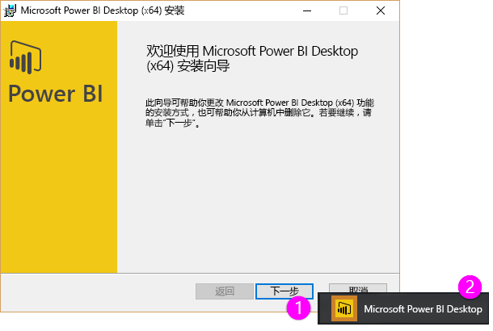

欢迎来到 Power BI **引导学习**课程的第二部分：**获取数据**。 本部分介绍 Power BI 中许多以数据为中心的功能和工具，其中重点介绍 Power BI Desktop。 其中许多工具也适用于 Power BI 服务，所以你对于本部分的学习可以达到事半功倍的效果。

当你获得数据时，有时数据并非你所希望的那样，它的格式不完全正确或者说不是 *干净* 的。 在本部分中，你会学习到如何获取数据，如何让它变为正确的格式（有时称为 *清洗* 或 *转换* 数据），并且还将学习一些高级的技巧，可使数据的获取更轻松。

和往常一样，本课程将按照 Power BI 中的工作流引导你进入学习之旅。 那么，我们就来看看 **Power BI Desktop**，这通常是开始的位置。

## Power BI Desktop 概述
Power BI Desktop 是用于连接、清除和可视化数据的工具。 使用 Power BI Desktop，可以连接到数据，然后以不同的方式将数据建模和可视化数据。 大多处理商业智能项目的用户会将大部分时间用在 Power BI Desktop 的使用上。

可以[从 Web](http://go.microsoft.com/fwlink/?LinkID=521662) 下载 Power BI Desktop，也可以从 [**Windows 应用商店**](http://aka.ms/pbidesktopstore)将 **Power BI Desktop** 安装为应用，还可以从 Power BI 服务下载它。 在该服务中，若要获取 **Power BI Desktop**，只需选择 Power BI 右上侧的向下箭头按钮，然后选择“Power BI Desktop”。

Power BI Desktop 将作为应用程序安装到你的 Windows 计算机上。

因此下载 Power BI Desktop 后，你将安装它并像运行其他应用程序那样在 Windows 上运行它。 以下图像显示了 Power BI Desktop 的启动屏幕，当你启动该应用程序时会出现此屏幕。

Power BI Desktop 可连接到种类广泛的多种数据源，包括本地数据库、Excel 工作表和云服务等。 它可帮助清理数据和设置数据格式，以使数据更为有用，包括拆分和重命名列、更改数据类型和处理日期。 还可创建列之间的关系，以便可以更轻松地将数据建模和分析数据。

