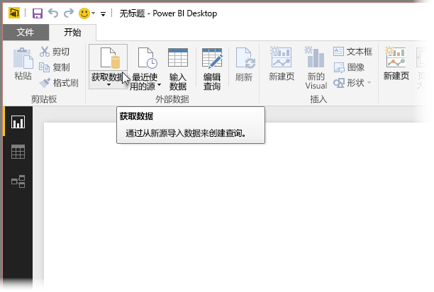
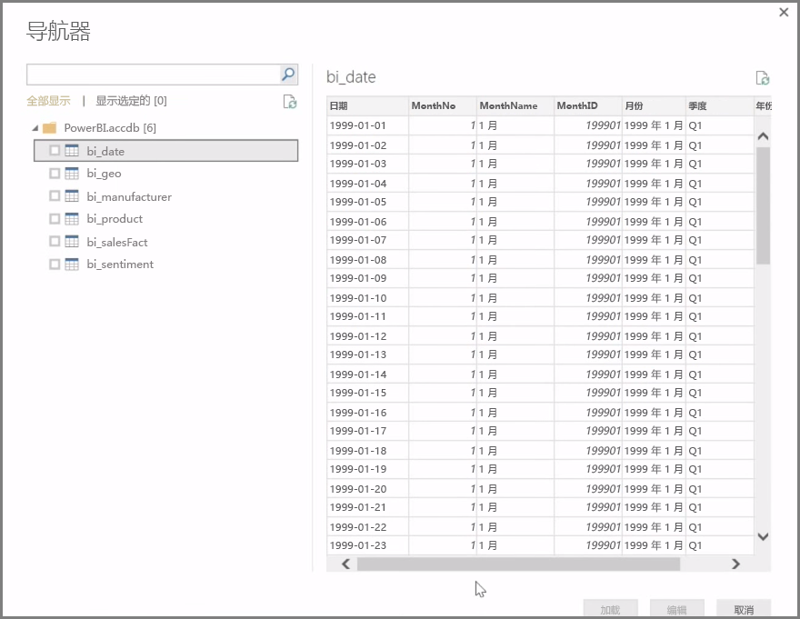
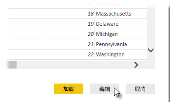

**Power BI Desktop** 可以连接一系列数据源，包括本地数据库、Excel 工作簿和云服务。 目前，超过 59 种不同的云服务（例如 GitHub 和 Marketo）具有特定的连接器，并且你可以通过 XML、CSV、文本和 ODBC 连接到通用源。 Power BI 甚至将直接从网站 URL 擦除表格数据！ 但让我们从头开始，打开 Power BI Desktop，然后连接数据。

启动 **Power BI Desktop** 并移至“开始屏幕”时，你可以在功能区“开始”选项卡上选择“获取数据”。

Power BI Desktop 每月均有更新，通过每个更新，**Power BI Desktop 新增功能**页将使用有关更新、到博客的链接以及下载链接的信息来获得更新。

在 Power BI Desktop 中，存在各种不同的可用数据源。 选择一个源以建立一个连接。 根据你的选择，将要求你在计算机或网络上查找相应源，或者系统会提示你登录某个服务，以对你的请求进行验证。

连接后，你将看到的第一个窗口是**导航器**。 导航器显示你的数据源的表或实体，单击其中一个将提供其内容的预览。 然后，可以立即导入所选的表或实体，或在导入数据前，选择**编辑**以转换并清理数据。

选定想要导入到 Power BI Desktop 中的表后，通过选择**导航器**右下角的**加载**按钮，可以将其加载到 Power BI Desktop 中。 但是，在将这些表加载到 Power BI Desktop 中之前，有时你可能想要先对它们进行更改。 你可能只想要客户的子集，或可能会筛选仅发生在特定国家/地区的销售数据。 在这些情况下，可以先选择“编辑”按钮，筛选或转换这些数据，再将其所有导入到 Power BI Desktop 中。

下一部分中，我们将在该位置提取并编辑数据。

