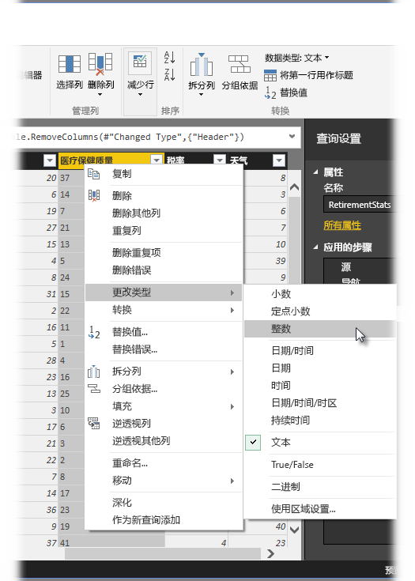
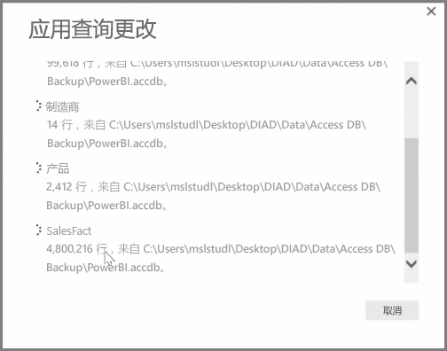

**Power BI Desktop** 包括**查询编辑器**，这是一款强大的工具，可将数据具体化并进行转换，以使其可供你的模型和可视化效果使用。 当你在“导航器”中选择“编辑”时，此时将启动“查询编辑器”并使用你从数据源中选择的表或其他实体进行填充。

你还可以使用**开始**功能区中的**编辑查询**按钮直接从 **Power BI Desktop** 启动**查询编辑器**。

一旦查询编辑器与可供你定型的数据进行加载后，你将看到以下几个分区：

1. 在功能区中，许多按钮当前处于活动状态，以与查询中的数据进行交互
2. 在左窗格中，列出了所有查询（每个查询各对应一个表或一个实体）并可供选择、查看和定型
3. 在中央窗格中，将显示已选择查询中的数据，可供你调整
4. 显示的查询设置窗口列出了查询的属性和应用步骤

在中央窗格中，右键单击某一列将显示多种不同的可用转换，如从表中删除该列、以新名称复制该列并替换值。 根据此菜单，你还可以通过常用分隔符将文本列拆分成多列。

**查询编辑器**功能区包含其他工具，如更改列的数据类型、添加科学记数法或根据日期（如一周中的某天）提取元素。

应用转换时，每个步骤都将出现在**查询编辑器**右侧的**查询设置**窗格中的**应用步骤**列表中。 可以使用此列表撤消或查看特定更改，甚至更改步骤的名称。 若要保存你的转换，请选择**开始**选项卡上的**关闭并应用**。

选择**关闭并应用**后，查询编辑器将应用所做的查询更改，并将其应用到 Power BI Desktop。

当在**查询编辑器**中转换数据时，你可以进行所有类型的操作，其中包括高级转换。 在下一节，我们将看看其中几个高级转换，让你感受一下如何用**查询编辑器**以几乎不可估量的方式转换数据。

