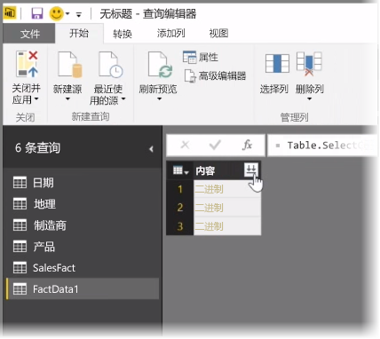
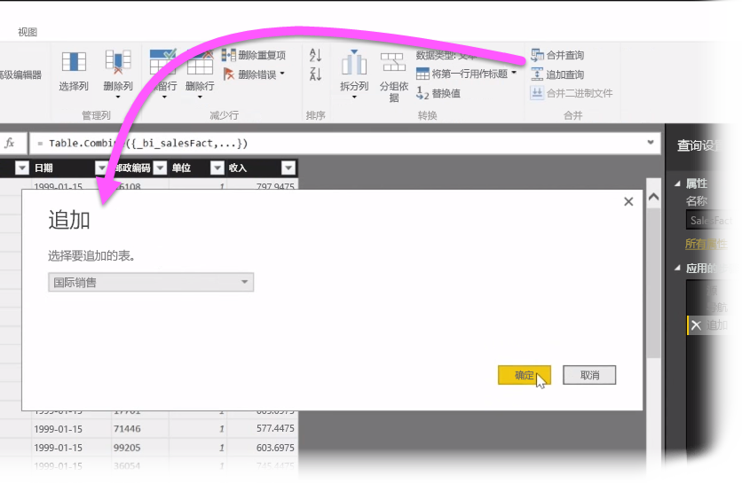
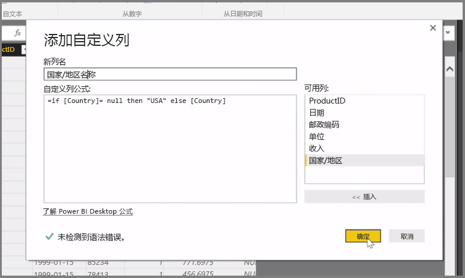

在本文中，我们将讨论一些适用于 **Power BI Desktop** 的高级数据导入和清理方法 。 在**查询编辑器**中塑造好你的数据并将其引入 **Power BI Desktop**中后，你可以以多种不同的方式进行查看。 Power BI Desktop 中有三种视图：**报表**视图、**数据**视图和**关系**视图。 通过选择画布左上方的图标可以查看每个视图。 下图中选择了**报表**视图。 图标旁的黄色条指示处于活动状态的视图。

若要更改视图，只需选择两个图标中的任意一个。 图标旁的黄色条指示处于活动状态的视图。

Power BI Desktop 可在建模过程中随时将来自多个源的数据合并为单一报表。 若要将其他源添加到现有报表，请在**开始**功能区中选择**编辑查询**，然后在**查询编辑器**中选择**新源**。

**Power BI Desktop** 中可以使用许多不同的可能性数据源，其中包括文件夹。 通过连接到文件夹，你可以同时导入来自多个文件的数据，例如一系列 Excel 文件的 CSV 文件。 所选文件夹中包含的文件会以二进制内容显示在**查询编辑器**中，单击**内容**顶部的双箭头图标将会加载它们的值。

Power BI 最有用的工具之一就是筛选器。 例如，选择与列相邻的下拉箭头将打开文本筛选器清单，你可以使用它来删除模型中的值。

你还可以合并和追加查询，并将多个表（或来自文件夹中多个文件的数据）转变成仅包含你所需数据的单一表格。 你可以使用**追加查询**工具将数据从新表添加到现有查询。 Power BI Desktop 将尝试匹配查询中的列，你可以根据需要在**查询编辑器**中进行调整。

最后，**添加自定义列**工具为高级用户提供了使用功能强大的 M 语言从草稿编写查询表达式的选项。 你可以添加基于 M 查询语言语句的自定义列，并按所需的方式获取你的数据。

