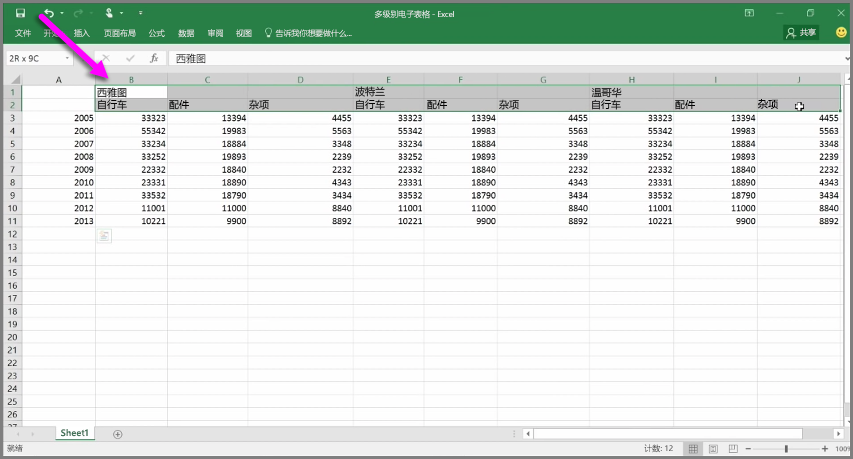
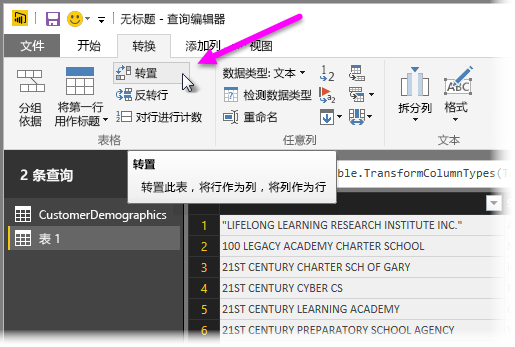
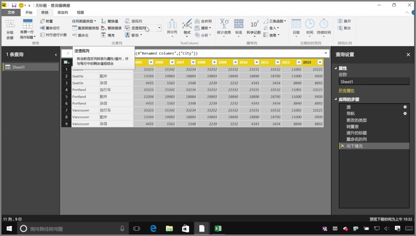
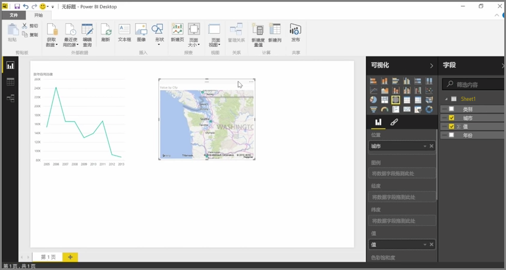

Power BI 可以从几乎任何来源导入数据，其可视化效果和建模工具最适用于列式数据。 有时数据不采用简单列格式，这种情况常出现在 Excel 电子表格中，适合肉眼查看的表格布局不一定是自动查询的最优选择。 例如，以下电子表格具有跨多个列的标题。

幸运的是，Power BI 中的工具能将多列表格快速转化为数据集供你使用。

## 转置数据
例如，使用**查询编辑器**中的**转置**，你可以对数据进行翻转（即将列变为行，将行变为列），从而将数据分解为可操作的格式。

进行数次转置后，如视频所述，表格将开始转换为 Power BI 更容易处理的格式。

## 设置数据格式
你可能还需要设置数据格式，以便 Power BI 在导入数据后对其进行适当分类和标识。

通过几种转换（包括 *将行提升为标题* 以分解标题、使用 **填充** 将 *null* 值变为给定列中上方或下方行内找到的值，以及 **逆透视列** ），即可将数据清理为可在 Power BI 中使用的数据集。

通过 Power BI，你可以在你的数据上对这些转换进行试验，确定可将数据转换为 Power BI 可处理的列格式的转换类型。 请记住，你采取的所有操作都记录在“查询编辑器”中的“应用的步骤”部分中，因此如果转换未达到预期，只需单击该步骤旁的 **x** 撤消操作即可。

## 创建视觉对象
数据 Power BI 可用格式后，即可通过转换和清理数据开始创建视觉对象。

## 后续步骤
**祝贺你！** 你已经完成了本部分的 Power BI **引导学习**课程。 你现已了解如何 **将数据导入** Power BI Desktop，以及如何 *调整* 或 *转换* 这些数据，因此你可以创建具引人注目的视觉对象。

了解 Power BI 的工作原理以及如何使其 *为你* 服务的下一步，是了解 **建模** 包含的内容。 你已经了解，**数据集**是 Power BI 的基本构建块，但某些数据集可能比较复杂并基于众多不同的数据源。 有时，你需要为所创建数据集添加自己的特殊亮点（或 *字段* ）。

在下一个部分中，你将了解如何**建模**以及更多内容。 不见不散！

