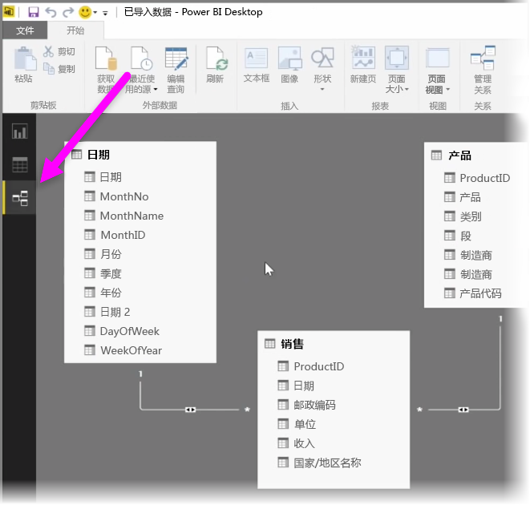
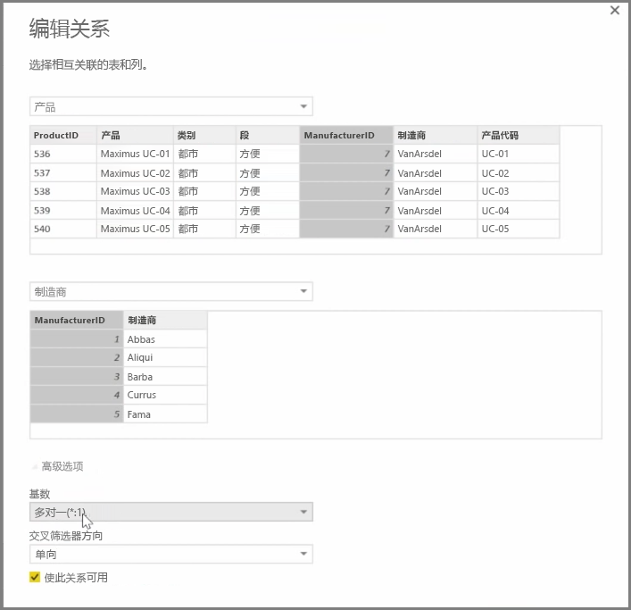

Power BI 允许你以可视方式设置表或元素之间的关系。 若要查看数据的图表视图，请使用**关系视图**（位于报表画布旁屏幕的最左侧）。

在**关系**视图中，你可以看到表示各个表的数据块，它们之间的表列和表行就是表示的关系。

添加和删除关系非常简单。 若要删除关系，右键单击它并选择**删除**。 若要创建关系，拖放想要在表格之间创建链接的字段。

若要隐藏报表中的表格或单列，在关系视图中右键单击它，然后选择**在报表视图中隐藏**。

有关你的数据关系的更详细视图，请选择**开始**选项卡中的**管理关系**。这将打开**管理关系**对话框，该对话框将你的关系显示为列表而不是直观的关系图。 在此处，你可以选择**自动检测**以查找新的或更新数据中的关系。 选择**管理关系**对话框中的**编辑**，以手动编辑你的关系。 你也可以在该位置找到高级选项以设置关系的 *基数* 和 *交叉筛选* 方向。

基数的选项有 *多对一* 和 *一对一* 。 *多对一* 是维度类型关系事实，例如一张销售表，每种产品都具有多行数据，与之匹配的是一个表格，在唯一行中列出了所有产品。 *一对一* 通常用于链接引用表格中的单个条目。

默认情况下，关系将设置为在两个方向上交叉筛选。 只在一个方向交叉筛选限制了关系中的某些建模功能。

设置数据之间的准确关系让你能够在多个数据元素间创建复杂的计算。

