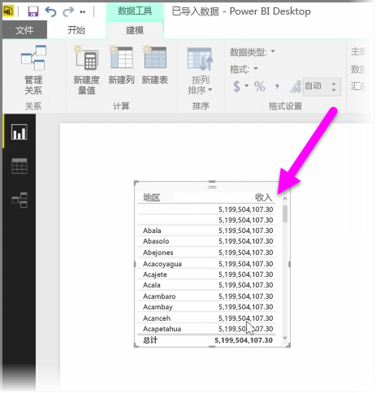
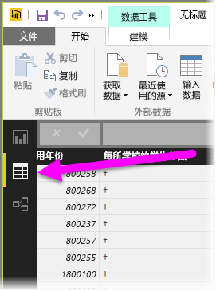
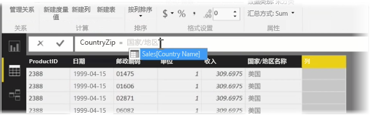
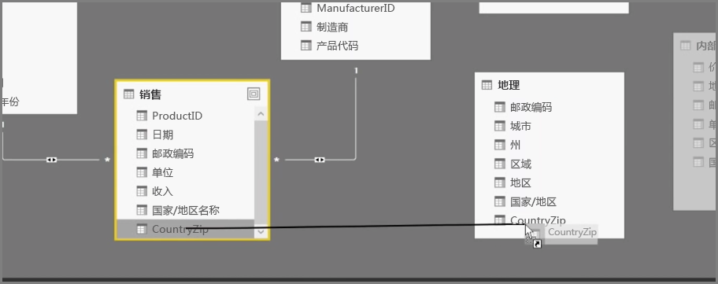
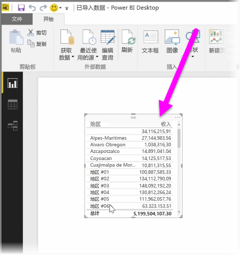

创建计算列是一种用于丰富并增强数据的简单方法。 **计算列**是通过对以下计算进行定义而创建的新列：转换或合并现有数据的两个或多个元素。 例如，可以通过将两列合并为一列来创建新列。

创建计算列的其中一个有效原因是，当没有可用于建立关系的唯一字段时，在表格之间建立关系。 当在 Power BI Desktop 中创建简单的表格视觉对象时，缺少关系会变得明显，并且所有条目都将获得同样的值，而你知道基础数据是不同的。

若要使用具有唯一字段的数据创建关系，例如，当数据中存在“区号”和“本地电话”列时，你可以通过将两者的值合并创建新的“完整电话号码”计算列。 计算列是用于快速创建模型和可视化效果的有用工具。

若要创建计算列，请在报表画布的左侧选择 Power BI Desktop 中的**数据视图**。

在“建模”选项卡中，选择**新建列**。 这将在你可以使用 DAX（数据分析表达式）语言输入计算的地方启用公式栏。 DAX 是一种功能强大的公式语言（Excel 中也有），它可以生成可靠的计算。 在键入公式期间，Power BI Desktop 会显示匹配的公式或数据元素来帮助并加速公式的创建。

在输入表达式期间，Power BI 公式栏将提供特定的 DAX 函数和相关数据列建议。

一旦在每个表中都创建了计算列，它们便可以用作关系键来建立它们之间的关系。 转到**关系**视图，你便可以将字段从一个表拖动到另一个表来创建关系了。

返回**报表**视图，你现在将看到各区的值都不同。

还有可以通过创建计算列执行的各种其他操作。

