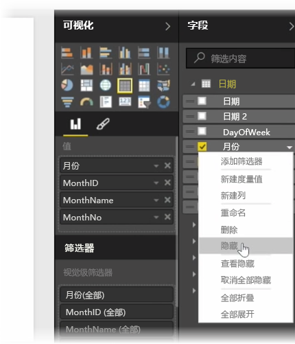
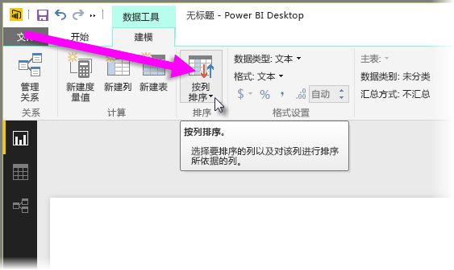
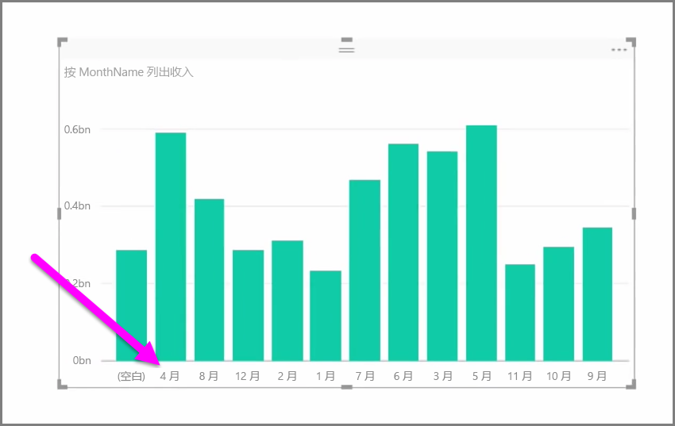
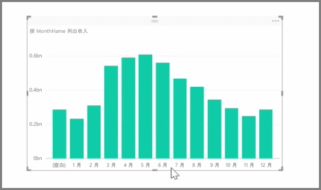

导入的数据通常包含报表和可视化任务中实际不需要的字段，原因是它为额外信息，或者此数据已在其他列中可用。 Power BI Desktop 提供一些工具，可用于优化数据、使其更利于创建报表和视觉对象，以及查看共享报表。

## 隐藏字段
若要隐藏 Power BI Desktop 的**字段**窗格中的某列，请右键单击它，然后选择**隐藏**。 请注意，不会删除隐藏的列；如果此字段已在现有可视化对象中使用，则数据仍位于该视觉对象中，且你仍可在其他可视化对象中使用此数据，隐藏的字段仅不在**字段**窗格中显示。

若在**关系**视图中查看表格，则隐藏的字段将通过灰显进行表示。同样，其数据仍然可用且仍是模型的一部分，只是隐藏不可见而已。 通过右键单击该字段并选择**取消隐藏**，可随时取消隐藏已隐藏的任何字段。

## 按其他字段对可视化数据进行排序
**建模**选项卡中提供的**按列排序**工具对于确保数据按预期顺序显示非常有用。

举一个常见的例子，包括该月名称的数据默认按字母顺序排序，因此比如“八月”显示在“二月”之前。

此情况下，解决此问题的方法是在字段列表中选择字段、再从**建模**选项卡中选择**按列排序**，然后选择要排序的字段。 本例中，“MonthNo”类别排序选项按预期对月份进行排序。

另一种优化信息以使其正确处理的方式是设置字段的数据类型。 若要从报表画布中更改数据类型，请在**字段**窗格中选择该列，然后使用**格式**下拉菜单选择其中一种格式设置选项。 任何已创建且显示此字段的视觉对象均将自动更新。

