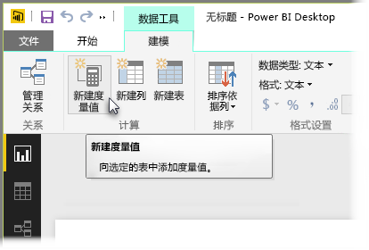
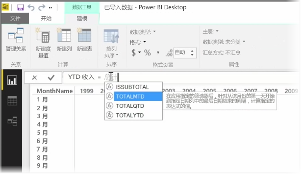
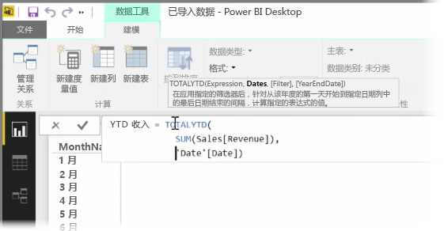
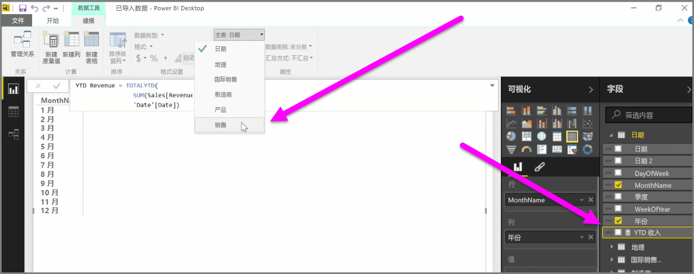

*度量值* 是存在于你的 Power BI 数据模型中的一种计算。 要创建度量值，在**报表**视图中从**建模**选项卡选择**新度量值**。

DAX（Power BI 中数据分析表达式语言）最大优势之一是它有很多有用函数，特别是关于基于时间的计算，如本年截止到现在或同比。 你只需使用 DAX 定义一次时间度量值，然后从数据模型中按照你所需数量的不同字段来划分它。

在 Power BI中，定义的计算称为度量值。 若要创建度量值，从**主页**选项卡中选择**新度量值**。此操作将打开公示栏，你可以在其中输入定义度量值的 DAX 表达式。 键入时，在输入计算过程中，Power BI 会建议相关的 DAX 函数和数据字段，并且你还将得到解释语法和函数参数的工具提示。

如果你的计算很长，则通过键入 **ALT-Enter**，你可以在表达式编辑器中添加额外的换行符。

创建新的度量值后，它将出现在屏幕右侧的**字段**窗格中一个表格中。 Power BI 会将新的度量值插入到当前你选中的表格中，不管度量值处在数据的什么位置，你都可以通过选中此度量值，并使用**主页表**下拉菜单，轻松地移动它。

你可以像使用其它任何表格列一样使用度量值：只需将它拖放到报表画布或可视化效果字段中。 度量值还可与切片器无缝集成，快速分割数据，这意味着你只需定义一次度量值，然后就可将其用于不同的可视化效果。

**计算** DAX 函数是一个功能强大的函数，它可实现各种类型的有用的计算，对于财务报表和视觉对象尤为有用。

