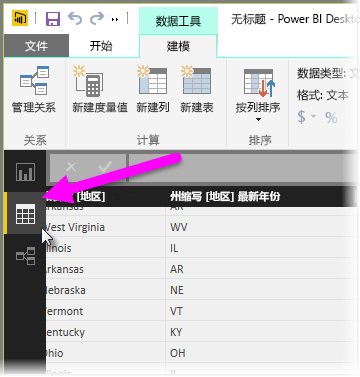
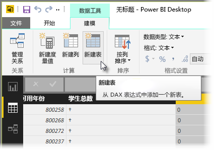
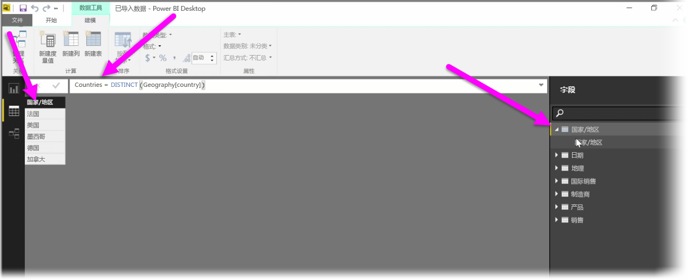

计算表是 DAX 的一个功能，可用于表达一众新增建模功能。 例如，如果你希望进行不同类型的合并联接或以函数公式的结果为基础创建随即变化的新表，使用计算表可以达到此目的。

要创建计算表，请转到 Power BI Desktop 中的**数据视图**（可从报表画布的左侧激活该视图）。

从“建模”选项卡选择**新建表**，以打开公式栏。

在等号的左侧键入新表的名称，在右侧键入要用于形成该表的计算。 完成计算后，新表将显示在模型的“字段”窗格中。

创建后，即可像使用任何其他表的关系、公式、报表那样使用计算表。

