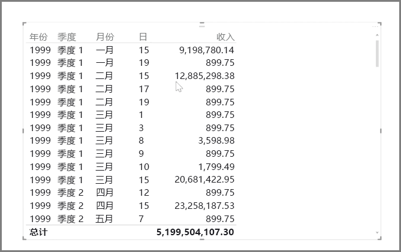
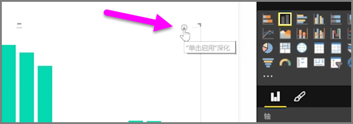
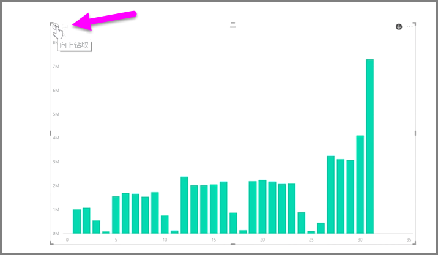
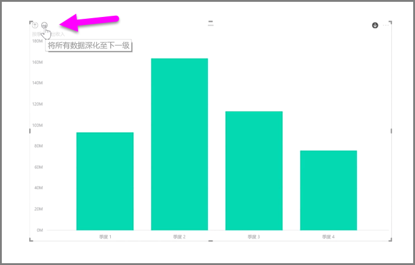
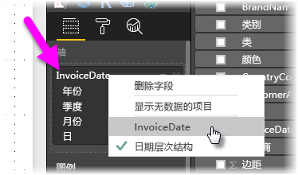

使用 Power BI 分析基于时间的数据非常容易。 Power BI Desktop 中的建模工具自动包括一些生成字段，在这些字段中，你可通过一次单击深化到年份、季度、月份和日期。  

当你在报表中使用日期字段创建表格可视化效果时，Power BI Desktop 将自动包括按时间段分解的信息。 例如，Power BI 会自动将**日期**表中的单个日期字段分为年、季度、月和日，如下图中所示。

可视化效果默认在 *年* 级别显示数据，但是你可以通过打开视觉对象右上角的 **向下钻取** 来更改它。

现在，当你单击图表中的条幅或线段时，它将深化到时间层次结构的下一级别，例如从 *年* 到 *季度* 。 你可以继续深化，直到到达层次结构的最精细级别，在本例中即为 *天* 。 若要在时间层次结构中逆向移动，请单击视觉对象左上角的**向上钻取**。

你还可以深化视觉对象上显示的所有数据，而非只是所选字段，方法是使用**钻取全部**双箭头图标，它也位于视觉对象的右上角。

只要你的模型具有日期字段，Power BI 就会为不同的时间层次结构自动生成不同的视图。

若要返回单个日期（而不是使用日期层次结构），只需右键单击“ **字段** ”列中的列名称（在下图中，列名称为“ *InvoiceDate* ”，然后从显示的菜单中选择列名称，而不是选择“ **日期层次结构** ”。 然后，你的视觉对象会显示基于该列数据的数据，而无需使用日期层次结构。 需要返回以使用日期层次结构？ 没问题！只需再次右键单击并从菜单中选择“**日期层次结构**”。

## 后续步骤
**祝贺你！** 你已经完成了本部分的 Power BI **引导学习**课程。 了解有关数据 *建模* 的信息后，即可学习下一部分中的有趣知识： **可视化** 。

如上所述，本课程按照 Power BI 中的常见工作流构建知识：

* 将数据导入 **Power BI Desktop**，然后创建报表。
* 发布到 Power BI 服务，你可在该服务中创建新的**可视化效果**和构建仪表板
* 与他人（尤其是差旅人员）**共享**你的仪表板
* 在 **Power BI Mobile** 应用中查看共享仪表板和报表并与其交互

虽然你可能不会亲自动手进行所有操作，但你将 *理解* 这些仪表板的创建方式、其连接到数据的方式...完成本课程时，你将能够创建自己的仪表板。

下一部分见！

