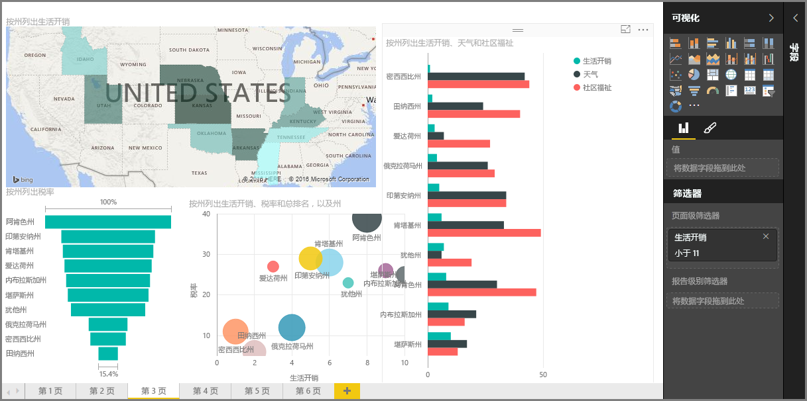

欢迎来到 Power BI **引导学习**课程的**可视化效果**部分。 准备好体验 Power BI 提供的众多可视化效果的趣味十足的启发之旅。 这并还不是全部 - 我们将不断推出更多可视化效果！

当然，视觉对象是任何商业智能事业的最终结果...我们希望获取数据、以引人注目并可提供深刻见解的方式呈现这些数据，并 *显示* 重要内容。Power BI 提供各种引人注目的视觉对象（以及对其进行自定义的几乎无限制的方法），因此这一部分非常重要！

这一部分看似有很多主题，但不必担心：每个主题都很短，并且如你所想，介绍了各种视觉对象，并且很容易理解吸收。 你很可能会发现自己在本部分中漫游，并想象如何在自己的数据中呈现这些视觉对象。

我们将从可视化的支柱（人人都熟悉的简单视觉对象）开始，并确保让你了解各种细节。 然后我们会讲到更高级的（至少是更少见的）视觉对象，充实你的报表创建工具箱。

祝你学习愉快 - 你可以在这里学到很多知识和技巧！

## Power BI 中的视觉对象简介
实现数据可视化是 Power BI 的核心部分（像我们在本课程前面所定义那样，它是基本的构建基块），而创建视觉对象是发现并共享你的见解的最简方法。

Power BI 默认提供众多可视化效果，从简单的条形图到饼图再到地图，甚至瀑布图、漏斗图和仪表等更深奥的可视化效果。 Power BI Desktop 还提供大量页面格式设置工具（如形状和图像），可帮助让报表变得生动。

