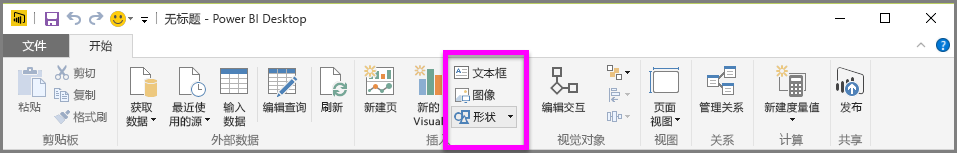
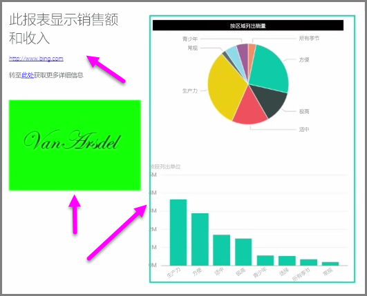

除了绑定数据的视觉对象外，你还可以添加静态元素（如文本框、图像和形状）来改进报表的视觉设计。 若要添加视觉元素，请从**开始**选项卡选择**文本框**、**图像**或**形状**。

**文本框**是随可视化效果显示大标题、题注或短段落信息的理想方法。 可通过编写 URL，或通过在文本框选项栏上突出显示固定短语并选择链接符号，使文本框包括链接。 你可以在文本框中包括 URL，Power BI 将自动检测链接并使其实时更新。

选择**图像**将打开文件浏览器，你可以在其中从计算机或其他联网源选择图像。 默认情况下，在报表中重新调整图像大小将维持其纵横比，但可在视觉对象格式选项中禁用此功能。

**形状**有五种不同的形式选项，包括矩形和箭头。 形状可以不透明，也可以透明并带有彩色边框。 （后者对于在可视化效果组周围创建边框很有用。）

