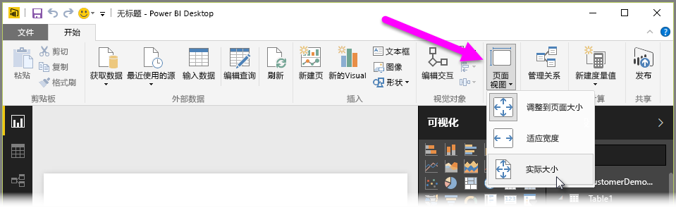
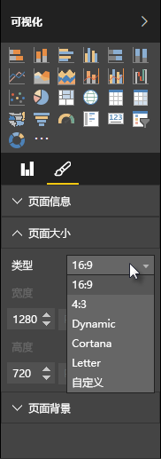

Power BI Desktop 使你能够控制报表页面的布局和格式，如大小和方向。

使用“开始”选项卡中的**页面视图**菜单，更改报表页面的缩放方式。 可用选项包括**适应页面**（默认值）、**适应宽度**和**实际大小**。

还可以自行更改页面大小。 默认情况下，报表页比例为 16:9。 若要更改页面大小，请确保没有选择任何视觉对象，然后在“可视化效果”窗格中，选择画笔图标，然后选择**页面大小**以展开该部分。

页大小的选项包括 4x3（更多方形纵横比）和动态（页面将拉伸以填充可用空间）。 报表还有标准的信纸大小。 请记住，在更改页面大小之后，你可能需要调整视觉元素，确保它们完全显示在画布上。

你还可以指定自定义页面大小，设置大小（英寸或像素）和更改整个报表的背景色。

另一种方法是选择 Cortana，用于调整报表的大小，因此它可以用作使用 Cortana 的搜索结果。

