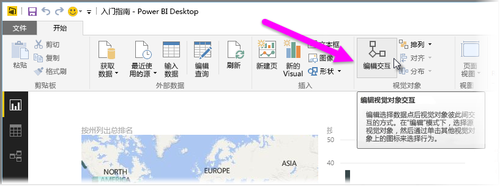
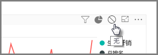
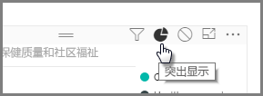
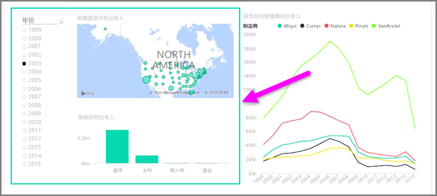

当同一报表页上具有多个可视化效果时，通过单击或使用切片器选择特定片段将影响该页上的所有视觉对象。 但是，在某些情况下，你可能只想切分特定的视觉对象。 使用散点图等元素时尤其如此，在这些元素中将数据限制为特定片段将删除重要含义。 幸运的是，Power BI Desktop 让你能够控制视觉对象之间交互作用的流向。

若要更改可视化效果之间的交互作用，请从**开始**功能区的“视觉对象”部分选择**编辑**，以切换到**编辑模式**。

>[!NOTE]
>自录制视频后，Power BI Desktop 中的“编辑交互作用”图标即已改变。
> 
> 

现在，当你选择报表画布上的视觉对象时，它将影响的每个其他视觉对象右上角将显示小型不透明 *筛选器* 图标。 若要从交互作用中排除视觉对象，请单击右上角 *筛选器* 图标旁边的 *无* 符号。

在某些情况下，你可以调整视觉对象之间出现的筛选器交互作用的类型。 切换到**编辑模式**后，选择你用于筛选的视觉对象。 如果你可以更改另一个视觉对象上的交互作用类型，则右上角筛选器图标旁边将出现 *饼图* 图标。

单击 *饼图* 图标以突出显示分段数据。 否则，数据将被筛选。 像之前一样，你可以单击 *无* 图标删除所有交互作用。

在互相交互的视觉对象周围绘制透明形状是一个有用的设计技巧，这样就可以明确告知用户它们具有交互关系。

