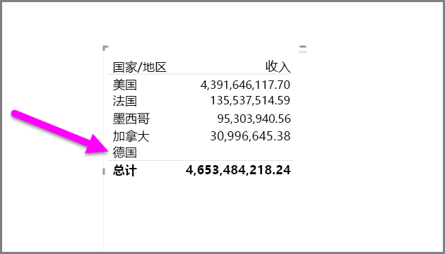
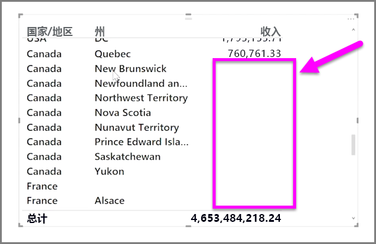

默认情况下，列标题仅显示在包含数据的报表中。 例如，如果你按国家/地区显示收入，并且在挪威没有销售额，则挪威不会显示在可视化效果中的任何位置。

若要显示空的类别，请单击**可视化效果**窗格中你想要更改的字段中的下拉箭头，然后选择**显示无数据项**。

空值视觉对象中将显示所有空列。

为**可视化效果**窗格中的任意字段选择**显示无数据项**后，它将应用到可视化效果窗格中显示的所有字段。 因此，如果你添加另一字段，无数据的任何项也会显示出来，而无需重新访问下拉菜单。

