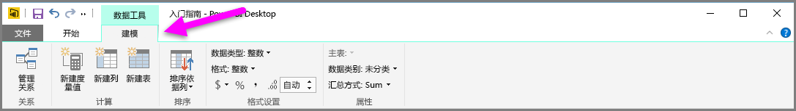
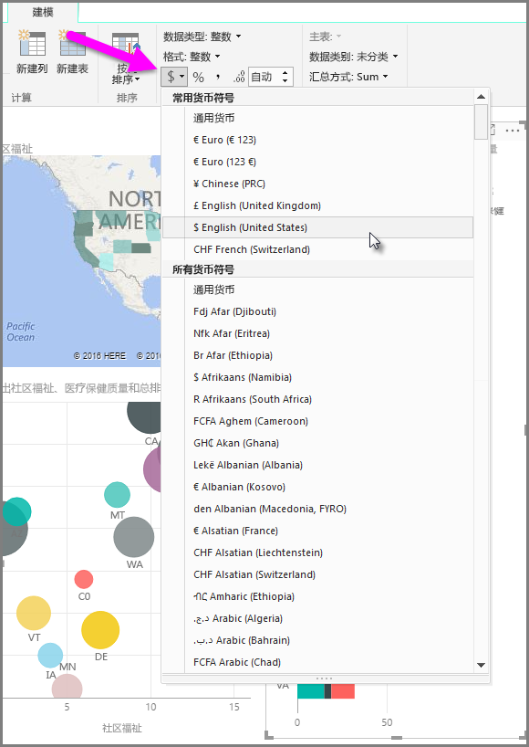
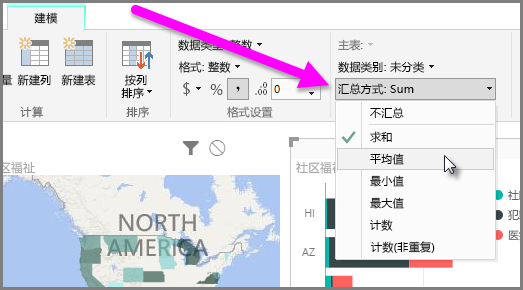
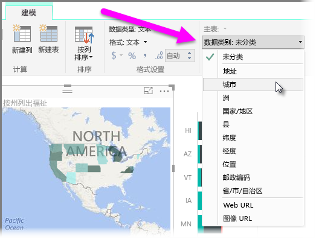

Power BI 的属性可以分配到模型的各个字段，这有助于你以更清晰的显示方式报表、可视化和表示数据。 例如，有时你想要计算数字列表的平均值，Power BI 就会自动对该列表求和。 你可以使用 Power BI 调整这些数字列表的汇总方式。

## 数值汇总控制
我们来举例说明如何控制 Power BI 汇总数字数据字段的方式。

在报表画布上选择视觉对象，然后选择**字段**窗格中的某个字段。 此时功能区将出现**建模**选项卡，并显示用于设置数据和数据属性格式的选项。

你可以通过选择货币符号下拉列表选择当前使用的货币符号类型，如下图所示。

有许多不同选项可供设置字段格式。 例如，可以将格式从货币改为百分比。

你也可以更改 Powwer BI 的数据汇总方式。 选择**默认汇总**图标来更改汇总字段的方式，包括显示总和、计数或平均值。

## 管理和澄清位置数据
在地图上绘制位置时，可以进行类似更改。 选择你的地图，然后选择**字段**窗格中的字段，将它用于位置值。 在**建模**选项卡上，选择**数据类别**，然后从下拉菜单中选择表示你的位置数据的类别。 例如，选择州、国家/地区或城市。

